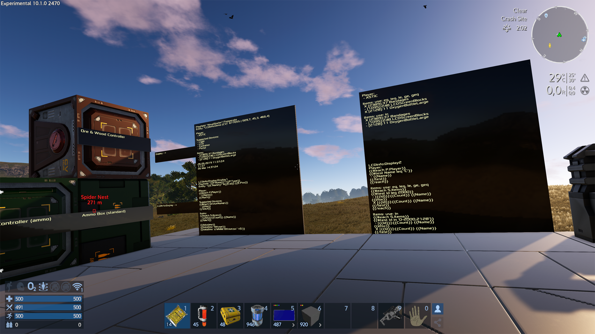
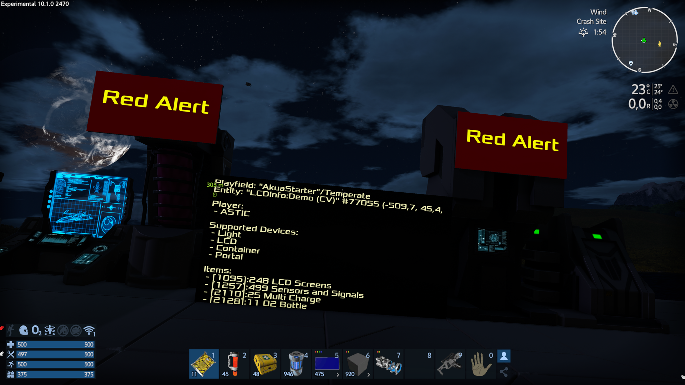
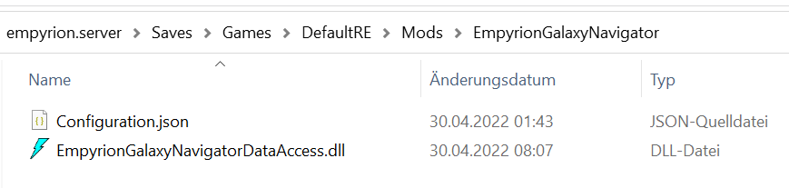

# Empyrion Scripting
[English part of this ReadMe.md](#English-Version)

## Installation
1. Downloade die EmpyrionScripting.zip Datei vom aktuellen https://github.com/GitHub-TC/EmpyrionScripting/releases
1. UnZip die Datei in dem Verzeichnis Content\\Mods directory

#### Installation für SinglePlayer
1. Downloade die EmpyrionScripting.zip Datei vom aktuellen https://github.com/GitHub-TC/EmpyrionScripting/releases
1. UnZip die Datei in dem Verzeichnis Content\\Mods directory
1. Das Spiel MUSS dann ohne EAC gestartet werden damit die Mods geladen werden

### Wofür dient diese MOD?


Echte Spielinhalte direkt auf einem LCD ausgeben

Eine dem Struktur 'LCDInfo-Demo' findest du im workshop
https://steamcommunity.com/workshop/filedetails/?id=1751409371

#### Hilfe



YouTube video;
* https://youtu.be/8nEpEygHBu8 (danke an Olly :-) )
* https://youtu.be/8MzjdeYlzPU
* https://youtu.be/gPp5CGJusr4
* https://youtu.be/9601vpeLJAI
* https://youtu.be/V1w2A3LAZCs
* https://youtu.be/O89NQJjbQuw
* https://youtu.be/uTgXwrlCfNQ
* https://youtu.be/qhYmJWHk8ec
* https://youtu.be/IbVuzFf_ywI

* https://youtu.be/XzYKNevK0bs
* https://youtu.be/SOnZ_mzytA4
* https://youtu.be/oDOSbllwqSw
* https://youtu.be/qhOnj2D3ejo

* Änderungen mit der A11: https://youtu.be/hxvKs5U1I6I

Beginners guide (english):
* https://steamcommunity.com/workshop/filedetails/discussion/1751409371/3191368095147121750/
* https://youtu.be/IjJTNp_ZYUI

## Tutorials
* Workshop von Sephrajin: DSEV LCD Script Tutorial, https://steamcommunity.com/sharedfiles/filedetails/?id=2863240303
* Workshop von Noob: Scripting Tutorial Ship, https://steamcommunity.com/sharedfiles/filedetails/?id=2817433272
* Workshop von ASTIC, Vega AI, https://steamcommunity.com/sharedfiles/filedetails/?id=2227639387

## Beispiele
Allgemein: 
Benötigt werden mindestens 2 LCD und mindestens 1 Container
1. LCD 1 (Eingabe) wird mit der Abfrage programmiert siehe Beispiele unten. Der Namen des LCDs im ControlPanel MUSS mit "Script:" beginnen.
1. LCD 2 (Ausgabe) Muss eindeutigen Namen haben z.B. "LCD Alle Erze"
1. Jeder Kontainer der eine Information ausgeben soll, muss einen eindeutigen Namen haben

Unten stehen die ID Nummer für Erze und Barren.<br/>
Einige Funktionen benötigen ein Komma"," andere benötigen Simikolon ";".<br/>
Alles in "" sind Texte und nicht mit anzugeben.<br/>
Einzelne ' sind mit anzugeben.<br/>
Man kann eine Information auch auf 2 LCD's anzeigen lassen dannsortedeach bei Targets:Name LCD;Name LCD2<br/>
Man kann eine Information auch auf n LCD's anzeigen lassen dann bei Targets:LCDAusgabe*<br/>
Man kann eine Information auch auf n LCD's anzeigen lassen welche schon im ScriptLCD Namen angegeben sind Script:LCDAusgabe*<br/>
Man kann auf einem LCD auch den Inhalt verschiedner Kisten anzeigen lassen!<br/>
 
 ---

## Sprache, Format, Zeit der Ausgaben
Die Sprache, Uhrzeitoffset und Anzeigeformate kann man mit einem LCD einstellen welches man
'CultureInfo' benennt. Etwaige Fehler bei der Angabe werden in einem LCD mit dem Namen 'CultureInfoDebug' angezeigt.

Dabei kann man in der 'CultureInfo' folgendes angeben:
```
{
  "LanguageTag": "de-EN",
  "i18nDefault": "English",
  "UTCplusTimezone": 2
}
```
LanguageTag: https://docs.microsoft.com/en-us/openspecs/windows_protocols/ms-lcid/a9eac961-e77d-41a6-90a5-ce1a8b0cdb9c

## Was ist in der Kiste/Container/ContainerController/MunitionsKiste/Kühlschrank

Eingabe im LCD 1 (alles ohne "")
```
Targets:"NAME DES ANZUZEIGENDEN LCD"
"TEXT Optional"
{{items E.S '"Name der Kiste"'}}
{{Count}}{{Name}}
{{/items}}
```
Bsp:
```
Targets:LCD Alle Erze
Meine Erze
{{#items E.S 'Alle Erze'}}
{{Count}}{{i18 Key}}
{{/items}}
```
---
## Ausgabe aller Erze in der Basis/Schiff/HV/CV

Eingabe im LCD (alles ohne "")
```
Targets:"NAME DES ANZUZEIGENDEN LCD"
"TEXT optional"
{{#test ID in '4296,4297,4298,4299,4300,4301,4302,4317,4318,4332,4341,4345'}}
{{Count}} {{i18n Key}}
{{/test}}
{{/each}}
```
Bsp:
```
Targets:LCD Alle Erze
Meine Erze
{{#each E.S.Items}}
{{#test Id in '4296,4297,4298,4299,4300,4301,4317,4318,4332,4345,4328,4302'}}
{{Count}} {{i18n Key}}
{{/test}}
{{/each}}
```
---
## Ausgabe aller Barren in der Basis/Schiff/HV/CV

Eingabe im LCD (alles ohne "")
```
Targets:"NAME DES ANZUZEIGENDEN LCD"
"TEXT optional"
{{#each E.S.Items}}
{{#test Id in '4319,4320,4321,4322,4323,4324,4325,4326,4327,4328,4329,4333,4342,4346'}}
{{Count}} {{i18n Key}}
{{/test}}
{{/each}}
```
Bsp:
```
Targets:LCD Barren
Alle meine Barren in der Basis:
{{#each E.S.Items}}
{{#test Id in '4319,4320,4321,4322,4323,4324,4325,4326,4327,4328,4329,4333,4342,4346'}}
{{Count}} {{i18n Key}}
{{/test}}
{{/each}}
```
-----------------------------------------------------------------------------------------
## Ausgabe dieser per ID festgelegten Produkte (hier sind es alle Barren die es gibt im Spiel)
Eingabe im LCD (alles ohne "")
```
Targets:"NAME DES ANZUZEIGENDEN LCD"
"TEXT optional"
{{#itemlist E.S.Items '4319,4320,4321,4322,4323,4324,4325,4326,4327,4328,4329,4333,4342,4346'}}
{{Count}} {{i18n Key}}
{{/itemlist}}
```
Bsp:
```
Targets:LCD Alle Barren im Spiel
Alle Barren im Spiel:
{{#itemlist E.S.Items '4319,4320,4321,4322,4323,4324,4325,4326,4327,4328,4329,4333,4342,4346'}}
{{Count}} {{i18n Key}}
{{/itemlist}}
```
-----------------------------------------------------
## Anzeige eines bestimmten Produktes in der Basis/Schiff/HV/CV
```
Eingabe im LCD (alles ohne "")
Targets:"NAME DES ANZUZEIGENDEN LCD"
"TEXT optional"
{{#itemlist E.S.Items '4297'}}
{{Count}} {{i18n Key}}
{{/itemlist}}
```
Bsp:
```
Targets:LCD EISEN ERZ
Meine EisenErz und Barren
{{#itemlist E.S.Items '4297,4320'}}
{{Count}} {{i18n Key}}
{{/itemlist}}
```
------------------------------------------------------------------
## Welche Erze sind alle, bzw. nur noch X Anzahl über

Hier werden alle Erze angezeigt wo nur 1-1000 auf der Basis vorhanden ist.
```
{{#itemlist E.S.Items '4296,4297,4298,4299,4300,4301,4317,4318,4332,4345,4328,4302'}}
{{#test Count geq 1}}
{{#test Count leq 1000}}
{{Count}} {{i18n Key}}
{{/test}}
{{/test}}
{{/itemlist}}
```
---
## Hier werden alle Erze angezeigt die nicht mehr auf der Basis sind
```
{#itemlist E.S.Items '4296,4297,4298,4299,4300,4301,4317,4318,4332,4345,4328,4302'}}
{{#test Count leq 0}}
{{Count}} {{i18n Key}}
{{/test}}
{{/itemlist}}
```

## Vordefinierte ID Listen

Diese Listen können geändert werden oder durch neue Einträge erweitert werden.
Dazu kann einfach der Abschnitt "Ids" in der Datei \[EGS\]\Saves\Games\\[SaveGameName\]\Mods\EmpyrionScripting\Configuration.json
geändert werden.

Hinweis: Um den Originalzustand wieder herzustellen kann der Abschnitt "Ids" aus der Datei geöscht werden. Die Mod trägt dann hier die im Programm hinterlegte Standardkonfiguration wieder ein.

Folgende Listen können über "Ids.\[NameDerListe\] im Standard abgerufen werden.

- "Ore"                   = ",AluminiumOre,CobaltOre,CopperOre,ErestrumOre,GoldOre,IronOre,MagnesiumOre,NeodymiumOre,PentaxidOre,PromethiumOre,SiliconOre,TitanOre,ZascosiumOre,",
- "Ingot"                 = ",CobaltIngot,CopperIngot,CrushedStone,ErestrumIngot,GoldIngot,IronIngot,MagnesiumPowder,NeodymiumIngot,PentaxidCrystal,PlatinBar,PromethiumPellets,RockDust,SathiumIngot,SiliconIngot,ZascosiumIngot,",
- "BlockL"                = ",AlienBlocks,AlienLargeBlocks,ConcreteArmoredBlocks,ConcreteBlocks,ConcreteDestroyedBlocks,GrowingPot,GrowingPotConcrete,GrowingPotWood,HeavyWindowBlocks,HullArmoredLargeBlocks,HullCombatFullLarge,HullCombatLargeBlocks,HullFullLarge,HullLargeBlocks,HullLargeDestroyedBlocks,HullThinLarge,LadderBlocks,PlasticLargeBlocks,StairsBlocks,StairsBlocksConcrete,StairsBlocksWood,TrussLargeBlocks,WindowArmoredLargeBlocks,WindowLargeBlocks,WindowShutterLargeBlocks,WoodBlocks,HeavyWindowDetailedBlocks,SteelRampBlocksL,HardenedRampBlocksL,CombatRampBlocksL,PassengerSeatMS,WalkwayLargeBlocks,",
- "BlockS"                = ",ArtMassBlocks,HullArmoredSmallBlocks,HullSmallBlocks,HullSmallDestroyedBlocks,ModularWingBlocks,PlasticSmallBlocks,TrussSmallBlocks,VentilatorCubeQuarter,WindowArmoredSmallBlocks,WindowShutterSmallBlocks,WindowSmallBlocks,WingBlocks,HullCombatSmallBlocks,WalkwaySmallBlocks,HeavyWindowBlocksSmall,SteelRampBlocksS,HardenedRampBlocksS,CombatRampBlocksS,",
- "Medic"                 = ",AlienParts03,AntibioticInjection,AntibioticPills,Medikit01,Medikit02,Medikit03,Medikit04,RadiationImmunityShot,RadiationPills,StomachPills,Bandages,EnergyPills,AntibioticOintment,AdrenalineShot,AntiRadiationOintment,AntiToxicOintment,AntiToxicPills,AntiParasitePills,AntiToxicInjection,AntiParasiteInjection,AntiRadiationInjection,EnergyDrink,AblativeSpray,BugSpray,Medikit05,Eden_EmergencyLifeSupport,Eden_RegenKit,Eden_StaminaRegenKit,Eden_ImmunityShield,Eden_RegenKitT2,Eden_StaminaRegenKitT2,Eden_RadiationRegenKit,Eden_Implant1,Eden_Implant2,Eden_Implant3,Eden_Implant4,Eden_Implant5,Eden_Implant6,Eden_BandagesT2,",
- "Food"                  = ",AkuaWine,AnniversaryCake,Beer,BerryJuice,Bread,Cheese,EmergencyRations,FruitJuice,FruitPie,HotBeverage,MeatBurger,Milk,Pizza,Sandwich,Steak,Stew,VegetableJuice,VeggieBurger,",
- "Ingredient"            = ",5312,AlienParts01,AlienParts02,AlienParts03,AlienThorn,AlienTooth,AloeVera,BerryJuice,Cheese,ConfettiMossScrapings,Eden_SilverIngot,Egg,ErestrumGel,Fiber,FireMossScrapings,FishMeat,Flour,Fruit,FruitJuice,Ham,HerbalLeaves,HWSFish,Meat,Milk,NCPowder,NutrientSolution,PentaxidElement,PlantProtein,PlasticMaterial,PlatinOunce,PromethiumPellets,Ratatouille,RockDust,RottenFood,Salami,Spice,TrumpetGreens,VegetableJuice,Vegetables,WaterBottle,XenoSubstrate,",
- "Sprout"                = ",AlienPalmTreeStage1,AlienPlantTube2Stage1,AlienplantWormStage1,BigFlowerStage1,BulbShroomYoungStage1,CobraLeavesPlantStage1,CoffeePlantStage1,CornStage1,DesertPlant20Stage1,DurianRoot,ElderberryStage1,InsanityPepperStage1,MushroomBellBrown01Stage1,PearthingStage1,PumpkinStage1,SnakeweedStage1,TomatoStage1,WheatStage1,",
- "Tools"                 = ",Chainsaw,ColorTool,ConcreteBlocks,ConstructorSurvival,DrillT2,Explosives,Flashlight,LightWork,LightWork02,MobileAirCon,MultiTool,MultiToolT2,OreScanner,OxygenGeneratorSmall,PlayerBike,RadarSuitT1,TextureTool,WaterGenerator,AutoMiningDeviceT1,AutoMiningDeviceT2,AutoMiningDeviceT3,Eden_AutoMiningDeviceT4,DrillEpic,TextureColorTool,NightVision,SurvivalTent,OxygenGenerator,OxygenHydrogenGenerator,Drill,SurvivalTool,DrillEpic,MedicGun,Eden_DrillVoidium,Eden_VoidiumScanner,Eden_VoidiumScannerT2,",
- "ArmorMod"              = ",ArmorBoost,ArmorBoostEpic,Eden_ArmorBoostAbyss,Eden_ArmorBoostAugmented,Eden_ColdBoostAbyss,Eden_ColdBoostAugmented,Eden_HeatBoostAbyss,Eden_HeatBoostAugmented,Eden_JetpackBoostAbyss,Eden_JetpackBoostAugmented,Eden_RadiationBoostAbyss,Eden_RadiationBoostAugmented,Eden_TransportationBoostAugmented,EVABoost,InsulationBoost,InsulationBoostEpic,JetpackBoost,JetpackBoostEpic,MobilityBoost,MobilityBoostEpic,MultiBoost,MultiBoostEpic,OxygenBoost,RadiationBoost,RadiationBoostEpic,TransportationBoost,",
- "DeviceL"               = ",AlienNPCBlocks,ArmorLocker,ATM,BlastDoorLargeBlocks,BoardingRampBlocks,CloneChamber,CockpitBlocksCV,ConstructorT0,ConstructorT1V2,ConstructorT2,ContainerAmmoControllerLarge,ContainerAmmoLarge,ContainerControllerLarge,ContainerExtensionLarge,ContainerLargeBlocks,ContainerPersonal,Core,CoreNoCPU,CPUExtenderBAT2,CPUExtenderBAT3,CPUExtenderBAT4,Deconstructor,DetectorCV,DoorArmoredBlocks,DoorBlocks,ElevatorMS,ExplosiveBlocks,ExplosiveBlocks2,Flare,FoodProcessorV2,ForcefieldEmitterBlocks,FridgeBlocks,FuelTankMSLarge,FuelTankMSLargeT2,FuelTankMSSmall,Furnace,GeneratorBA,GeneratorMS,GeneratorMST2,GravityGeneratorMS,HangarDoorBlocks,HumanNPCBlocks,LandClaimDevice,LandinggearBlocksCV,LCDScreenBlocks,LightLargeBlocks,LightPlant01,MedicalStationBlocks,OfflineProtector,OxygenStation,OxygenTankMS,OxygenTankSmallMS,PentaxidTank,Portal,RampLargeBlocks,RCSBlockMS,RCSBlockMS_T2,RemoteConnection,RepairBayBA,RepairBayBAT2,RepairBayConsole,RepairBayCVT2,RepairStation,SensorTriggerBlocks,ShieldGeneratorBA,ShieldGeneratorBAT2,ShieldGeneratorPOI,ShutterDoorLargeBlocks,SolarGenerator,SolarPanelBlocks,SolarPanelSmallBlocks,SpotlightBlocks,TeleporterBA,ThrusterMSDirectional,ThrusterMSRound2x2Blocks,ThrusterMSRound3x3Blocks,ThrusterMSRoundBlocks,VentilatorBlocks,PassengerSeatMS,CPUExtenderLargeT5,WarpDrive,RepairBayCV,TeleporterCV,ContainerHarvestControllerLarge,ShieldGeneratorCV,ShieldGeneratorCVT2,CPUExtenderCVT2,CPUExtenderCVT3,CPUExtenderCVT4,WarpDriveT2,DetectorCVT2,ShieldGeneratorT0,ShieldChargerLarge,FusionReactorLarge,ShieldCapacitorT2Large,ShieldCapacitorT3Large,ShieldChargerT2Large,ShieldChargerT3Large,Eden_LiftLargeBlocks,Eden_AuxillaryDummy,Eden_ShieldGeneratorAugmentedCV,Eden_AntimatterTank,Eden_WarpDriveAntimatter,Eden_ShieldGeneratorRegenerateCV,Eden_HydroponicsGrain,Eden_HydroponicsFruit,Eden_HydroponicsVegetables,Eden_HydroponicsNaturalStimulant,Eden_HydroponicsHerbalLeaves,Eden_HydroponicsPlantProtein,Eden_HydroponicsNaturalSweetener,Eden_HydroponicsFiber,Eden_HydroponicsMushroomBrown,Eden_HydroponicsSpice,Eden_HydroponicsBuds,Eden_HydroponicsBerries,Eden_HydroponicsPentaxid,Eden_ExplorationScannerCV,CVSmallSolarPanelBlocks,CVLargeSolarPanelBlocks,ShieldCapacitorLarge,Eden_ScienceStation,AsgardPassGen,AsgardThrusterCV,HWSLiftBlocks,AsgardExtensionLarge,AsgardExplosiveBlock,ThrusterMSRoundLarge,",
- "DeviceS"               = ",ArmorLockerSV,CloneChamberHV,ConstructorHV,ConstructorSV,Core,CPUExtenderHVT2,CPUExtenderHVT3,CPUExtenderHVT4,DetectorHVT1,DoorBlocksSV,Flare,ForcefieldEmitterBlocks,FridgeSV,FuelTankSV,FuelTankSVSmall,GeneratorSV,GeneratorSVSmall,HoverBooster,HoverEngineLarge,HoverEngineSmall,HoverEngineThruster,LightSS01,MedicStationHV,OxygenTankSV,PentaxidTankSV,RCSBlockGV,RCSBlockSV,RemoteConnection,ShieldGeneratorHV,ThrusterGVJetRound1x3x1,ThrusterGVRoundBlocks,ThrusterGVRoundLarge,ThrusterGVRoundLargeT2,ThrusterGVRoundNormalT2,ThrusterJetRound1x3x1,ThrusterJetRound2x5x2,ThrusterJetRound2x5x2V2,ThrusterJetRound3x10x3,ThrusterJetRound3x10x3V2,ThrusterJetRound3x13x3,ThrusterJetRound3x13x3V2,ThrusterJetRound3x7x3,ThrusterSVDirectional,ThrusterSVRoundBlocks,ThrusterSVRoundLarge,ThrusterSVRoundLargeT2,ThrusterSVRoundNormalT2,VentilatorBlocks,WarpDriveSV,GeneratorSVT2,ThrusterSVRoundT2Blocks,DetectorSVT2,ShieldGeneratorSVT0,ShieldGeneratorSVT2,CPUExtenderSmallT5,LargeCargoContainer,LargeHarvestContainer,ShieldCapacitorSmall,ShieldChargerSmall,FoodProcessorSmall,Eden_AuxillaryCPUSV,Eden_ShieldGeneratorAugmentedSV,Eden_WarpDriveAntimatterSV,AsgardContainerExtensionHVSV,AsgardFuelTankSVHV,AsgardExplosiveBlock,AsgardWarpDriveSV,AsgardGeneratorSVHV,ThrusterGVSuperRound2x4x2,PassengerSeatSV,PassengerSeat2SV,OxygenStationSV,ShutterDoorSmallBlocks,CockpitBlocksSV,LandinggearBlocksSV,LandinggearBlocksHeavySV,SensorTriggerBlocksSV,DetectorSVT1,ContainerControllerSmall,ContainerExtensionSmall,ContainerHarvestControllerSmall,ContainerAmmoControllerSmall,LandinggearBlocksHeavySV,RampSmallBlocks,ContainerSmallBlocks,CockpitBlocksSVT2,ShieldGeneratorSV,CPUExtenderSVT2,CPUExtenderSVT3,CPUExtenderSVT4,",
- "WeaponPlayer"          = ",AssaultRifle,AssaultRifleEpic,AssaultRifleT2,Chainsaw,ColorTool,DrillT2,Explosives,LaserPistol,LaserPistolT2,LaserRifle,LaserRifleEpic,Minigun,MinigunEpic,MultiTool,Pistol,PistolEpic,PistolT2,PulseRifle,RocketLauncher,RocketLauncherEpic,RocketLauncherT2,ScifiCannon,ScifiCannonEpic,Shotgun,Shotgun2,Shotgun2Epic,Sniper,Sniper2,Sniper2Epic,TextureTool,PulseRifleT2,SubmachineGunT1,SpecOpsRifle,SubmachineGunT2,GrenadeLauncher,TalonRepeatingCrossbow,",
- "WeaponHV"              = ",DrillAttachment,DrillAttachmentLarge,DrillAttachmentT2,SawAttachment,TurretGVArtilleryBlocks,TurretGVMinigunBlocks,TurretGVPlasmaBlocks,TurretGVRocketBlocks,TurretGVToolBlocks,WeaponSV02,TurretGVRocketBlocksT2,TurretGVArtilleryBlocksT2,WeaponSV09,WeaponSV11,",
- "WeaponSV"              = ",WeaponSV01,WeaponSV02,WeaponSV03,WeaponSV04,WeaponSV05,WeaponSV05Homing,TurretSVSmall,DrillAttachmentSVT2,TurretSVPulseLaserT2,TurretGVProjectileBlocksT2,TurretGVPlasmaBlocksT2,WeaponSV06,WeaponSV07,WeaponSV08,TurretGVBeamLaserBlocksT2, Eden_TurretVulcanSmall,Eden_ModularPulseLaserSVIR,Eden_ModularPulseLaserSVUV,Eden_ModularPulseLaserSVGamma,Eden_ShieldBoosterSV,AsgardDrillSV,",
- "WeaponCV"              = ",DrillAttachmentCV,SentryGunBlocks,TurretMSArtilleryBlocks,TurretMSLaserBlocks,TurretMSProjectileBlocks,TurretMSRocketBlocks,TurretMSToolBlocks,TurretZiraxMSLaser,TurretZiraxMSPlasma,TurretZiraxMSRocket,WeaponMS01,WeaponMS02,TurretAlien,TurretEnemyBallista,TurretMSProjectileBlocksT2,TurretMSRocketBlocksT2,TurretMSLaserBlocksT2,TurretMSArtilleryBlocksT2,WeaponMS03,TurretZiraxMSPlasmaArtillery,TurretZiraxMSLaserT2,TurretZiraxMSPlasmaT2,TurretZiraxMSRocketT2,Eden_TurretBolterCV,Eden_TurretMissileLight,Eden_TurretMissileLightT2,Eden_BlasterCV,Eden_RailgunCVSpinal_Kit,Eden_CVTorpedoRapid,Eden_TurretVulcanCV,Eden_DrillIceCV,Eden_DrillRichCV,Eden_DrillIceTurretCV,Eden_DrillTurretAutoCV,Eden_DrillTurretAutoCVT2,Eden_TurretLaserBeamCV,Eden_TurretLaserBeamCVT2,Eden_TurretLaserBeamCVT3,Eden_TurretBeamHeavyT1,Eden_TurretMissileCruiseCV,Eden_TurretMissileCruiseEMPCV,Eden_TurretMissileSwarmCV,Eden_TurretLaserT4,Eden_TurretAlienVulcan,Eden_TurretFlakClose,Eden_TurretRailgun,Eden_TurretRailgunHeavy,Eden_DrillIceTurretCVAlien,Eden_DrillTurretAutoCVAlien,AsgardDrillCV,",
- "WeaponBA"              = ",SentryGunBlocks,TurretBaseArtilleryBlocks,TurretBaseLaserBlocks,TurretBaseProjectileBlocks,TurretBaseRocketBlocks,TurretBaseProjectileBlocksT2,TurretBaseRocketBlocksT2,TurretBaseLaserBlocksT2,TurretBaseArtilleryBlocksT2,TurretBABeamLaserBlocksT2,",
- "AmmoPlayer"            = ",12.7mmBullet,5.8mmBullet,50Caliber,8.3mmBullet,DrillCharge,MultiCharge,PulseLaserChargePistol,PulseLaserChargeRifle,SciFiCannonPlasmaCharge,ShotgunShells,SlowRocket,SlowRocketHoming,",
- "AmmoHV"                = ",15mmBullet,ArtilleryRocket,FastRocket,TurretGVPlasmaCharge,",
- "AmmoSV"                = ",15mmBullet,FastRocket,FastRocketHoming,PlasmaCannonChargeSS,PulseLaserChargeSS,RailgunBullet,",
- "AmmoCV"                = ",15mmBullet,30mmBullet,5.8mmBullet,FastRocketMS,FlakRocketMS,LargeRocketMS,PulseLaserChargeMS,PulseLaserChargeMSWeapon,TurretMSPlasmaCharge,",
- "AmmoBA"                = ",15mmBullet,30mmBullet,5.8mmBullet,FastRocketBA,FlakRocket,LargeRocket,PulseLaserChargeBA,TurretBAPlasmaCharge,",
- "Gardeners"             = ",ConsoleSmallHuman,",
- "Components"            = ",AluminiumCoil,AluminiumOre,AluminiumPowder,AutoMinerCore,CapacitorComponent,Cement,CobaltAlloy,Computer,Electronics,EnergyCell,EnergyMatrix,ErestrumGel,Fiber,FluxCoil,GlassPlate,GoldIngot,HydrogenBottle,IceBlocks,LargeOptronicBridge,LargeOptronicMatrix,MagnesiumPowder,MechanicalComponents,Motor,Nanotubes,NCPowder,OpticalFiber,Oscillator,PentaxidCrystal,PentaxidElement,PentaxidOre,PlasticMaterial,PowerCoil,PromethiumOre,PromethiumPellets,RawDiamond,RockDust,SmallOptronicBridge,SmallOptronicMatrix,SteelPlate,SteelPlateArmored,WaterJug,WoodLogs,WoodPlanks,XenoSubstrate,ZascosiumAlloy,",
- "EdenComponents"        = ",AluminiumCoil,AluminiumOre,AluminiumPowder,Coolant,Eden_ComputerT2,Eden_DarkMatter,Eden_DarkMatterSmall,Eden_DiamondCut,Eden_DroneSalvageCore,Eden_DroneSalvageProcessor,Eden_Electromagnet,Eden_GaussRail,Eden_ModularPulseLaserLensLarge,Eden_ModularPulseLaserLensSmall,Eden_PlasmaCoil,Eden_PowerRegulator,Eden_ProgenitorArtifact,Eden_Semiconductor,Eden_Voidium,Fertilizer,HeatExchanger,HeliumBottle,NitrogenBottle,QuantumProcessor,RadiationShielding,ReactorCore,SolarCell,Superconductor,ThrusterComponents,XenonBottle,SmallUpgradeKit,LargeUpgradeKit,AdvancedUpgradeKit,Eden_MagmaciteIngot,Eden_MagmacitePlate,Eden_Deuterium,Eden_OreDenseT1Ingot,Eden_OreDenseT2Ingot,Eden_OreDenseT3Ingot,Eden_OreDenseT4Ingot,Eden_OreDenseT5Ingot,AncientRelics,LJArtifact1,LJArtifact2,LJArtifact3,LJArtifact4,NaqahdahOre,NaqahdahIngot,NaqahdahPlate,Naquadria,LJSandOre,LJEarthOre,Eden_MagmacitePlate,Eden_AugmentedMold,",
- "Armor"                 = ",ArmorHeavy,ArmorHeavyEpic,ArmorLight,ArmorLightEpic,ArmorMedium,ArmorMediumEpic,Eden_ArmorAbyssLight,Eden_ArmorHeavyEpicReinforced,Eden_ArmorHeavyReinforced,Eden_ArmorLightAugmented,Eden_ArmorLightReinforced,Eden_ArmorMediumReinforced,AsgardArmor,AsgardArmorDonat",
- "IngredientBasic"       = ",Meat,Spice,AlienParts01,AlienParts02,AlienParts03,Bread,Fruit,Grain,Egg,NaturalStimulant,AlienTooth,Milk,Cheese,RottenFood,HerbalLeaves,ConfettiMossScrapings,FireMossScrapings,PlantProtein,MushroomBrown,AloeVera,AlienThorn,Vegetables,Flour,Ham,Berries,Ratatouille,NaturalSweetener,FruitJuice,Buds,",
- "IngredientExtra"       = ",PromethiumPellets,RockDust,PlasticMaterial,PentaxidElement,PlatinOunce,ErestrumGel,XenoSubstrate,NutrientSolution,WaterBottle,Eden_SilverIngot,",
- "IngredientExtraMod"    = ",Medikit04,RadiationImmunityShot,Bandages,AdrenalineShot,AntiRadiationInjection,EnergyDrink,",
- "OreFurnace"            = ",IronOre,CobaltOre,SiliconOre,NeodymiumOre,CopperOre,ErestrumOre,ZascosiumOre,SathiumOre,GoldOre,TitanOre,PlatinOre,Eden_MagmaciteOre,Eden_TungstenOre,",
- "Deconstruct"           = ",Eden_IceDense,Eden_IceRich,Eden_IceHeavy,Eden_Salvage1,Eden_Salvage2,Eden_Salvage3,Eden_Salvage4,Eden_Salvage5,Eden_OreDenseT1,Eden_OreDenseT2,Eden_OreDenseT3,Eden_OreDenseT4,Eden_OreDenseT5,",
- "AmmoAllEnergy"         = ",DrillCharge,PulseLaserChargePistol,PulseLaserChargeRifle,MultiCharge,SciFiCannonPlasmaCharge,PlasmaCannonAlienCharge,PlasmaCannonChargeSS,PulseLaserChargeSS,PulseLaserChargeMS,TurretGVPlasmaCharge,TurretMSPlasmaCharge,TurretEnemyLaserCharge,PulseLaserChargeBA,TurretBAPlasmaCharge,PulseLaserChargeMSWeapon,PlasmaCartridge,PulseLaserChargeMST2,TurretMSPlasmaChargeT2,PulseLaserChargeBAT2,TurretBAPlasmaChargeT2,TurretGVPlasmaChargeT2,PulseLaserChargeSST2,ZiraxMSPlasmaCharge,HeatSinkSmall,HeatSinkLarge,AsgardPlazmerAmmo,LJDrillChargeEpic,Eden_ModularPulseLaserSVIR_Ammo,Eden_ModularPulseLaserSVUV_Ammo,Eden_ModularPulseLaserSVGamma_Ammo,Eden_PlasmaChargeEntropic,Eden_PlasmaRifleXCorp_Ammo,Eden_BlasterCV_Ammo,Eden_ShieldBoosterSV_Ammo,Eden_PlasmaRifleRoyal_Ammo,",
- "AmmoAllProjectile"     = ",50Caliber,8.3mmBullet,5.8mmBullet,12.7mmBullet,15mmBullet,ShotgunShells,FlameThrowerCanister,RailgunBullet,30mmBullet,FlamethrowerTank,CrossbowBoltPlayer,40mmBullet,20mmBullet,Eden_TurretRailgun_Ammo,Eden_TurretRailgunHeavy_Ammo,Eden_VulcanAmmo,Eden_TurretBolterBA_Ammo,Eden_TurretBolterCV_Ammo,Eden_TurretVulcanCV_Ammo,",
- "AmmoAllRocket"         = ",SlowRocket,SlowRocketHoming,FastRocket,LargeRocket,FastRocketMS,FlakRocket,ArtilleryRocket,FastRocketHoming,FlakRocketMS,LargeRocketMS,FastRocketBA,TurretEnemyRocketAmmo,FastRocketGV,SVBomb,LightRocketCV,HeavyRocketMS,FlakRocketMST2,ArtilleryShellCVT2,FlakRocketBAT2,ArtilleryShellBAT2,SwarmRocketHV,ArtilleryShellHVT2,HeavyRocketBA,TorpedoSV,Eden_TurretFlakClose_Ammo,Eden_TurretRocketRapid_Ammo,Eden_TurretMissileLight_Ammo,Eden_TurretMissileLightT2_Ammo,Eden_TurretMissileCruiseCV_Ammo,Eden_TurretMissileCruiseEMPCV_Ammo,Eden_TurretMissileSwarmCV_Ammo,Eden_CVTorpedoRapid_Ammo,",
- "WeaponPlayerUpgrades"  = ",PistolKit,RifleKit,SniperKit,ShotgunKit,HeavyWeaponKit,LaserKit,",
- "WeaponPlayerEpic"      = ",PulseRifleEpic,PlasmaCannonAlien,MinigunT2,FlameThrowerT2,AsgardPlazmer,Eden_PlasmaRifleEntropic,Eden_MinigunIncendiary,Eden_LaserRifleEntropic,Eden_ShotgunGauss,Eden_ShotgunDouble,Eden_ScoutRifle,Eden_Uzi,Eden_LightRailgunRifle,Eden_IonRifle,Eden_FarrPlasmaCrossbow,Eden_RifleLightning,Eden_PlasmaRifleXCorp,Eden_PlasmaRifleRoyal,AssaultRifleT3,TalonCrossbowPlayer,HeavyPistol,SubmachineGunT3,LaserPistolT3,ZiraxBeamRifle,AsgardPlazmer,",
- "Deco"                  = ",TurretRadar,AntennaBlocks,DecoBlocks,ConsoleBlocks,IndoorPlants,DecoBlocks2,DecoStoneBlocks,ChristmasTree,DecoVesselBlocks,DecoTribalBlocks,PosterARest,PosterBiker,PosterDontHide,PosterForeignWorld,PosterJump,PosterNewWorld,PosterSoleDesert,PosterStranger,PosterSurvivor,PosterTakingABreak,PosterTalon,PosterTrader,PosterZiraxAlienWorld,",
- "DataPads"              = ",Eden_UnlockPoint,Eden_WarpUpgrade,Eden_DataChipT1,Eden_DataChipT2,Eden_DataChipT3,",
 
Für das deconstruct script zu löschende Blöcke:
- "RemoveBlocks"          = ",ContainerUltraRare,AlienContainer,AlienContainerRare,AlienContainerVeryRare,AlienContainerUltraRare,AlienDeviceBlocks,Eden_AlienBlocksPOI,Eden_CoreNPCSpecial,Eden_CoreNPCFake,"

Die Listen beginnen und enden mit einem Komma so das sie einfach mit dem Befehl `concat` kombiniert werden können.
```
(concat @root.Ids.WeaponHV @root.Ids.WeaponSV @root.Ids.WeaponCV)
oder
(concat '1234,5568' @root.Ids.ArmorMod)
```


-----------------------------------------------------
## Welcher Spieler ist auf der Basis/Schiff gerade aktiv

Eingabe im LCD (alles ohne "")
```
Targets:"NAME DES ANZUZEIGENDEN LCD"Eingabe im LCD (alles ohne "")
"TEXT optional"
{{#each P.Players}}
 "-" {{Name}}
{{/each}}
```
Bsp.
```
Targets:LCD Info W1
Player:
{{#each P.Players}}
 - {{Name}}
{{/each}}
```
------------------------------------------------------
## Datum und Uhrzeit anzeigen lassen

Eingabe im LCD (alles ohne "")
```
Targets:"NAME DES ANZUZEIGENDEN LCD"Eingabe im LCD (alles ohne "")
"TEXT optional"
{{datetime}}

{{datetime 'HH:mm'}}

{{datetime 'dd MMM HH:mm:ss' '+7'}}
```
Bsp.
```
Targets:LCD UHRZEIT
Wie spät ist es?
{{datetime}}

{{datetime 'HH:mm'}}

{{datetime 'dd MMM HH:mm:ss' '+7'}}
```
----------------------------------------------------
## SCROLLEN:
Wenn zu viele Produkte nicht angzeigt werden können, dann kann man auch Scrollen
Hier werden 5 Produkte angezeigt mit 2 Sekunden Scrollgeschwindigkeit, wenn mehr als 5 Items zur Verfügung stehen. 
```
{{#scroll 5 2}}
{{#items E.S '"Name der Kiste"'}}
{{Count}} {{i18n Key}}
{{/items}}
```
Bsp.
```
{{#scroll 5 2}}
{{#items E.S 'Kühlschrank 1'}}
{{Count}} {{i18n Key}}
{{/items}}

{{#scroll 10 1}}
{{#each E.S.Items}}
 - [{{Id}}]:{{Name}}
{{/each}}
{{/scroll}}
```
----------------------------------------------------
## Intervalle:
Es kann alles in Intervallen angezeigt werden. Hier im Beispiel wäre es ein Pfeil
Man kann auch den Inhalt von 2 Kisten anzeigen lassen
```
{{#intervall 1}}
= = = = = = = = = = = = = = = = >
{{else}}
 = = = = = = = = = = = = = = = =>
{{/intervall}}
```
oder hier sind sind 2 Kisten die abwechselnd angezeigt werden.
```
{{#intervall 2}}
"Text optional"
{{#items E.S '"Name der Kiste"'}}
{{Count}} {{i18n Key}}
{{/items}}
{{else}}
"Text optional"
{{#items E.S '"Name der Kiste2"'}}
{{Count}} {{i18n Key}}
{{/items}}
{{/intervall}}
```
Bsp.
```
{{#intervall 2}}

Kühlschrank 1:

{{#items E.S 'Kühlschrank 1'}}
{{Count}} {{i18n Key}}
{{/items}}
{{else}}

Kühlschrank 2:

{{#items E.S 'Kühlschrank 2'}}
{{Count}} {{i18n Key}}
{{/items}}
{{/intervall}}
```
----------------------------------------------------
## Farbe Schrift und Hintergrund, Schriftgrösse und Intervall
Im folgendem Beispiel wechselt alle 5 Sekunden das Wort "Hallo" und "Welt"
dann wechselt auch alle 5 Sekunden die Schriftgrösse
Es wechselt jede Sekunde die Schriftfarbe und jede Sekunde der Hintergrund
```
{{#intervall 5}}
Hallo
{{else}}
Welt
{{/intervall}}

{{#intervall 5}}
{{fontsize 8}}
{{else}}
{{fontsize 15}}
{{/intervall}}

{{#intervall 1}}
{{color 'ff0000'}}
{{else}}
{{color '00ff00'}}
{{/intervall}}

{{#intervall 1}}
{{bgcolor 'ffff00'}}
{{else}}
{{bgcolor '000000'}}
{{/intervall}}
```
----------------------------------------------------
## ERZE und BARREN IDENTIFIKATIONS NUMMER:
@root.Ids.Ore

+ Item Id: 4296, Name: Magnesiumerz
+ Item Id: 4297, Name: Eisenerz
+ Item Id: 4298, Name: Kobalterz
+ Item Id: 4299, Name: Siliziumerz
+ Item Id: 4300, Name: Neodymiumerz
+ Item Id: 4301, Name: Kupfererz
+ Item Id: 4302, Name: Promethium
+ Item Id: 4317, Name: Erestrumerz
+ Item Id: 4318, Name: Zascosiumerz
+ Item Id: 4332, Name: Sathiumerz
+ Item Id: 4341, Name: Pentaxiderz
+ Item Id: 4345, Name: Golderz
+ Item Id: 4359, Name: Titanerz

---
@root.Ids.Ingots

+ Item Id: 4319, Name: Magnesiumpulver
+ Item Id: 4320, Name: Eisen Barren
+ Item Id: 4321, Name: Kobalt Barren
+ Item Id: 4322, Name: Silizium Barren
+ Item Id: 4323, Name: Neodymium Barren
+ Item Id: 4324, Name: Kupfer Barren
+ Item Id: 4325, Name: Promethium Pallets
+ Item Id: 4326, Name: Erestrum Barren
+ Item Id: 4327, Name: Zascosium Barren
+ Item Id: 4328, Name: Stein
+ Item Id: 4329, Name: Steinstaub
+ Item Id: 4333, Name: Sathium Barren
+ Item Id: 4342, Name: Pentaxid Kristalle
+ Item Id: 4346, Name: Gold Barren
+ Item Id: 4360, Name: Titanstäbe

---
# Technical
Syntaxdocu:
+ http://handlebarsjs.com/
+ http://handlebarsjs.com/guide/
+ https://zordius.github.io/HandlebarsCookbook/index.html
+ https://zordius.github.io/HandlebarsCookbook/0014-path.html
+ https://github.com/rexm/Handlebars.Net

## Items
Items habe folgende Basisdaten

* Id : Vollständige eineindeutige Zahl. Für Tokens ist es eine Kombination aus 'TokenId * 100000 + ItemId'
* IsToken: 'true' wenn es sich um eine Token handelt sonst 'false'
* ItemId: Der Tokenunabhänige Teil der Id (dies entwpricht dem Tokenitem in Empyrion)
* TokenId: Die Id des Tokens wenn es sich um ein Token handelt

## Bedingungen
* {{#test Select Op Value}}
  * Op: eq is =
  * Op: neq is <> or !=
  * Op: leq is <=
  * Op: le is <
  * Op: geq is >=
  * Op: ge is >
  * Op: in  (Trennzeichen sind: ,;#+ )
    * Value: '1,2,3,42'
    * Value: '1-3,42'
    * Value: 'A,xyz,mag'

* {{regex value regex}}
    * Prüft den Wert 'value' mit dem regulären Ausdruck 'regex' bei Erfolg/Misserfolg wird das Ergebnis des Ausdrucks in den nächsten Abschnitt als '.' übergeben

* {{#ok data}}
  * Block ausführen wenn (data) einen Wert (ungleich 'null') hat oder (data) gleich 'true' oder ungleich 0 ist
  * anderfalls wird der {{else}} Teil ausgeführt

* {{#if data}}
  * Block ausführen wenn (data) einen Wert ungleich 'null' oder 0 hat
  * anderfalls wird der {{else}} Teil ausgeführt

* {{not data}}
  * Negation von (data)

## Inhalte
+ {{#items structure 'box1;box2;fridge*;...'}} = Alle Items aus den Containers (names)='box1;box2;fridge*;...' ermitteln

+ {{#getitems structure 'box1;box2;fridge*;...'}} = Alle Items aus den Containers (names)='box1;box2;fridge*;...' ermitteln und als Liste liefern z.B. für itemlist

* {{#itemlist list 'id1;id2;id3,...'}}
  * Liste der Items (list) auf die Items mit den Ids 'id1;id2;id3,...' filtern. 
    Falls eine Id nicht vorhanden ist wird diese mit einer Anzahl 0 eingefügt.

+ {{configid name}}
  + Liest aus Konfiguration des Block/Items 'name' das Attribut 'id'

+ {{configattr id attrname}}
  + Liest aus Konfiguration des Block/Items 'id' das Attribut 'attrname'

+ {{configattrbyname name attrname}}
  + Liest aus Konfiguration des Block/Items 'name' das Attribut 'attrname'

+ {{configbyid id}}
  + Liest aus Konfiguration den Abschnitt für den Block/Item mit der 'id'

+ {{configbyname name}}
  + Liest aus Konfiguration den Abschnitt für den Block/Item mit dem 'name'

+ {{resourcesforid id}}
  + Liste der benötigten Ressourcen für den Block/Item mit der 'id'

## Verschieben/Auffüllen/Verarbeiten
+ {{move item structure names \[maxLimit\]}}
  + Item (item) in die Struktur (structure) in die Container mit den Namen (names) verschieben
  + \[maxLimit\] ist ein optionaler Parameter der die Anzahl im Zielcontainer begrenzt

+ {{fill item structure tank \[max\]}}
  + Füllt in der Struktur (structure) den Tank (tank) = Fuel/Pxygen/Pentaxid mit dem Item (item) auf. Der prozentuale Füllstand kann mit (max) optional limitiert werden. Standard ist 100.

+ {{deconstruct entity container \[CorePrefix\] \[RemoveItemsIds1,Id2,...\]}}
  + Baut die Struktur 'entity' ab und befördert die Teile in den Container mit dem Namen welcher mit 'container' angegben wird
  + Hinweis: Der Kern der Struktur muss 'Core-Destruct-ID' (wobei ID für die Id der Struktur steht) heißen
  + Mit der Konfigurationseinstellung DeconstructBlockSubstitution kann eine Ersetzung(durch eine anderen BlockTyp)/Löschung (durch 0) von BlockTypen definiert werden

+ {{recycle entity container \[CorePrefix\]}}
  + Baut die Struktur 'entity' ab und befördert die Rohstoffe (der bekannten Rezepten) in den Container mit dem Namen welcher mit 'container' angegben wird
  + Hinweis: Der Kern der Struktur muss 'Core-Recycle-ID' (wobei ID für die Id der Struktur steht) heißen
  + Mit der Konfigurationseinstellung DeconstructBlockSubstitution kann eine Ersetzung(durch eine anderen BlockTyp)/Löschung (durch 0) von BlockTypen definiert werden

+ {{harvest structure block's target gx gy gz \[removeDeadPlants\]}}
  + Mit dem Befehl können Pflanzen geernet werden. Dazu ist ein "Gärtner" (NPC Crew) und Geld (als Bezahlung) im Kühlschrank notwendig. 
    Auf Wunsch können auch die toten Planzen entsorgt werden. Dies kostet jedoch den 100 fachen Preis

+ {{pickupplants structure block's target gx gy gz \[removeDeadPlants\]}}
  + Mit dem Befehl können Pflanzen abgebaut werden. Dazu ist ein "Gärtner" (NPC Crew) und Geld (als Bezahlung) im Kühlschrank notwendig. 
    Auf Wunsch können auch die toten Planzen entsorgt werden. Dies kostet jedoch den 100 fachen Preis

+ {{replantplants structure target}}
  + Mit dem Befehl können die mit 'pickupplants' abgebauten Pflanzen wieder angebaut werden. 
    Hinweis: Dies ist jedoch nur möglich wenn kein Wechsel des Playfields oder ein Logout stattgefunden hat.

## Lichter
+ {{lights structure names}}
  + Lichter der Struktur (structure) mit den Namen (names) auswählen

+ {{lightcolor light color}}
  + Bei Licht (light) die Farbe (color rgb hex) auswählen

+ {{lightblink light interval length offset}}
  + Bei Licht (light) das Intervall (intervall) die Intervalllänge (length) und den Intervalloffset (offset) einstellen

+ {{lightintensity light intensity}}
  + Bei Licht (light) die Lichtintensität (intensity) einstellen

+ {{lightrange light range}}
  + Bei Licht (light) die Lichtreichweite (range) einstellen

+ {{lightspotangle light spotangle}}
  + Bei Licht (light) die Lichtspotwinkel (spotangle) einstellen

+ {{lighttype light type}}
  + Bei Licht (light) die Lichttyp (type) einstellen
	+	Spot
	+	Directional
	+	Point
	+	Area
	+	Rectangle
	+	Disc

## Geräte
+ {{devices structure customnames}}
  + (structure) (name;name*;*;name)

+ {{devicesoftype structure type}}
  + (structure) (type)

+ {{setactive block|device active}}

+ {{islocked structure x y z}}
  + Prüft bei der Struktur (structure) ob das Device (device) oder das Device an der Position (x) (y) (z) gesperrt ist.

+ {{trashcontainer structure containername}}
  + Löscht unwiderruflich ALLE Items welche sich in dem Container 'containername' befinden. Für den Containernamen sind KEINE Wildcards '*' erlaubt

## Datenaufbereitung
* {{#intervall sec}}
  * Intervall in (sec) Sekunden

* {{#scroll lines delay \[step\]}}
  * Text scrollen mit (lines) Zeilen und einer Verzögerung von (delay) Sekunden
  * Optional mit (step) Zeilen Schritten

* {{#i18n Select \['Language'\]}}
  * Language: English,Deutsch,Français,Italiano,Spanish,...
    das Sprachkürzel kann hier, aus der ersten Zeile, entnommen werden \[ESG\]\\Content\\Extras\\Localization.csv
    wird sonst aus dem CultureInfo LCD genommen

+ {{datetime}} = Datum und Uhrzeit anzeigen
+ {{datetime 'format'}} = gemäß dem 'format' ausgeben
+ {{datetime 'format' '+5'}} = N Stunden addieren
   + DateTime format:<br/>
    https://docs.microsoft.com/en-us/dotnet/api/system.datetime.tostring?view=netframework-4.8#System_DateTime_ToString_System_String_

+ {{format data format}} = Daten (data) gemäß dem Format (format) ausgeben
  + https://docs.microsoft.com/de-de/dotnet/api/system.string.format?view=netframework-4.8#remarks-top

+ {{steps start end \[step\] \[delay\]}}
  + Von (start) nach (end) mit optional einer Schrittweite von (step) und einer (delay)-Sekunden geänderten Zeitbasis

+ {{sortedeach array sortedBy}}
  + Sortiert das Array nach (+/-sortedBy) und iteriert über die einzelen Element
  
+ {{sort array sortedBy}}
  + Sortiert das Array nach (+/-sortedBy)
  
+ {{orderedeach array '+/-sortedBy1,+/-sortedBy2,...'}}
  + Sortiert das Array nach (sortedBy1) dann nach 'sortedBy2' usw. bei '+' aufsteigend, bei '-' absteigend nach dem jeweiligen Feld 
  + iteriert danach über jedes Element
  
+ {{order array '+/-sortedBy1,+/-sortedBy2,...'}}
  + Sortiert das Array nach (sortedBy1) dann nach 'sortedBy2' usw. bei '+' aufsteigend, bei '-' absteigend nach dem jeweiligen Feld 
  
+ {{split string separator \[removeemptyentries\] \[trimchars\]}}
  + (string) mit dem Trennzeichen (separator) zerteilen.
  + \[removeemptyentries\] falls leere Einträge entfernt werden sollen 'true'
  + \[trimchars\] Zeichen die vorne und hinten entfernt werden sollen

+ {{trim string \[trimchars\]}}
  + (string) Text
  + \[trimchars\] Zeichen die vorne und hinten entfernt werden sollen

+ {{random start end}}
  + Zufallswert zwischen (start) und (end) liefern und in den Block als {{this}} hereinreichen

+ {{bar data min max length \[char\] \[bgchar\] \[l|r\]}}
  + Erzeugt eine Balkenanzeige für (data) in dem Bereich von (min) bis (max) mit der Länge (length)
  + Der Balkensymbole für "gefüllt" (char) und den Hintergrund (bgchar) sind optional 

+ {{use data}}
  + Diesen Datensatz im Inhalt zum direkten Zugriff bereitstellen
  + der {{else}} fall wird aufgerufen wenn data == null ist

+ {{set key data}}
  + Die Daten (data) hinterlegen so dass sie per @root.Data.(key) jederzeit wieder abgerufen werden können

+ {{setblock key}}
  + Die Daten des Blockes hinterlegen so dass sie per @root.Data.(key) jederzeit wieder abgerufen werden können

+ {{setcache key data}}
  + Die Daten (data) hinterlegen so dass sie per @root.CacheData.(key) jederzeit wieder abgerufen werden können. 
  + Diese werden für die Entität gespeichert und stehen beim nächsten Scriptaufruf wieder zur Verfügung können jedoch durch Playfieldwechel oder ähnliches verworfen werden.

+ {{setcacheblock key}}
  + Die Daten des Blockes hinterlegen so dass sie per @root.CacheData.(key) jederzeit wieder abgerufen werden können
  + Diese werden für die Entität gespeichert und stehen beim nächsten Scriptaufruf wieder zur Verfügung können jedoch durch Playfieldwechel oder ähnliches verworfen werden.

+ {{concat a1 a2 a3 ...}}
  + Fügt die Werte a1 .. aN zusammen
  + Wenn ein Wert ein Array von Texten (string\[\]) ist wird der nächste Parameter als Trennzeichen für diese Einträge gewertet

+ {{substring text startindex \[length\]}}
  + Teiltext von dem Text (text) von Index (startindex) mit einer optionalen maximalen Länge von (length) Zeichen

+ {{replace text find replaceto}}
  + Ersetzt die (find) durch (replaceto) in dem Text (text)
  
+ {{startswith text starts \[ignoreCase\]}}
  + Beginnt der Text (text) mit dem Text (starts) optional unabhängige Groß/Kleinschreibung

+ {{endswith text ends \[ignoreCase\]}}
  + Endet der Text (text) mit dem Text (ends) optional unabhängige Groß/Kleinschreibung

+ {{chararray text}}
  + Text als Array von Zeichen liefern

+ {{selectlines lines from to}}
  + Liefert die Zeilen (from) bis (to) aus dem Text (lines)

+ {{lookup array index}} und + {{lookupblock array index}}
  + Liefert das Element an der Position (index) beginnend mit 0

+ {{concatarrays (array1,array2,array3,...)}}
  + Kombiniert Arrays oder Dictionaries zu einem (bei Dictionaries werden vorhandene Elemente überschrieben)

+ {{loop array/dictionary}}
  + Iteriert über die einzelenen Elemente des Arrays oder Dictionaries

+ {{createdictionary}}
  + Erzeugt ein Dictionary welches mit 'addkeyvalue' befüllt werden kann

+ {{set dictionary key value}} | {{setblock dictionary key}}
  + Fügt Key/Value dem Dictionary hinzu

+ {{removekey dictionary key}}
  + Löscht den Eintrag key aus dem Dictionary

+ {{createarray}}
  + Erzeugt ein Array welches mit 'additem' befüllt werden kann

+ {{set array value}} | {{setblock array}}
  + Fügt value dem Array hinzu

+ {{removeitem array value}}
  + Löscht den Eintrag value aus dem Array

## Block
+ {{block structure x y z}}
  + Liefert den Block/Device der (structure) von der Position (x) (y) (z) 

+ {{gettexture block pos}}
  + Liefert die TexturId des Blocks von der Seite T=Top, B=Bottom,, N=North, S=South, W=West, E=East

+ {{settexture block textureid [pos]}}
  + Setzt die TexturId des Blocks an den Seiten T=Top, B=Bottom,, N=North, S=South, W=West, E=East es können mehrere durch Komma getrennt angegeben werden, wenn keine Position angegeben wird wird der ganze Block gesetzt

+ {{setcolor block colorid [pos]}}
  + Setzt die Farbe des Blocks an den Seiten T=Top, B=Bottom,, N=North, S=South, W=West, E=East es können mehrere durch Komma getrennt angegeben werden, wenn keine Position angegeben wird wird der ganze Block gesetzt

+ {{blocks structure fromX fromY fromZ toX toY toZ}}
  + Liefert in Paketen von 100 Blöcken alle Blöckte des angegeben Bereiches für eine weitere verarbeitung z.B. mit dem 'harvest' Befehl
  
## Rechnen
+ {{math (lvalue) op (rvalue) [digits]}}
  + op = +, -, *, /, %
  + optional [digits] um das Ergebnis auf [digits] Stellen zu runden

+ {{calc (lvalue) op (rvalue) [digits]}}
  + op = +, -, *, /, %
  + optional [digits] um das Ergebnis auf [digits] Stellen zu runden
  + Kann mit () inline in anderen Kommandos benutzt werden

+ {{distance (lVector) (rVector) [format]}}
  + Abstand zwischen (lVector) und (rVector)
  + Optional ein format

+ {{vector x y z}}
  + Erzeugt einen Vektor aus x y z

+ {{min (lValue) (rValue)}}
  + Liefert den kleineren Wert der beiden

+ {{max (lValue) (rValue)}}
  + Liefert den größeren Wert der beiden

+ {{int (value)}}
  + Liefert den ganzzahligen Anteil des Wertes

+ {{abs (value)}}
  + Liefert den absoluten Wert
  
## LCD
+ {{gettext lcddevice}}
  + Liefert den Text des LCD (lcddevice)

+ {{settext lcddevice text}}
  + Setzt den Text des LCD (lcddevice) mit dem Text (text)

+ {{settextblock lcddevice}}
  + Setzt den Text des LCD (lcddevice) mit dem Text des innenliegenden Blockes

+ {{setcolor lcddevice (rgb hex)}}
  + Setzt die Farbe des LCD (lcddevice) auf (rgb hex)

+ {{setbrcolor lcddevice (rgb hex)}}
  + Setzt die Hintergrundfarbe des LCD (lcddevice) auf (rgb hex)

## Strukturen
+ {{entitybyname name \[maxdistance\]}}
  + Liefert die Entiäten, in der Nähe und mit der selben Fraktion, mit Name (name) und der, optionalen, maximalen Entfernung \[maxdistance\]

+ {{entitiesbyname names \[maxdistance\] \[types\]}}
  + Liefert die Entiäten, in der Nähe und mit der selben Fraktion, mit Namen in (name;name*;*) und der, optionalen, maximalen Entfernung \[maxdistance\]
  + \[types\] ist nur in 'Elevated Scripten' erlaubt und liefert alle Objkete mit den Typen aus (Z.B. auch Proxy und Asteroid)

+ {{entitybyid id}}
  + Liefert die Entiäten, in der Nähe und mit der selben Fraktion, mit Id (id)

+ {{entitiesbyid ids}}
  + Liefert die Entiäten, in der Nähe und mit der selben Fraktion, mit IDs in (id1;id2;id3)

## Signale
+ {{signalevents names}} 
  + die letzten Signalevents mit den namen (name1;name2...)

+ {{triggerifsignalgoes names boolstate}}
  + triggert wenn eines der Signale 'names' auf den Status 'boolstate' wechselt
  
+ {{signals structure names}}
  + Liefert die Signale (names) der Struktur

+ {{getsignal structure name}}
  + Liefert den Status true/false des Signal (name)

+ {{setswitch structure name state}}
  + Setzt den Schalter (name) auf (state) = true/false. Der Name darf der Name des Schalter im ControlPanel oder der Name seines Signales sein

+ {{getswitch structure name}}
  + Liefert den Status true/false des Schalters (name). Der Name darf der Name des Schalter im ControlPanel oder der Name seines Signales sein

+ {{getswitches structure name}}
  + Liefert alle Schalte die im ControlPanel auf dem Namen (name) passen

+ {{stopwatch startsignal stopsignal \[resetsignal\]}}
  + Eine einfache Stopuhr (für Rennstrecken) mit einem Startsignal, einem Stopsignal und für das Zurücksetzten der Ergebnisse optionalem Resetsignal

## Positionen (Struktur und Welt)
+ {{structtoglobalpos structure (vector | x y z)}}
  + Liefert die Weltkoorinaten der Strukturpostion (vector | x y z)

+ {{globaltostructpos structure (vector | x y z)}}
  + Liefert die Position (vector | x y z) der Weltkoordinaten aus sicht der Struktur


## Teleport
+ {{teleportplayer player (device | toPos | x y z)}}
 + Teleportiert den Spieler zu dem Device/Block der Struktur
 + 'toPos' und 'x y z' sind nur in Adminscripten erlaubt

## JSON
+ {{jsontodictionary string}}
  + gibt eine Dictionary-Datenstruktur zurück, die sich aus dem JSON-'String' ergibt.

+ {{fromjson string}}
  + liefert eine aus dem JSON 'string' resultierende Datenstruktur

{{tojson object}}
  + erzeugt aus dem Objket 'object' einen JSON Datenstring

## Fliegen
Hinweis: Fliegen funktioniert nur wenn kein Pilot das Schiff steuert und die Triebwerke eingeschaltet sind

+ {{movestop}}
    + Stoppt den Flug
+ {{moveto vektor3 | x y z}}
    + Flugrichtung festlegen
+ {{moveforward speed}}
    + Fluggeschwindigkeit festlegen

## Dialogfenster
+ {{dialog player|Id|SignalName title body}} 
  + Zeigt einen Dialog dem Spieler an (bei SignalName wenn eines dieser Signale ausgelöst wird): (player | playerId | SignalName) (title) (body) [ButtonTexts] [ButtonIdxForEnter] [ButtonIdxForEsc] [MaxChars] [InitialPlayerInput] [closeOnLinkClick] [DialogData] [Placeholder]

+ {{dialogbox player|Id|SignalName}} 
  + Zeigt einen Dialog dem Spieler an (bei SignalName wenn eines dieser Signale ausgelöst wird): (player | playerId | SignalName) [ButtonIdxForEnter] [ButtonIdxForEsc] [MaxChars] [InitialPlayerInput] [closeOnLinkClick] [DialogData] [Placeholder]
  + (title) (body) (ButtonTexts) werden aus dem {{else}} ermittelt bei dem die Playerdaten als this zur Verfügung stehen 1.Zeile=Titel, Letzte Zeile=Buttons, die Zeilen dazwischen = Body

## DB Zugriff
+ {{db queryname [top] [orderBy] [additionalWhereAnd] [parameters]}}
  + 'queryname' der Name der SQL Query welche über die Konfiguration zur Verfügung gestellt wird
  + 'top' nur die ersten X Einträge liefern
  + 'orderby' Abfrage mit dem Feld sortieren. Standardmässig aufsteigend 'feldname asc' kann aber auch absteigend 'feldname desc' eingestellt werden
  + 'additionalWhereAnd' zusätzliche 'where' Bedingung
  + 'parameter' falls das Script weitere Parameter erforder können deren Werte hier angegeben werden die Parameter stehen dann unter @1..N der Abfrage zur Verfügung

Um die 'global.db' Datenbank des EmpyrionSavegames zu durchforsten und eigene Queries der Konfiguration hinzuzufügen bietet sich der SQLiteBrowser https://sqlitebrowser.org/ an.

Der Query stehen Standardmäßig folgende Parameter zur Verfügung:
 + @PlayerId             = @root.E.S.Pilot.Id   
 + @FactionId            = @root.E.Faction.Id   
 + @FactionGroup  (int)  = @root.E.Faction.Group
 + @EntityId             = @root.E.Id           

Folgende Queries stehen zur Verfügung:

### Entities
```
SELECT * FROM Structures 
LEFT JOIN Entities ON Structures.entityid = Entities.entityid
LEFT JOIN Playfields ON Entities.pfid = Playfields.pfid
LEFT JOIN SolarSystems ON SolarSystems.ssid = Playfields.ssid
WHERE (isremoved = 0 AND ((facgroup = 1 AND facid = @FactionId) OR (facgroup = 1 AND facid = @PlayerId) OR (facgroup = 0 AND facid = @FactionId)))
```

### DiscoveredPOIs
```
SELECT * FROM DiscoveredPOIs
LEFT JOIN Entities ON DiscoveredPOIs.poiid = Entities.entityid
LEFT JOIN Playfields ON Entities.pfid = Playfields.pfid
LEFT JOIN SolarSystems ON SolarSystems.ssid = Playfields.ssid
WHERE (Entities.isremoved = 0 AND ((DiscoveredPOIs.facgroup = 1 AND DiscoveredPOIs.facid = @FactionId) OR (DiscoveredPOIs.facgroup = 1 AND DiscoveredPOIs.facid = @EntityId) OR (DiscoveredPOIs.facgroup = 0 AND DiscoveredPOIs.facid = @EntityId) OR (DiscoveredPOIs.facgroup = 0 AND DiscoveredPOIs.facid = @PlayerId) OR (DiscoveredPOIs.facgroup = 0 AND DiscoveredPOIs.facid = @FactionId)))
```

### TerrainPlaceables
```
SELECT * FROM TerrainPlaceables 
LEFT JOIN Entities ON TerrainPlaceables.entityid = Entities.entityid
LEFT JOIN Playfields ON Entities.pfid = Playfields.pfid
LEFT JOIN SolarSystems ON SolarSystems.ssid = Playfields.ssid
WHERE (isremoved = 0 AND ((facgroup = 1 AND facid = @FactionId) OR (facgroup = 1 AND facid = @PlayerId) OR (facgroup = 0 AND facid = @FactionId)))
```

### Playfields
```
SELECT * FROM Playfields
LEFT JOIN DiscoveredPlayfields ON DiscoveredPlayfields.pfid = playfields.pfid
JOIN SolarSystems ON SolarSystems.ssid = Playfields.ssid
WHERE playfields.ssid IN (
SELECT ssid FROM Playfields
LEFT JOIN DiscoveredPlayfields ON DiscoveredPlayfields.pfid = playfields.pfid
WHERE (DiscoveredPlayfields.facgroup = 0 AND DiscoveredPlayfields.facid = @FactionId) OR (DiscoveredPlayfields.facgroup = 1 AND DiscoveredPlayfields.facid = @PlayerId)
GROUP BY playfields.ssid
) {additionalWhereAnd}
```

### PlayfieldResources
```
SELECT * FROM Playfields
LEFT JOIN DiscoveredPlayfields ON DiscoveredPlayfields.pfid = playfields.pfid
JOIN SolarSystems ON SolarSystems.ssid = Playfields.ssid
JOIN PlayfieldResources ON PlayfieldResources.pfid = Playfields.pfid
WHERE playfields.ssid IN (
SELECT ssid FROM Playfields
LEFT JOIN DiscoveredPlayfields ON DiscoveredPlayfields.pfid = playfields.pfid
WHERE (DiscoveredPlayfields.facgroup = 0 AND DiscoveredPlayfields.facid = @FactionId) OR (DiscoveredPlayfields.facgroup = 1 AND DiscoveredPlayfields.facid = @PlayerId)
GROUP BY playfields.ssid
) {additionalWhereAnd}
```

### PlayerData
```
SELECT * FROM PlayerData 
JOIN Entities ON Entities.entityid = PlayerData.entityid
JOIN Playfields ON Playfields.pfid = PlayerData.pfid
JOIN SolarSystems ON SolarSystems.ssid = Playfields.ssid
WHERE ((Entities.facgroup = 1 AND Entities.facid = @FactionId) OR (Entities.facgroup = 1 AND Entities.facid = @PlayerId) OR (Entities.facgroup = 0 AND Entities.facid = @FactionId))
```

## Externe Daten
+ {{external 'Key' [args]}}
  + 'Key' Schlüssel für den Zugriff auf die externen Daten
  + [args] Zuätzliche Parameter welche die externe Datenzugriffsmethode benötigt
    
Hier mit ist es möglich externe Daten aus den AddOnAssemblys abzurufen. Welche Parameter zusätzlich benötigt werden müssen der Dokumentation 
der jeweiligen externen Datenquelle entnommen werden.

### Bereitstellung einer DLL für die externen Daten (mit einem Beispiel aus dem EmpyrionGalaxyNavtigator)
Diese Dll muss eine Klasse welche das IMod Interface implementiert besitzen. Außerdem muss die ein Property 'ScriptExternalDataAccess' implementieren.
```
public class ExternalDataAccess : IMod
{
    public IDictionary<string, Func<IEntity, object[], object>> ScriptExternalDataAccess { get; }

    public ExternalDataAccess()
    {
        ScriptExternalDataAccess = new Dictionary<string, Func<IEntity, object[], object>>()
        {
            ["Navigation"] = (entity, args) => entity?.Structure?.Pilot?.Id > 0 ?         Navigation(entity) : null,
            ["MaxWarp"   ] = (entity, args) => entity?.Structure?.Pilot?.Id > 0 ? (object)MaxWarp   (entity) : null,
        };
    }
```

Des weiteren muss der Pfad zu der DLL in der Konfigurationsdatei des EmpyrionScripting angegeben werden. (Basis ist das Modverzeichnis des EmpyrionScripting im Savegame)
```
"AddOnAssemblies": [
    "..\\EmpyrionGalaxyNavigator\\EmpyrionGalaxyNavigatorDataAccess.dll"
],
```

Und die DLL muss an ihrem vorgesehen Platz kopiert werden (im Fall des EmyprionGalaxyNavigators in dessen Modverzeichins im Savegame)

Die DLL befindet sich in dieser Datei 'EmpyrionGalaxyNavigatorDataAccess.zip' welche im ModLoaderpaket enthalten ist oder unter https://github.com/GitHub-TC/EmpyrionGalaxyNavigator/releases heruntergeladen weden kann. 

Beim Aufruf der Funktionen werden die aktuelle Entität sowie die übergebenen 'args' mit übergeben.
(in diesem Fall werden keine weiteren Parameter für den Zugriff auf den GalaxyNavigator benötigt)
```
{{#external 'MaxWarp'}}
Maximale Sprungreichweite: {{.}}
{{/external}}
```


## Elevated Scripte (Savegame oder Adm-Strukturen)
+ {{lockdevice structure device|x y z}}
  + Sperrt ein Device

+ {{additems container itemid count}}
  + Fügt (itemid) (count) mal dem container hinzu (dieser sollte gelocked sein)

+ {{removeitems container itemid maxcount}}
  + Entfernt (itemid) (count) aus dem container hinzu (dieser sollte gelocked sein)

+ {{replaceblocks entity RemoveItemsIds1,Id2,... ReplaceId}}
  + Tauscht die Blöcke mit 'RemoveItemsIds1,Id2,...' gegen den Block 'ReplaceId'
  + Replace = 0 entfernt den Block einfach

## SaveGame Scripte
Diese besondere Form von Scripten kann im SaveGame hinterlegt werden. Der BasisPfad dafür ist der
\[SaveGame\]\\Mods\\EmpyrionScripting\\Scripts

Dieser Pfad ist auch über @root.MainScriptPath zu erreichen.

in diesem Verzeichnis werden nach folgendem Muster Scriptdateien mit der Endung *.hbs gesucht
* EntityType
* EntityName
* PlayfieldName
* PlayfieldName\\EntityType
* PlayfieldName\\EntityName
* EntityId
* im Verzeichnis selber

Hinweis: EntityType ist BA,CV,SV or HV

### CustomHelpers-SaveGameScripts
+ {{readfile dir filename}} 
  + (dir)\\(filename) Dateiinhalt wird als ZeilenArray geliefert
  + Falls die Datei nicht existiert wird der {{else}} Teil ausgeführt

+ {{writefile dir filename}} 
  + (dir)\\(filename) Inhalt des Blockes wird in die Datei geschrieben

+ {{fileexists dir filename}}
  + Wenn die Datei existiert dann das Innere ausführen ansonsten den exec Teil auswerten

+ {{filelist dir filename \[recursive\]}}
  + Liste der Dateien (optional rekursiv amit allen Unterverzeichnissen) in dem Verzeichnis (dir) auf, welche dem Pattern (filename) entsprechen

+ {{settype block typeid}}
  + Den Block (austauschen) zu (typeid)

+ {{setdamage block damage}}
  + Schaden des Blockes setzen

## Priorisierung von Scripten
Wenn viele Scripte eingebaut sind macht es Sinn, die jenigen welche nicht so häufig ausgeführt werden brauchen, 
herabzustufen damit die anderen Scripte häufiger ausgeführt werden.
Dazu kann man VOR dem Namen eines Scripte eine Zahl von 0-9 schreiben so dass dieseses Script nur alle N Zyklen ausgeführt wird.
z.B.
1Script:abc
3Script:uvw
4Script:xyz

1: abc
2: abc
3: abc, uvw
4: abc, xyz
5: abc
6: abc, uvw
7: abc
8: abc, xyz
...

Der Unterschied zwischen einem Script OHNE Nummer oder 0 und einem Script mit einer '1' ist der das Scripte
mit einer Priorität >= 1 unabhängig davon laufen ob das ScriptLCD ausgeschaltet ist.

Scripte mit 0 oder ohne Nummer werden nur ausgeführt wenn das LCD eingeschaltet ist. 
(Hinweis: man kann die Schriftfarbe (bei Projektoren) auf transparent setzen um es "unsichtbar" zu machen)

## Allgemeines
Wenn die Struktur ausgeschaltet ist oder keinen Strom hat werden keine InGameScripte von ihr ausgeführt.
Somit verbrauchen "alte" oder nicht mehr benutze Strukturen auch keine Leistung der Scriptengine.

### Whats next?


ASTIC/TC

***

# English Version

---

# Empyrion Scripting
## Installation
1. Download the EmpyrionScripting.zip file from the current https://github.com/GitHub-TC/EmpyrionScripting/releases
1. unzip the file in the Content\\Mods directory

#### Installation for SinglePlayer
1. Download the EmpyrionScripting.zip file from the current https://github.com/GitHub-TC/EmpyrionScripting/releases
1. UnZip the file in the directory Content\\Mods directory
1. The game MUST then be started without EAC so the mods are loaded

### Whats for?


Displays various informations directly and live on LCD screens.

Get the demo structure 'LCDInfo-Demo' from the workshop
https://steamcommunity.com/workshop/filedetails/?id=1751409371

#### Help


YouTube video;
* https://youtu.be/Wm_09Q-cvh0 (thanks to Olly :-) )
* https://youtu.be/8MzjdeYlzPU
* https://youtu.be/gPp5CGJusr4
* https://youtu.be/9601vpeLJAI
* https://youtu.be/V1w2A3LAZCs
* https://youtu.be/O89NQJjbQuw
* https://youtu.be/uTgXwrlCfNQ
* https://youtu.be/qhYmJWHk8ec

* https://youtu.be/XzYKNevK0bs
* https://youtu.be/SOnZ_mzytA4
* https://youtu.be/oDOSbllwqSw
* https://youtu.be/qhOnj2D3ejo

* Changes with the A11: https://youtu.be/hxvKs5U1I6I

Beginners guide (english):
* https://steamcommunity.com/workshop/filedetails/discussion/1751409371/3191368095147121750/
* https://youtu.be/IjJTNp_ZYUI

## Tutorials
* Workshop von Sephrajin: DSEV LCD Script Tutorial, https://steamcommunity.com/sharedfiles/filedetails/?id=2863240303
* Workshop von Noob: Scripting Tutorial Ship, https://steamcommunity.com/sharedfiles/filedetails/?id=2817433272
* Workshop von ASTIC, Vega AI, https://steamcommunity.com/sharedfiles/filedetails/?id=2227639387

## Examples
General:
At least 2 LCDs and at least 1 container are required
1. LCD 1 (input) is programmed with the query see examples below
1. LCD 2 (output) Must have unique name, e.g. "LCD All ores"
1. Each container that is to output information must have a unique name

Below is the ID number for ores and ingots.<br/>
Some functions require a comma "," others require a simcard ";".<br/>
Everything in "" are texts and not to be specified.<br/>
Individuals are to be indicated.<br/>
One can also display an information on 2 LCD's then at Targets: "Name LCD"; "Name LCD2"<br/>
You can also display the content of various boxes on an LCD!<br/>

---

## Language, format, time of the outputs
The language, time offset and display formats can be set with an LCD which is called
named 'CultureInfo'. Any errors in the specification are displayed in an LCD named 'CultureInfoDebug'.

You can specify the following in the 'CultureInfo':
```
{
  "LanguageTag: "en-EN",
  "i18nDefault": "English",
  "UTCplusTimezone": 2
}
```

LanguageTag: https://docs.microsoft.com/en-us/openspecs/windows_protocols/ms-lcid/a9eac961-e77d-41a6-90a5-ce1a8b0cdb9c

## What's in the box / container / container controller / ammo box / refrigerator

Eingabe im LCD 1 (alles ohne "")
```
Targets:"NAME DES ANZUZEIGENDEN LCD"
"TEXT Optional"
{{items E.S '"Name der Kiste"'}}
{{Count}}{{Name}}
{{/items}}
```
Bsp:
```
Targets:LCD Alle Erze
Meine Erze
{{#items E.S 'Alle Erze'}}
{{Count}}{{i18 Key 'Deutsch'}}
{{/items}}
```
---
## Output of all ores in the base / ship / HV / CV

Input on the LCD (everything without "")
```
Targets:"NAME DES ANZUZEIGENDEN LCD"
"TEXT optional"
{{#test ID in '4296,4297,4298,4299,4300,4301,4302,4317,4318,4332,4341,4345'}}
{{Count}} {{i18n Key}}
{{/test}}
{{/each}}
```
Bsp:
```
Targets:LCD Alle Erze
Meine Erze
{{#each E.S.Items}}
{{#test Id in '4296,4297,4298,4299,4300,4301,4317,4318,4332,4345,4328,4302'}}
{{Count}} {{i18n Key}}
{{/test}}
{{/each}}
```
---
## Output of all bars in the base / ship / HV / CV

Input on the LCD (everything without "")
```
Targets:"NAME DES ANZUZEIGENDEN LCD"
"TEXT optional"
{{#each E.S.Items}}
{{#test Id in '4319,4320,4321,4322,4323,4324,4325,4326,4327,4328,4329,4333,4342,4346'}}
{{Count}} {{i18n Key}}
{{/test}}
{{/each}}
```
Bsp:
```
Targets:LCD Barren
Alle meine Barren in der Basis:
{{#each E.S.Items}}
{{#test Id in '4319,4320,4321,4322,4323,4324,4325,4326,4327,4328,4329,4333,4342,4346'}}
{{Count}} {{i18n Key}}
{{/test}}
{{/each}}
```
-----------------------------------------------------------------------------------------
## Output of these ID-defined products (here are all ingots in the game)
Input on the LCD (everything without "")
```
Targets:"NAME DES ANZUZEIGENDEN LCD"
"TEXT optional"
{{#itemlist E.S.Items '4319,4320,4321,4322,4323,4324,4325,4326,4327,4328,4329,4333,4342,4346'}}
{{Count}} {{i18n Key}}
{{/itemlist}}
```
Bsp:
```
Targets:LCD Alle Barren im Spiel
Alle Barren im Spiel:
{{#itemlist E.S.Items '4319,4320,4321,4322,4323,4324,4325,4326,4327,4328,4329,4333,4342,4346'}}
{{Count}} {{i18n Key}}
{{/itemlist}}
```
-----------------------------------------------------
## Display of a specific product in the base / ship / HV / CV

Input on the LCD (everything without "")
```
Targets:"NAME DES ANZUZEIGENDEN LCD"
"TEXT optional"
{{#itemlist E.S.Items '4297'}}
{{Count}} {{i18n Key}}
{{/itemlist}}
```
Bsp:
```
Targets:LCD EISEN ERZ
Meine EisenErz und Barren
{{#itemlist E.S.Items '4297,4320'}}
{{Count}} {{i18n Key}}
{{/itemlist}}
```
------------------------------------------------------------------
## Which ores are all, or only X number over

Here all ores are displayed where only 1-1000 exists on the basis.
```
{{#itemlist E.S.Items '4296,4297,4298,4299,4300,4301,4317,4318,4332,4345,4328,4302'}}
{{#test Count geq 1}}
{{#test Count leq 1000}}
{{Count}} {{i18n Key}}
{{/test}}
{{/test}}
{{/itemlist}}
```
---
## Here all ores are displayed that are no longer based
```
{#itemlist E.S.Items '4296,4297,4298,4299,4300,4301,4317,4318,4332,4345,4328,4302'}}
{{#test Count leq 0}}
{{Count}} {{i18n Key}}
{{/test}}
{{/itemlist}}
```

## Predefined ID lists

These lists can be changed or expanded with new entries.
To do this, simply use the section "Ids" in the file \[EGS\]\Saves\Games\\[SaveGameName\]\Mods\EmpyrionScripting\Configuration.json
be changed.

Note: To restore the original state, the section "Ids" can be deleted from the file. The mod then enters the standard configuration stored in the program again.

The following lists can be called up via "Ids.\[NameDerListe\] in the standard system.

- "Ore"                   = ",AluminiumOre,CobaltOre,CopperOre,ErestrumOre,GoldOre,IronOre,MagnesiumOre,NeodymiumOre,PentaxidOre,PromethiumOre,SiliconOre,TitanOre,ZascosiumOre,",
- "Ingot"                 = ",CobaltIngot,CopperIngot,CrushedStone,ErestrumIngot,GoldIngot,IronIngot,MagnesiumPowder,NeodymiumIngot,PentaxidCrystal,PlatinBar,PromethiumPellets,RockDust,SathiumIngot,SiliconIngot,ZascosiumIngot,",
- "BlockL"                = ",AlienBlocks,AlienLargeBlocks,ConcreteArmoredBlocks,ConcreteBlocks,ConcreteDestroyedBlocks,GrowingPot,GrowingPotConcrete,GrowingPotWood,HeavyWindowBlocks,HullArmoredLargeBlocks,HullCombatFullLarge,HullCombatLargeBlocks,HullFullLarge,HullLargeBlocks,HullLargeDestroyedBlocks,HullThinLarge,LadderBlocks,PlasticLargeBlocks,StairsBlocks,StairsBlocksConcrete,StairsBlocksWood,TrussLargeBlocks,WindowArmoredLargeBlocks,WindowLargeBlocks,WindowShutterLargeBlocks,WoodBlocks,HeavyWindowDetailedBlocks,SteelRampBlocksL,HardenedRampBlocksL,CombatRampBlocksL,PassengerSeatMS,WalkwayLargeBlocks,",
- "BlockS"                = ",ArtMassBlocks,HullArmoredSmallBlocks,HullSmallBlocks,HullSmallDestroyedBlocks,ModularWingBlocks,PlasticSmallBlocks,TrussSmallBlocks,VentilatorCubeQuarter,WindowArmoredSmallBlocks,WindowShutterSmallBlocks,WindowSmallBlocks,WingBlocks,HullCombatSmallBlocks,WalkwaySmallBlocks,HeavyWindowBlocksSmall,SteelRampBlocksS,HardenedRampBlocksS,CombatRampBlocksS,",
- "Medic"                 = ",AlienParts03,AntibioticInjection,AntibioticPills,Medikit01,Medikit02,Medikit03,Medikit04,RadiationImmunityShot,RadiationPills,StomachPills,Bandages,EnergyPills,AntibioticOintment,AdrenalineShot,AntiRadiationOintment,AntiToxicOintment,AntiToxicPills,AntiParasitePills,AntiToxicInjection,AntiParasiteInjection,AntiRadiationInjection,EnergyDrink,AblativeSpray,BugSpray,Medikit05,Eden_EmergencyLifeSupport,Eden_RegenKit,Eden_StaminaRegenKit,Eden_ImmunityShield,Eden_RegenKitT2,Eden_StaminaRegenKitT2,Eden_RadiationRegenKit,Eden_Implant1,Eden_Implant2,Eden_Implant3,Eden_Implant4,Eden_Implant5,Eden_Implant6,Eden_BandagesT2,",
- "Food"                  = ",AkuaWine,AnniversaryCake,Beer,BerryJuice,Bread,Cheese,EmergencyRations,FruitJuice,FruitPie,HotBeverage,MeatBurger,Milk,Pizza,Sandwich,Steak,Stew,VegetableJuice,VeggieBurger,",
- "Ingredient"            = ",5312,AlienParts01,AlienParts02,AlienParts03,AlienThorn,AlienTooth,AloeVera,BerryJuice,Cheese,ConfettiMossScrapings,Eden_SilverIngot,Egg,ErestrumGel,Fiber,FireMossScrapings,FishMeat,Flour,Fruit,FruitJuice,Ham,HerbalLeaves,HWSFish,Meat,Milk,NCPowder,NutrientSolution,PentaxidElement,PlantProtein,PlasticMaterial,PlatinOunce,PromethiumPellets,Ratatouille,RockDust,RottenFood,Salami,Spice,TrumpetGreens,VegetableJuice,Vegetables,WaterBottle,XenoSubstrate,",
- "Sprout"                = ",AlienPalmTreeStage1,AlienPlantTube2Stage1,AlienplantWormStage1,BigFlowerStage1,BulbShroomYoungStage1,CobraLeavesPlantStage1,CoffeePlantStage1,CornStage1,DesertPlant20Stage1,DurianRoot,ElderberryStage1,InsanityPepperStage1,MushroomBellBrown01Stage1,PearthingStage1,PumpkinStage1,SnakeweedStage1,TomatoStage1,WheatStage1,",
- "Tools"                 = ",Chainsaw,ColorTool,ConcreteBlocks,ConstructorSurvival,DrillT2,Explosives,Flashlight,LightWork,LightWork02,MobileAirCon,MultiTool,MultiToolT2,OreScanner,OxygenGeneratorSmall,PlayerBike,RadarSuitT1,TextureTool,WaterGenerator,AutoMiningDeviceT1,AutoMiningDeviceT2,AutoMiningDeviceT3,Eden_AutoMiningDeviceT4,DrillEpic,TextureColorTool,NightVision,SurvivalTent,OxygenGenerator,OxygenHydrogenGenerator,Drill,SurvivalTool,DrillEpic,MedicGun,Eden_DrillVoidium,Eden_VoidiumScanner,Eden_VoidiumScannerT2,",
- "ArmorMod"              = ",ArmorBoost,ArmorBoostEpic,Eden_ArmorBoostAbyss,Eden_ArmorBoostAugmented,Eden_ColdBoostAbyss,Eden_ColdBoostAugmented,Eden_HeatBoostAbyss,Eden_HeatBoostAugmented,Eden_JetpackBoostAbyss,Eden_JetpackBoostAugmented,Eden_RadiationBoostAbyss,Eden_RadiationBoostAugmented,Eden_TransportationBoostAugmented,EVABoost,InsulationBoost,InsulationBoostEpic,JetpackBoost,JetpackBoostEpic,MobilityBoost,MobilityBoostEpic,MultiBoost,MultiBoostEpic,OxygenBoost,RadiationBoost,RadiationBoostEpic,TransportationBoost,",
- "DeviceL"               = ",AlienNPCBlocks,ArmorLocker,ATM,BlastDoorLargeBlocks,BoardingRampBlocks,CloneChamber,CockpitBlocksCV,ConstructorT0,ConstructorT1V2,ConstructorT2,ContainerAmmoControllerLarge,ContainerAmmoLarge,ContainerControllerLarge,ContainerExtensionLarge,ContainerLargeBlocks,ContainerPersonal,Core,CoreNoCPU,CPUExtenderBAT2,CPUExtenderBAT3,CPUExtenderBAT4,Deconstructor,DetectorCV,DoorArmoredBlocks,DoorBlocks,ElevatorMS,ExplosiveBlocks,ExplosiveBlocks2,Flare,FoodProcessorV2,ForcefieldEmitterBlocks,FridgeBlocks,FuelTankMSLarge,FuelTankMSLargeT2,FuelTankMSSmall,Furnace,GeneratorBA,GeneratorMS,GeneratorMST2,GravityGeneratorMS,HangarDoorBlocks,HumanNPCBlocks,LandClaimDevice,LandinggearBlocksCV,LCDScreenBlocks,LightLargeBlocks,LightPlant01,MedicalStationBlocks,OfflineProtector,OxygenStation,OxygenTankMS,OxygenTankSmallMS,PentaxidTank,Portal,RampLargeBlocks,RCSBlockMS,RCSBlockMS_T2,RemoteConnection,RepairBayBA,RepairBayBAT2,RepairBayConsole,RepairBayCVT2,RepairStation,SensorTriggerBlocks,ShieldGeneratorBA,ShieldGeneratorBAT2,ShieldGeneratorPOI,ShutterDoorLargeBlocks,SolarGenerator,SolarPanelBlocks,SolarPanelSmallBlocks,SpotlightBlocks,TeleporterBA,ThrusterMSDirectional,ThrusterMSRound2x2Blocks,ThrusterMSRound3x3Blocks,ThrusterMSRoundBlocks,VentilatorBlocks,PassengerSeatMS,CPUExtenderLargeT5,WarpDrive,RepairBayCV,TeleporterCV,ContainerHarvestControllerLarge,ShieldGeneratorCV,ShieldGeneratorCVT2,CPUExtenderCVT2,CPUExtenderCVT3,CPUExtenderCVT4,WarpDriveT2,DetectorCVT2,ShieldGeneratorT0,ShieldChargerLarge,FusionReactorLarge,ShieldCapacitorT2Large,ShieldCapacitorT3Large,ShieldChargerT2Large,ShieldChargerT3Large,Eden_LiftLargeBlocks,Eden_AuxillaryDummy,Eden_ShieldGeneratorAugmentedCV,Eden_AntimatterTank,Eden_WarpDriveAntimatter,Eden_ShieldGeneratorRegenerateCV,Eden_HydroponicsGrain,Eden_HydroponicsFruit,Eden_HydroponicsVegetables,Eden_HydroponicsNaturalStimulant,Eden_HydroponicsHerbalLeaves,Eden_HydroponicsPlantProtein,Eden_HydroponicsNaturalSweetener,Eden_HydroponicsFiber,Eden_HydroponicsMushroomBrown,Eden_HydroponicsSpice,Eden_HydroponicsBuds,Eden_HydroponicsBerries,Eden_HydroponicsPentaxid,Eden_ExplorationScannerCV,CVSmallSolarPanelBlocks,CVLargeSolarPanelBlocks,ShieldCapacitorLarge,Eden_ScienceStation,AsgardPassGen,AsgardThrusterCV,HWSLiftBlocks,AsgardExtensionLarge,AsgardExplosiveBlock,ThrusterMSRoundLarge,",
- "DeviceS"               = ",ArmorLockerSV,CloneChamberHV,ConstructorHV,ConstructorSV,Core,CPUExtenderHVT2,CPUExtenderHVT3,CPUExtenderHVT4,DetectorHVT1,DoorBlocksSV,Flare,ForcefieldEmitterBlocks,FridgeSV,FuelTankSV,FuelTankSVSmall,GeneratorSV,GeneratorSVSmall,HoverBooster,HoverEngineLarge,HoverEngineSmall,HoverEngineThruster,LightSS01,MedicStationHV,OxygenTankSV,PentaxidTankSV,RCSBlockGV,RCSBlockSV,RemoteConnection,ShieldGeneratorHV,ThrusterGVJetRound1x3x1,ThrusterGVRoundBlocks,ThrusterGVRoundLarge,ThrusterGVRoundLargeT2,ThrusterGVRoundNormalT2,ThrusterJetRound1x3x1,ThrusterJetRound2x5x2,ThrusterJetRound2x5x2V2,ThrusterJetRound3x10x3,ThrusterJetRound3x10x3V2,ThrusterJetRound3x13x3,ThrusterJetRound3x13x3V2,ThrusterJetRound3x7x3,ThrusterSVDirectional,ThrusterSVRoundBlocks,ThrusterSVRoundLarge,ThrusterSVRoundLargeT2,ThrusterSVRoundNormalT2,VentilatorBlocks,WarpDriveSV,GeneratorSVT2,ThrusterSVRoundT2Blocks,DetectorSVT2,ShieldGeneratorSVT0,ShieldGeneratorSVT2,CPUExtenderSmallT5,LargeCargoContainer,LargeHarvestContainer,ShieldCapacitorSmall,ShieldChargerSmall,FoodProcessorSmall,Eden_AuxillaryCPUSV,Eden_ShieldGeneratorAugmentedSV,Eden_WarpDriveAntimatterSV,AsgardContainerExtensionHVSV,AsgardFuelTankSVHV,AsgardExplosiveBlock,AsgardWarpDriveSV,AsgardGeneratorSVHV,ThrusterGVSuperRound2x4x2,PassengerSeatSV,PassengerSeat2SV,OxygenStationSV,ShutterDoorSmallBlocks,CockpitBlocksSV,LandinggearBlocksSV,LandinggearBlocksHeavySV,SensorTriggerBlocksSV,DetectorSVT1,ContainerControllerSmall,ContainerExtensionSmall,ContainerHarvestControllerSmall,ContainerAmmoControllerSmall,LandinggearBlocksHeavySV,RampSmallBlocks,ContainerSmallBlocks,CockpitBlocksSVT2,ShieldGeneratorSV,CPUExtenderSVT2,CPUExtenderSVT3,CPUExtenderSVT4,",
- "WeaponPlayer"          = ",AssaultRifle,AssaultRifleEpic,AssaultRifleT2,Chainsaw,ColorTool,DrillT2,Explosives,LaserPistol,LaserPistolT2,LaserRifle,LaserRifleEpic,Minigun,MinigunEpic,MultiTool,Pistol,PistolEpic,PistolT2,PulseRifle,RocketLauncher,RocketLauncherEpic,RocketLauncherT2,ScifiCannon,ScifiCannonEpic,Shotgun,Shotgun2,Shotgun2Epic,Sniper,Sniper2,Sniper2Epic,TextureTool,PulseRifleT2,SubmachineGunT1,SpecOpsRifle,SubmachineGunT2,GrenadeLauncher,TalonRepeatingCrossbow,",
- "WeaponHV"              = ",DrillAttachment,DrillAttachmentLarge,DrillAttachmentT2,SawAttachment,TurretGVArtilleryBlocks,TurretGVMinigunBlocks,TurretGVPlasmaBlocks,TurretGVRocketBlocks,TurretGVToolBlocks,WeaponSV02,TurretGVRocketBlocksT2,TurretGVArtilleryBlocksT2,WeaponSV09,WeaponSV11,",
- "WeaponSV"              = ",WeaponSV01,WeaponSV02,WeaponSV03,WeaponSV04,WeaponSV05,WeaponSV05Homing,TurretSVSmall,DrillAttachmentSVT2,TurretSVPulseLaserT2,TurretGVProjectileBlocksT2,TurretGVPlasmaBlocksT2,WeaponSV06,WeaponSV07,WeaponSV08,TurretGVBeamLaserBlocksT2, Eden_TurretVulcanSmall,Eden_ModularPulseLaserSVIR,Eden_ModularPulseLaserSVUV,Eden_ModularPulseLaserSVGamma,Eden_ShieldBoosterSV,AsgardDrillSV,",
- "WeaponCV"              = ",DrillAttachmentCV,SentryGunBlocks,TurretMSArtilleryBlocks,TurretMSLaserBlocks,TurretMSProjectileBlocks,TurretMSRocketBlocks,TurretMSToolBlocks,TurretZiraxMSLaser,TurretZiraxMSPlasma,TurretZiraxMSRocket,WeaponMS01,WeaponMS02,TurretAlien,TurretEnemyBallista,TurretMSProjectileBlocksT2,TurretMSRocketBlocksT2,TurretMSLaserBlocksT2,TurretMSArtilleryBlocksT2,WeaponMS03,TurretZiraxMSPlasmaArtillery,TurretZiraxMSLaserT2,TurretZiraxMSPlasmaT2,TurretZiraxMSRocketT2,Eden_TurretBolterCV,Eden_TurretMissileLight,Eden_TurretMissileLightT2,Eden_BlasterCV,Eden_RailgunCVSpinal_Kit,Eden_CVTorpedoRapid,Eden_TurretVulcanCV,Eden_DrillIceCV,Eden_DrillRichCV,Eden_DrillIceTurretCV,Eden_DrillTurretAutoCV,Eden_DrillTurretAutoCVT2,Eden_TurretLaserBeamCV,Eden_TurretLaserBeamCVT2,Eden_TurretLaserBeamCVT3,Eden_TurretBeamHeavyT1,Eden_TurretMissileCruiseCV,Eden_TurretMissileCruiseEMPCV,Eden_TurretMissileSwarmCV,Eden_TurretLaserT4,Eden_TurretAlienVulcan,Eden_TurretFlakClose,Eden_TurretRailgun,Eden_TurretRailgunHeavy,Eden_DrillIceTurretCVAlien,Eden_DrillTurretAutoCVAlien,AsgardDrillCV,",
- "WeaponBA"              = ",SentryGunBlocks,TurretBaseArtilleryBlocks,TurretBaseLaserBlocks,TurretBaseProjectileBlocks,TurretBaseRocketBlocks,TurretBaseProjectileBlocksT2,TurretBaseRocketBlocksT2,TurretBaseLaserBlocksT2,TurretBaseArtilleryBlocksT2,TurretBABeamLaserBlocksT2,",
- "AmmoPlayer"            = ",12.7mmBullet,5.8mmBullet,50Caliber,8.3mmBullet,DrillCharge,MultiCharge,PulseLaserChargePistol,PulseLaserChargeRifle,SciFiCannonPlasmaCharge,ShotgunShells,SlowRocket,SlowRocketHoming,",
- "AmmoHV"                = ",15mmBullet,ArtilleryRocket,FastRocket,TurretGVPlasmaCharge,",
- "AmmoSV"                = ",15mmBullet,FastRocket,FastRocketHoming,PlasmaCannonChargeSS,PulseLaserChargeSS,RailgunBullet,",
- "AmmoCV"                = ",15mmBullet,30mmBullet,5.8mmBullet,FastRocketMS,FlakRocketMS,LargeRocketMS,PulseLaserChargeMS,PulseLaserChargeMSWeapon,TurretMSPlasmaCharge,",
- "AmmoBA"                = ",15mmBullet,30mmBullet,5.8mmBullet,FastRocketBA,FlakRocket,LargeRocket,PulseLaserChargeBA,TurretBAPlasmaCharge,",
- "Gardeners"             = ",ConsoleSmallHuman,",
- "Components"            = ",AluminiumCoil,AluminiumOre,AluminiumPowder,AutoMinerCore,CapacitorComponent,Cement,CobaltAlloy,Computer,Electronics,EnergyCell,EnergyMatrix,ErestrumGel,Fiber,FluxCoil,GlassPlate,GoldIngot,HydrogenBottle,IceBlocks,LargeOptronicBridge,LargeOptronicMatrix,MagnesiumPowder,MechanicalComponents,Motor,Nanotubes,NCPowder,OpticalFiber,Oscillator,PentaxidCrystal,PentaxidElement,PentaxidOre,PlasticMaterial,PowerCoil,PromethiumOre,PromethiumPellets,RawDiamond,RockDust,SmallOptronicBridge,SmallOptronicMatrix,SteelPlate,SteelPlateArmored,WaterJug,WoodLogs,WoodPlanks,XenoSubstrate,ZascosiumAlloy,",
- "EdenComponents"        = ",AluminiumCoil,AluminiumOre,AluminiumPowder,Coolant,Eden_ComputerT2,Eden_DarkMatter,Eden_DarkMatterSmall,Eden_DiamondCut,Eden_DroneSalvageCore,Eden_DroneSalvageProcessor,Eden_Electromagnet,Eden_GaussRail,Eden_ModularPulseLaserLensLarge,Eden_ModularPulseLaserLensSmall,Eden_PlasmaCoil,Eden_PowerRegulator,Eden_ProgenitorArtifact,Eden_Semiconductor,Eden_Voidium,Fertilizer,HeatExchanger,HeliumBottle,NitrogenBottle,QuantumProcessor,RadiationShielding,ReactorCore,SolarCell,Superconductor,ThrusterComponents,XenonBottle,SmallUpgradeKit,LargeUpgradeKit,AdvancedUpgradeKit,Eden_MagmaciteIngot,Eden_MagmacitePlate,Eden_Deuterium,Eden_OreDenseT1Ingot,Eden_OreDenseT2Ingot,Eden_OreDenseT3Ingot,Eden_OreDenseT4Ingot,Eden_OreDenseT5Ingot,AncientRelics,LJArtifact1,LJArtifact2,LJArtifact3,LJArtifact4,NaqahdahOre,NaqahdahIngot,NaqahdahPlate,Naquadria,LJSandOre,LJEarthOre,Eden_MagmacitePlate,Eden_AugmentedMold,",
- "Armor"                 = ",ArmorHeavy,ArmorHeavyEpic,ArmorLight,ArmorLightEpic,ArmorMedium,ArmorMediumEpic,Eden_ArmorAbyssLight,Eden_ArmorHeavyEpicReinforced,Eden_ArmorHeavyReinforced,Eden_ArmorLightAugmented,Eden_ArmorLightReinforced,Eden_ArmorMediumReinforced,AsgardArmor,AsgardArmorDonat",
- "IngredientBasic"       = ",Meat,Spice,AlienParts01,AlienParts02,AlienParts03,Bread,Fruit,Grain,Egg,NaturalStimulant,AlienTooth,Milk,Cheese,RottenFood,HerbalLeaves,ConfettiMossScrapings,FireMossScrapings,PlantProtein,MushroomBrown,AloeVera,AlienThorn,Vegetables,Flour,Ham,Berries,Ratatouille,NaturalSweetener,FruitJuice,Buds,",
- "IngredientExtra"       = ",PromethiumPellets,RockDust,PlasticMaterial,PentaxidElement,PlatinOunce,ErestrumGel,XenoSubstrate,NutrientSolution,WaterBottle,Eden_SilverIngot,",
- "IngredientExtraMod"    = ",Medikit04,RadiationImmunityShot,Bandages,AdrenalineShot,AntiRadiationInjection,EnergyDrink,",
- "OreFurnace"            = ",IronOre,CobaltOre,SiliconOre,NeodymiumOre,CopperOre,ErestrumOre,ZascosiumOre,SathiumOre,GoldOre,TitanOre,PlatinOre,Eden_MagmaciteOre,Eden_TungstenOre,",
- "Deconstruct"           = ",Eden_IceDense,Eden_IceRich,Eden_IceHeavy,Eden_Salvage1,Eden_Salvage2,Eden_Salvage3,Eden_Salvage4,Eden_Salvage5,Eden_OreDenseT1,Eden_OreDenseT2,Eden_OreDenseT3,Eden_OreDenseT4,Eden_OreDenseT5,",
- "AmmoAllEnergy"         = ",DrillCharge,PulseLaserChargePistol,PulseLaserChargeRifle,MultiCharge,SciFiCannonPlasmaCharge,PlasmaCannonAlienCharge,PlasmaCannonChargeSS,PulseLaserChargeSS,PulseLaserChargeMS,TurretGVPlasmaCharge,TurretMSPlasmaCharge,TurretEnemyLaserCharge,PulseLaserChargeBA,TurretBAPlasmaCharge,PulseLaserChargeMSWeapon,PlasmaCartridge,PulseLaserChargeMST2,TurretMSPlasmaChargeT2,PulseLaserChargeBAT2,TurretBAPlasmaChargeT2,TurretGVPlasmaChargeT2,PulseLaserChargeSST2,ZiraxMSPlasmaCharge,HeatSinkSmall,HeatSinkLarge,AsgardPlazmerAmmo,LJDrillChargeEpic,Eden_ModularPulseLaserSVIR_Ammo,Eden_ModularPulseLaserSVUV_Ammo,Eden_ModularPulseLaserSVGamma_Ammo,Eden_PlasmaChargeEntropic,Eden_PlasmaRifleXCorp_Ammo,Eden_BlasterCV_Ammo,Eden_ShieldBoosterSV_Ammo,Eden_PlasmaRifleRoyal_Ammo,",
- "AmmoAllProjectile"     = ",50Caliber,8.3mmBullet,5.8mmBullet,12.7mmBullet,15mmBullet,ShotgunShells,FlameThrowerCanister,RailgunBullet,30mmBullet,FlamethrowerTank,CrossbowBoltPlayer,40mmBullet,20mmBullet,Eden_TurretRailgun_Ammo,Eden_TurretRailgunHeavy_Ammo,Eden_VulcanAmmo,Eden_TurretBolterBA_Ammo,Eden_TurretBolterCV_Ammo,Eden_TurretVulcanCV_Ammo,",
- "AmmoAllRocket"         = ",SlowRocket,SlowRocketHoming,FastRocket,LargeRocket,FastRocketMS,FlakRocket,ArtilleryRocket,FastRocketHoming,FlakRocketMS,LargeRocketMS,FastRocketBA,TurretEnemyRocketAmmo,FastRocketGV,SVBomb,LightRocketCV,HeavyRocketMS,FlakRocketMST2,ArtilleryShellCVT2,FlakRocketBAT2,ArtilleryShellBAT2,SwarmRocketHV,ArtilleryShellHVT2,HeavyRocketBA,TorpedoSV,Eden_TurretFlakClose_Ammo,Eden_TurretRocketRapid_Ammo,Eden_TurretMissileLight_Ammo,Eden_TurretMissileLightT2_Ammo,Eden_TurretMissileCruiseCV_Ammo,Eden_TurretMissileCruiseEMPCV_Ammo,Eden_TurretMissileSwarmCV_Ammo,Eden_CVTorpedoRapid_Ammo,",
- "WeaponPlayerUpgrades"  = ",PistolKit,RifleKit,SniperKit,ShotgunKit,HeavyWeaponKit,LaserKit,",
- "WeaponPlayerEpic"      = ",PulseRifleEpic,PlasmaCannonAlien,MinigunT2,FlameThrowerT2,AsgardPlazmer,Eden_PlasmaRifleEntropic,Eden_MinigunIncendiary,Eden_LaserRifleEntropic,Eden_ShotgunGauss,Eden_ShotgunDouble,Eden_ScoutRifle,Eden_Uzi,Eden_LightRailgunRifle,Eden_IonRifle,Eden_FarrPlasmaCrossbow,Eden_RifleLightning,Eden_PlasmaRifleXCorp,Eden_PlasmaRifleRoyal,AssaultRifleT3,TalonCrossbowPlayer,HeavyPistol,SubmachineGunT3,LaserPistolT3,ZiraxBeamRifle,AsgardPlazmer,",
- "Deco"                  = ",TurretRadar,AntennaBlocks,DecoBlocks,ConsoleBlocks,IndoorPlants,DecoBlocks2,DecoStoneBlocks,ChristmasTree,DecoVesselBlocks,DecoTribalBlocks,PosterARest,PosterBiker,PosterDontHide,PosterForeignWorld,PosterJump,PosterNewWorld,PosterSoleDesert,PosterStranger,PosterSurvivor,PosterTakingABreak,PosterTalon,PosterTrader,PosterZiraxAlienWorld,",
- "DataPads"              = ",Eden_UnlockPoint,Eden_WarpUpgrade,Eden_DataChipT1,Eden_DataChipT2,Eden_DataChipT3,",
 
Für das deconstruct script zu löschende Blöcke:
- "RemoveBlocks"          = ",ContainerUltraRare,AlienContainer,AlienContainerRare,AlienContainerVeryRare,AlienContainerUltraRare,AlienDeviceBlocks,Eden_AlienBlocksPOI,Eden_CoreNPCSpecial,Eden_CoreNPCFake,"

The lists begin and end with a comma so that they can be easily combined with the command `concat`.
```
(concat @root.Ids.WeaponHV @root.Ids.WeaponSV @root.Ids.WeaponCV)
or
(concat '1234.5568' @root.Ids.ArmorMod)
```

-----------------------------------------------------
## Which player is currently active on the base / ship

Input on the LCD (everything without "")
```
Targets:"NAME DES ANZUZEIGENDEN LCD"Input on the LCD (everything without "")
"TEXT optional"
{{#each P.Players}}
 "-" {{Name}}
{{/each}}
```
Bsp.
```
Targets:LCD Info W1
Player:
{{#each P.Players}}
 - {{Name}}
{{/each}}
```
------------------------------------------------------
## Display date and time

Input on the LCD (everything without "")
```
Targets:"NAME DES ANZUZEIGENDEN LCD"Input on the LCD (everything without "")
"TEXT optional"
{{datetime}}

{{datetime 'HH:mm'}}

{{datetime 'dd MMM HH:mm:ss' '+7'}}
```
Bsp.
```
Targets:LCD UHRZEIT
Wie spät ist es?
{{datetime}}

{{datetime 'HH:mm'}}

{{datetime 'dd MMM HH:mm:ss' '+7'}}
```
----------------------------------------------------
## SCROLLEN:
If too many products can not be displayed, then you can also scroll
5 products are shown here with 2 seconds scrolling speed if more than 5 items are available.
```
{{#scroll 5 2}}
{{#items E.S '"Name der Kiste"'}}
{{Count}} {{i18n Key}}
{{/items}}
```
Bsp.
```
{{#scroll 5 2}}
{{#items E.S 'Kühlschrank 1'}}
{{Count}} {{i18n Key}}
{{/items}}

{{#scroll 10 1}}
{{#each S.Items}}
 - [{{Id}}]:{{Name}}
{{/each}}
{{/scroll}}
```
----------------------------------------------------
## Intervalle:
Everything can be displayed at intervals. Here in the example it would be an arrow
You can also display the contents of 2 boxes
```
{{#intervall 1}}
= = = = = = = = = = = = = = = = >
{{else}}
 = = = = = = = = = = = = = = = =>
{{/intervall}}
```
or here are 2 boxes that are displayed alternately.
```
{{#intervall 2}}
"Text optional"
{{#items E.S '"Name der Kiste"'}}
{{Count}} {{i18n Key}}
{{/items}}
{{else}}
"Text optional"
{{#items E.S '"Name der Kiste2"'}}
{{Count}} {{i18n Key}}
{{/items}}
{{/intervall}}
```
Bsp.
```
{{#intervall 2}}

Kühlschrank 1:

{{#items E.S 'Kühlschrank 1'}}
{{Count}} {{i18n Key}}
{{/items}}
{{else}}

Kühlschrank 2:

{{#items E.S 'Kühlschrank 2'}}
{{Count}} {{i18n Key}}
{{/items}}
{{/intervall}}
```
----------------------------------------------------
## Color font and background, font size and interval
In the following example, the word "Hello" and "World" changes every 5 seconds.
then the font size also changes every 5 seconds
The font color changes every second and the background every second
```
{{#intervall 5}}
Hallo
{{else}}
Welt
{{/intervall}}

{{#intervall 5}}
{{fontsize 8}}
{{else}}
{{fontsize 15}}
{{/intervall}}

{{#intervall 1}}
{{color 'ff0000'}}
{{else}}
{{color '00ff00'}}
{{/intervall}}

{{#intervall 1}}
{{bgcolor 'ffff00'}}
{{else}}
{{bgcolor '000000'}}
{{/intervall}}
```
----------------------------------------------------
## ERZE und BARREN IDENTIFIKATIONS NUMMER:

@root.Ids.Ore

+ Item Id: 4296, Name: MagnesiumOre
+ Item Id: 4297, Name: IronOre
+ Item Id: 4298, Name: CobaltOre
+ Item Id: 4299, Name: SiliconOre
+ Item Id: 4300, Name: NeodymiumOre
+ Item Id: 4301, Name: CopperOre
+ Item Id: 4302, Name: PromethiumOre
+ Item Id: 4317, Name: ErestrumOre
+ Item Id: 4318, Name: ZascosiumOre
+ Item Id: 4332, Name: SathiumOre
+ Item Id: 4341, Name: PentaxidOre
+ Item Id: 4345, Name: GoldOre
+ Item Id: 4359, Name: TitaniumOre

---
@root.Ids.Ingot

+ Item Id: 4319, Name: MagnesiumPowder
+ Item Id: 4320, Name: IronIngot
+ Item Id: 4321, Name: CobaltIngot
+ Item Id: 4322, Name: SiliconIngot
+ Item Id: 4323, Name: NeodymiumIngot
+ Item Id: 4324, Name: CopperIngot
+ Item Id: 4325, Name: PromethiumPellets
+ Item Id: 4326, Name: ErestrumIngot
+ Item Id: 4327, Name: ZascosiumIngot
+ Item Id: 4328, Name: CrushedStone
+ Item Id: 4329, Name: RockDust
+ Item Id: 4333, Name: SathiumIngot
+ Item Id: 4342, Name: PentaxidCrystal
+ Item Id: 4346, Name: GoldIngot
+ Item Id: 4360, Name: TitaniumRods

---
# Technical
Syntaxdocu:
+ http://handlebarsjs.com/
+ http://handlebarsjs.com/reference.html#data
+ https://zordius.github.io/HandlebarsCookbook/index.html
+ https://zordius.github.io/HandlebarsCookbook/0014-path.html
+ https://github.com/rexm/Handlebars.Net

## Items
Items have the following basic data

* Id : Complete one-to-one number. For tokens it is a combination of 'TokenId * 100000 + ItemId'.
* IsToken: 'true' if it is a token otherwise 'false'.
* ItemId: The token-independent part of the Id (this is equivalent to the token item in Empyrion).
* TokenId: The Id of the token if it is a token.

## Conditions
* {{#test Select Op Value}}
  * Op: eq is =
  * Op: neq is <> or !=
  * Op: leq is <=
  * Op: le is <
  * Op: geq is >=
  * Op: ge is >
  * Op: in (Delimitters are: ,;#+ )
    * Value: '1,2,3,42'
    * Value: '1-3,42'
    * Value: 'A,xyz,mag'

* {{regex value regex}}
    * Checks the value 'value' with the regular expression 'regex' on success/failure the result of the expression is passed to the next section as '.'.

## Items
+ {{configid name}}
   + Reads the attribute 'id' from the configuration of the block/item 'name'

+ {{configattr id attrname}}
   + Reads the attribute 'attrname' from the configuration of the block/item 'id'

+ {{configattrbyname name attrname}}
   + Reads the attribute 'attrname' from the configuration of the block/item 'name'
   
+ {{configbyid id}}
  + Reads the config section block/item for 'id'

+ {{configbyname name}}
  + Reads the config section block/item for 'name'

+ {{resourcesforid id}}
   + List of the required resources for the block / item with the 'id'

### Logiccheck
* {{#ok data}}
   * Execute block if (data) has a value (not equal to 'zero') or (data) is equal to 'true' or not equal to 0
   * otherwise the {{else}} part is executed

* {{#if data}}
   * Execute block if (data) has a value not equal to 'zero' or 0
   * otherwise the {{else}} part is executed

* {{not data}}
   * Negation of (data)
   
### (intervall)
* {{#intervall sec}}
  * intervall in seconds

### (scroll)
* {{#scroll lines delay \[step\]}}
  * Text scroll block with (lines) od text, scrolls with (delay) seconds
  * optional (step) lines per step

+ {{#getitems structure 'box1; box2; fridge *; ...'}} = Determine all items from the containers (names) = 'box1; box2; fridge *; ...' and deliver them as a list e.g. for itemlist

* {{#itemlist list 'id1;id2;id3'}}
  * Itemlist the the selected items (ids) even if they don't in the list (list)

### (i18n)
* {{#i18n Select \['Language'\]}}
  * Language: English,Deutsch,Français,Italiano,Spanish,...
    look at \[ESG\]\\Content\\Extras\\Localization.csv at the first line
    from default it's get from the CultureInfo lcd.

### (datetime)
+ {{datetime}} = Display the Datetime
+ {{datetime 'format'}} = uses the formatstring
+ {{datetime 'format' '+5'}} = adds N hours

DateTime format:
+ https://docs.microsoft.com/en-us/dotnet/api/system.datetime.tostring?view=netframework-4.8#System_DateTime_ToString_System_String_

### (move)
+ {{move item structure names [maxLimit]}}
  + Item (item) into the structure (structure) in the container with the names (names) move
  + [maxLimit] is an optional parameter which one is limited the amount in the target container

### (lights)
+ {lightsign names}}
  + Select lights of the structure with names

### (lightcolor)
+ {{light color light color}}
  + For light, select the color (color rgb hex)

### (lightblink)
+ {{lightblink light interval length offset}}
  + In the case of light, set the interval (interval), the interval length (length) and the interval offset (offset)

### (light intensity)
+ {{light intensity light}
  + Set the light intensity for light

### (lightrange)
+ {{lightrange light range}}
  + In the case of light, set the light range

### (lightspotangle)
+ {{lightspotangle light spotangle}}
  + Set the light spot angle (spotangle) for light

### (lighttype)
+ {{lighttype light type}}
  + For light, set the type of light
  + spot
  + Directional
  + Point
  + Area
  + rectangle
  + disc

### (devices)
+ {{devices structure customnames}}
  + (structure) (name;name*;*;name)

### (devicesoftype)
+ {{devicesoftype structure type}}
  + (structure) (type)

### (setactive)
+ {{setactive block|device active}}

### (steps)
+ {{steps start end \[step\] \[delay\]}}
  + From (start) to (end) with optional (step)-width and (delay) extends the 1 second per 1 counter add

+ {{sortedeach array sortedBy}}
  + Sorts the array by (+/-sortedBy) and iterates over the individual elements.
  
+ {{sort array sortedBy}}
  + Sorts the array by (+/-sortedBy)
  
+ {{orderedeach array '+/-sortedBy1,+/-sortedBy2,...'}}
  + sorts the array by (sortedBy1) then by 'sortedBy2' etc. with '+' ascending, with '-' descending by the respective field. 
  + iterates over each element
  
+ {{order array '+/-sortedBy1,+/-sortedBy2,...'}}
  + Sorts the array by (sortedBy1) then by 'sortedBy2' etc. with '+' ascending, with '-' descending by the respective field. 

+ {{random start end}}
   + Deliver a random value between (start) and (end) and submit to the block as {{this}}

### Stringfunctions
+ {{split string separator [removeemptyentries]}}
  + (string) split with the delimiter (separator).
  + \[removeemptyentries\] if empty entries should be removed 'true'

+ {{substring text startindex [length]}}
  + Substring from the Text (text) from Index (startindex) with optional maximum (length) characters

+ {{startswith text starts \[ignoreCase\]}}
   + If the text (text) begins with the text (starts), optionally independent upper / lower case

+ {{endswith text ends \[ignoreCase\]}}
   + If the text (text) ends with the text (ends), optionally independent upper / lower case
 
+ {{replace text find replaceto}}
  + replace the (find) into the (replaceto) in the (text)
   
### (chararray)
+ {{chararray text}}
  + Split the Text into an array of characters

+ {{selectlines lines from to}}
  + Returns the lines (from) to (to) from the text (lines)

+ {{lookup array index}} and {{lookupblock array index}}
  + Returns the element at the position (index) starting with 0

+ {{concatarrays (array1,array2,array3,...)}}
  + Combines arrays or dictionaries into one (for dictionaries existing elements are overwritten).

+ {{loop array/dictionary}}
  + iterates over the individual elements of the array or dictionary

+ {{bar data min max length \[char\] \[bgchar\] \[l|r\]}}
  + Displays a bar for (data) in the rage of (min) to (max) with the total bar length of (length)
  + The string for filled signs (char) and background signs (bgchar) are optional 

+ {{use data}}
  + Use this data for direct access
  + the {{else}} case will call when data == null is

### (set)
+ {{set key data}}
   + The data (data) are stored so that they can be recalled at any time via @root.Data.(Key)

+ {{setblock key}}
   + The data of the block are stored so that they can be recalled at any time via @root.Data.(Key)

+ {{setcache key data}}
   + Store the data (data) so that they can be called up again at any time via @root.CacheData.(Key).
   + These are saved for the entity and are available again the next time the script is called, but can be discarded by changing the playfield or similar.

+ {{setcacheblock key}}
   + Store the data of the block so that it can be called up at any time via @root.CacheData.(Key)
   + These are saved for the entity and are available again the next time the script is called, but can be discarded by changing the playfield or similar.

### (math)
+ {{math (lvalue) op (rvalue) [digits]}}
  + op = +, -, *, /, %
  + digits round number

+ {{calc (lvalue) op (rvalue) [digits]}}
  + op = +, -, *, /, %
  + digits round number
  + Can be used with () inline in other commands

+ {{min (lValue) (rValue)}}
   + Returns the smaller of the two

+ {{max (lValue) (rValue)}}
   + Returns the larger of the two

+ {{int (value)}}
   + Returns the integer part of the value
   
+ {{abs (value)}}
   + Returns the absoulute value
   
+ {{distance (lVector) (rVector) [format]}}
  + Distance between (lVector) and (rVector)
  + Optional a format

### (data)
+ {{createdictionary}}
  + Creates a dictionary which can be filled with 'addkeyvalue'.

+ {{set dictionary key value}} | {{setblock dictionary key}}
  + Adds/Update key/value to the dictionary

+ {{removekey dictionary key}}
  + Deletes the entry key from the dictionary

+ {{createarray}}
  + Creates an array which can be filled with 'additem'.

+ {{set array value}} | {{setblock array}}
  + Adds value to the array

+ {{removeitem array value}}
  + Deletes the entry value from the array

### (blocks)
+ {{block structure x y z}}

+ {{blocks structure fromX fromY fromZ toX toY toZ}}
  + Returns in packets of 100 blocks all blocks of the specified range for further processing, e.g. with the 'harvest' command.
  
### (concat)
+ {{concat a1 a2 a3 ...}}
  + Concatenate the values of a1 .. aN 
  + If a value is an array of texts (string []), the next parameter is considered the separator for those entries

### Devices
+ {{islocked structure device|x y z}}
  + Checks at the structure whether the device (device) or the device is locked at the position (x) (y) (z).

+ {{trashcontainer structure containername}}
  + Deletes irrevocably ALL items which are in the container 'containername'. For the container name NO wildcards '*' are allowed.

### (gettexture)
+ {{gettexture block pos}}
  + Get the TexturId of the block from the side T=Top, B=Bottom,, N=North, S=South, W=West, E=East

+ {{settexture block textureid [pos]}}
  + Sets the texture ID of the block on the sides T = Top, B = Bottom, N = North, S = South, W = West, E = East several can be specified separated by commas, if no position is given the whole Block set

+ {{setcolor block colorid [pos]}}
  + Sets the color of the block on the sides T = Top, B = Bottom, N = North, S = South, W = West, E = East several can be specified separated by commas, if no position is given the whole Block set

### (gettext)
+ {{gettext lcddevice}}
  + Gets the text from the  LCD (lcddevice)

### (settext)
+ {{settext lcddevice text}}
  + Set the text of the LCD (lcddevice) with (text)

### (settextblock)
+ {{settextblock lcddevice}}
  + Set the text of the LCD (lcddevice) from the nested block

### (setcolor)
+ {{setcolor lcddevice (rgb hex)}}
  + Set the color of the LCD (lcddevice) with (rgb hex)

### (setbgcolor)
+ {{setbrcolor lcddevice (rgb hex)}}
  + Set the bgcolor of the LCD (lcddevice) with (rgb hex)

### (entitybyname)
+ {{entitybyname name \[maxdistance\]}}
  + Returns the entities nearby and with the same fraction, with name (name) and the, optional, maximum distance \[maxdistance\]

+ {{entitiesbyname names \[maxdistance\] \[types\]}}
  + Returns the entities nearby and with the same fraction, with names in (name; name *; *) and the, optional, maximum distance \[maxdistance\]
  + \[types\] is only allowed in 'Elevated Scripts' and delivers all objects with the types (e.g. proxy and asteroid)

### (entitybyid)
+ {{entitybyid id}}
  + Get nearby Entity (with same faction) with (id)

### (entitiesbyid)
+ {{entitiesbyid ids}}
  + Get nearby Entity (with same faction) with IDs in (id1;id2;id3)

## Move/Fill/Process
+ {{move item structure names \[maxLimit\]}}
  + Move item (item) to the structure (structure) to the containers with the names (names).
  + \[maxLimit\] is an optional parameter that limits the number in the target container

+ {{fill item structure tank \[max\]}}
  + Fills up the tank = fuel/oxygen/pentaxide with the item in the structure. The percentage fill level can be optionally limited with (max). Default is 100.

+ {{deconstruct entity container \[CorePrefix\] \[RemoveItemsIds1,Id2,...\]}}
   + Deconstruct the entity 'entity' and moves parts to container named as 'container''
   + Note: The core of the structure must be called 'Core-Destruct-ID' (where ID stands for the id of the structure)
   + With the configuration setting DeconstructBlockSubstitution a replacement (by another block type) / deletion (by 0) of block types can be defined

+ {{recycle entity container \[CorePrefix\]}}
   + Dismantles the 'entity' structure and transports the raw materials (of the known recipes) into the container with the name given by 'container'
   + Note: The core of the structure must be called 'Core-Recycle-ID' (where ID stands for the ID of the structure)
   + With the configuration setting DeconstructBlockSubstitution, a replacement (by another block type) / deletion (by 0) of block types can be defined
    
+ {{harvest structure block's target gx gy gz \[removeDeadPlants\]}}
  + The command can be used to mine plants. This requires a "gardener" (NPC crew) and money (as payment) in the refrigerator. 
    If desired, the dead plants can also be disposed of. However, this costs 100 times the price

+ {{pickupplants structure block's target gx gy gz \[removeDeadPlants\]}}
  + With this command, plants can be removed. This requires a "gardener" (NPC crew) and money (as payment) in the fridge. 
    If desired, the dead plants can also be disposed of. However, this costs 100 times the price

+ {{replantplants structure target}}
  + With this command, the plants removed with 'pickupplants' can be replanted. 
    Note: This is only possible if the playfield has not been changed or a logout has not taken place.

## Positions (structure and world)
+ {{vector x y z}}
  + Creates a vector from x y z

+ {{structtoglobalpos structure (vector | x y z)}}
  + Returns the world coorinates of structurepos structure (vector | x y z)

+ {{globaltostructpos structure (vector | x y z)}}
  + Returns the position (vector | x y z) of the world coordinates from the point of view of the structure

## Teleport
+ {{teleportplayer player (device | toPos | x y z)}}
 + Teleports the player to the device/block of the structure.
 + 'toPos' and 'x y z' are only allowed in elevated scripts

## JSON
+ {{jsontodictionary string}}
  + returns a dictionary data structure resulting from the JSON 'string'.

+ {{fromjson string}}
  + returns a data structure resulting from the JSON 'string'.

{{tojson object}}
  + creates a JSON data string from the object

## Flying
Note: Flying only works when there is no pilot controlling the ship and the engines are switched on.

+ {{movestop}}
    + Stop flight
+ {{moveto vector3 | x y z}}
    + Set flight direction
+ {{moveforward speed}}
    + Set flight speed

## Dialog windows
+ {{dialog player|Id|SignalName title body}} 
  + Displays a dialog to the player (at SignalName when one of these signals is triggered): [player | playerId | SignalName] [title] [body] [ButtonTexts] [ButtonIdxForEnter] [ButtonIdxForEsc] [MaxChars] [InitialPlayerInput] [closeOnLinkClick] [DialogData] [Placeholder]

+ {{dialogbox player|Id|SignalName}} 
  + Displays a dialog to the player (at SignalName when one of these signals is triggered): (player | playerId | SignalName) [ButtonIdxForEnter] [ButtonIdxForEsc] [MaxChars] [InitialPlayerInput] [closeOnLinkClick] [DialogData] [Placeholder]
  + (title) (body) (ButtonTexts) are determined from the {{else}} where the player data is available as this 1st line=title, last line=buttons, the lines in between = body

## DB Access
+ {{db queryname [top] [orderBy] [additionalWhereAnd] [parameters]}}
  + 'queryname' the name of the SQL query which is provided by the configuration.
  + 'top' provide only the first X entries
  + 'orderby' query with the field sort. By default ascending 'fieldname asc' but can also be set to descending 'fieldname desc'.
  + 'additionalWhereAnd' additional 'where' condition
  + 'parameter' if the script requires additional parameters their values can be specified here the parameters are then available under @1..N of the query

To search the 'global.db' database of the EmpyrionSavegame and to add own queries to the configuration you can use the SQLiteBrowser https://sqlitebrowser.org/.

By default the following parameters are available for the query:
 + @PlayerId = @root.E.S.Pilot.Id   
 + @FactionId = @root.E.Faction.Id   
 + @FactionGroup (int) = @root.E.Faction.Group
 + @EntityId = @root.E.Id           

The following queries are available:

### Entities
```
SELECT * FROM Structures 
JOIN Entities ON Structures.entityid = Entities.entityid
JOIN Playfields ON Entities.pfid = Playfields.pfid
JOIN SolarSystems ON SolarSystems.ssid = Playfields.ssid
WHERE (isremoved = 0 AND ((facgroup = 1 AND facid = @FactionId) OR (facgroup = 1 AND facid = @PlayerId) OR (facgroup = 0 AND facid = @FactionId))) {additionalWhereAnd}
```

### DiscoveredPOIs
```
SELECT * FROM DiscoveredPOIs
JOIN Entities ON DiscoveredPOIs.poiid = Entities.entityid
JOIN Playfields ON Entities.pfid = Playfields.pfid
JOIN SolarSystems ON SolarSystems.ssid = Playfields.ssid
WHERE (Entities.isremoved = 0 AND ((DiscoveredPOIs.facgroup = 1 AND DiscoveredPOIs.facid = @FactionId) OR (DiscoveredPOIs.facgroup = 1 AND DiscoveredPOIs.facid = @EntityId) OR (DiscoveredPOIs.facgroup = 0 AND DiscoveredPOIs.facid = @EntityId) OR (DiscoveredPOIs.facgroup = 0 AND DiscoveredPOIs.facid = @PlayerId) OR (DiscoveredPOIs.facgroup = 0 AND DiscoveredPOIs.facid = @FactionId))) {additionalWhereAnd}
```

### TerrainPlaceables
```
SELECT * FROM TerrainPlaceables 
JOIN Entities ON TerrainPlaceables.entityid = Entities.entityid
JOIN Playfields ON TerrainPlaceables.pfid = Playfields.pfid
JOIN SolarSystems ON SolarSystems.ssid = Playfields.ssid
WHERE (isremoved = 0 AND ((facgroup = 1 AND facid = @FactionId) OR (facgroup = 1 AND facid = @PlayerId) OR (facgroup = 0 AND facid = @FactionId))) {additionalWhereAnd}
```

### Playfields
```
SELECT * FROM Playfields
LEFT JOIN DiscoveredPlayfields ON DiscoveredPlayfields.pfid = playfields.pfid
JOIN SolarSystems ON SolarSystems.ssid = Playfields.ssid
WHERE playfields.ssid IN (
SELECT ssid FROM Playfields
LEFT JOIN DiscoveredPlayfields ON DiscoveredPlayfields.pfid = playfields.pfid
WHERE (DiscoveredPlayfields.facgroup = 0 AND DiscoveredPlayfields.facid = @FactionId) OR (DiscoveredPlayfields.facgroup = 1 AND DiscoveredPlayfields.facid = @PlayerId)
GROUP BY playfields.ssid
) {additionalWhereAnd}
```

### PlayfieldResources
```
SELECT * FROM Playfields
LEFT JOIN DiscoveredPlayfields ON DiscoveredPlayfields.pfid = playfields.pfid
JOIN SolarSystems ON SolarSystems.ssid = Playfields.ssid
JOIN PlayfieldResources ON PlayfieldResources.pfid = Playfields.pfid
WHERE playfields.ssid IN (
SELECT ssid FROM Playfields
LEFT JOIN DiscoveredPlayfields ON DiscoveredPlayfields.pfid = playfields.pfid
WHERE (DiscoveredPlayfields.facgroup = 0 AND DiscoveredPlayfields.facid = @FactionId) OR (DiscoveredPlayfields.facgroup = 1 AND DiscoveredPlayfields.facid = @PlayerId)
GROUP BY playfields.ssid
) {additionalWhereAnd}
```

### PlayerData
```
SELECT * FROM PlayerData 
JOIN Entities ON Entities.entityid = PlayerData.entityid
JOIN Playfields ON Playfields.pfid = PlayerData.pfid
JOIN SolarSystems ON SolarSystems.ssid = Playfields.ssid
WHERE ((Entities.facgroup = 1 AND Entities.facid = @FactionId) OR (Entities.facgroup = 1 AND Entities.facid = @PlayerId) OR (Entities.facgroup = 0 AND Entities.facid = @FactionId)) {additionalWhereAnd}
```

## External data
+ {{external 'Key' [args]}}
  + 'Key' Key for accessing the external data.
  + [args] Additional parameters needed by the external data access method.
    
Here with it is possible to retrieve external data from the AddOnAssemblys. Which parameters are additionally required must be taken from the documentation 
of the respective external data source.

### Providing a DLL for the external data (with an example from the EmpyrionGalaxyNavtigator).
This Dll must have a class which implements the IMod interface. Also, the must implement a property 'ScriptExternalDataAccess'.
```
public class ExternalDataAccess : IMod
{
    public IDictionary<string, Func<IEntity, object[], object>> ScriptExternalDataAccess { get; }

    public ExternalDataAccess()
    {
        ScriptExternalDataAccess = new Dictionary<string, Func<IEntity, object[], object>>()
        {
            ["Navigation"] = (entity, args) => entity?.Structure?.Pilot?.Id > 0 ?         Navigation(entity) : null,
            ["MaxWarp" ]   = (entity, args) => entity?.Structure?.Pilot?.Id > 0 ? (object)MaxWarp   (entity) : null,
        };
    }
```

Furthermore the path to the DLL must be specified in the configuration file of the EmpyrionScripting. (Basis is the mod directory of the EmpyrionScripting in the savegame).
```
"AddOnAssemblies": [
    "..\\EmpyrionGalaxyNavigator\\EmpyrionGalaxyNavigatorDataAccess.dll"
],
```

And the DLL must be copied to its intended place (in the case of EmyprionGalaxyNavigator in its mod directory in the savegame)

The DLL can be found in this file 'EmpyrionGalaxyNavigatorDataAccess.zip' which is included in the ModLoaderpaket or can be downloaded from https://github.com/GitHub-TC/EmpyrionGalaxyNavigator/releases. 

When the functions are called, the current entity and the passed 'args' are also passed.
(in this case no further parameters are needed to access the GalaxyNavigator).
```
{{#external 'MaxWarp'}}
Maximum jump range: {{.}}
{{/external}}
```

## Elevated scripts (Savegame or Adm structures)
+ {{lockdevice structure device | x y z}}
  + Locks a device

+ {{additems container item id count}}
  + Add (itemid) (count) times to the container (this should be locked)

+ {{removeitems container itemid maxcount}}
  + Removes (itemid) (count) from the container (it should be locked)

+ {{replaceblocks entity RemoveItemsIds1,Id2,... ReplaceId}}
  + Replace the block with the id 'RemoveItemsIds1,Id2,...' to 'ReplaceId'
  + Replace = 0 remove the block

## SaveGame scripts
This special form of scripts can be stored in the SaveGame. The basic path for this is the
\[Savegame\]\\Mods\\EmpyrionScripting\\Scripts

This path is avaiable with @root.MainScriptPath

in this directory script files with the extension *.hbs are searched for according to the following pattern
* EntityType
* EntityName
* PlayfieldName
* PlayfieldName\\EntityType
* PlayfieldName\\EntityName
* EntityId
* in the directory itself

Note: EntityType is BA,CV,SV or HV

### CustomHelpers-SaveGameScripts (readfile)
+ {{readfile dir filename}}
   + (dir)\\(filename) file content is supplied as a LineArray
   + If the file does not exist, the {{else}} part will be executed

### CustomHelpers-SaveGameScripts (writefile)
+ {{writefile dir filename}}
   + (dir)\\(filename) Content of the block is written to the file

### CustomHelpers-SaveGameScripts (fileexists)
+ {{fileexists dir filename}}
  + If exists then templane oterwirse exec else part

## Prioritization of scripts
If many scripts are built in it makes sense to downgrade the ones that don't need to be executed so often, 
so that the other scripts are executed more often.
To do this, you can write a number from 0-9 BEFORE the name of a script, so that this script is executed only every N cycles.
e.g.
1Script:abc
3Script:uvw
4Script:xyz

1: abc
2: abc
3: abc, uvw
4: abc, xyz
5: abc
6: abc, uvw
7: abc
8: abc, xyz
...

The difference between a script WITHOUT a number or 0 and a script with a '1' is that scripts with a priority
with a priority >= 1 will run regardless if the ScriptLCD is switched off.

Scripts with 0 or no number will only be executed if the LCD is on. 
(Note: you can set the font color (for projectors) to transparent to make it "invisible")

## General
If the structure is turned off or has no power, no ingame scripts will be executed from it.
So "old" or no longer used structures do not consume any power of the script engine.

### Whats next?


ASTIC/TC
