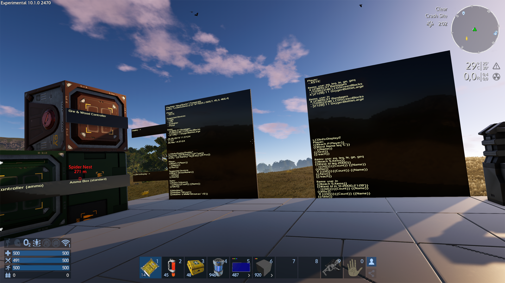
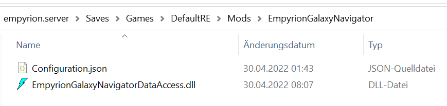

# Empyrion Scripting

[English version below](#-english-version) | [Workshop Demo](https://steamcommunity.com/workshop/filedetails/?id=1751409371) | [Releases](https://github.com/GitHub-TC/EmpyrionScripting/releases)



---

# 🇩🇪 Deutsch

## Inhaltsverzeichnis

- [Was ist EmpyrionScripting?](#was-ist-empyrionscripting)
- [🚀 Quickstart: Dein erstes Script in 5 Minuten](#-quickstart-dein-erstes-script-in-5-minuten)
- [Installation](#installation)
- [Grundkonzepte](#grundkonzepte)
- [Sprache & Zeitzone](#sprache--zeitzone)
- [Inventar & Container](#inventar--container)
- [Items filtern & suchen](#items-filtern--suchen)
- [Bedingungen & Logik](#bedingungen--logik)
- [Anzeige-Features](#anzeige-features)
- [Berechnungen](#berechnungen)
- [Automatisierung: Verschieben & Befüllen](#automatisierung-verschieben--befüllen)
- [Lichter steuern](#lichter-steuern)
- [Geräte steuern](#geräte-steuern)
- [Signale](#signale)
- [Teleporter-Steuerung](#teleporter-steuerung)
- [Chat & Teleport](#chat--teleport)
- [Dialoge](#dialoge)
- [JSON & Datenstrukturen](#json--datenstrukturen)
- [Fliegen](#fliegen)
- [Datenbankzugriff](#datenbankzugriff)
- [Externe Daten (AddOn DLLs)](#externe-daten-addon-dlls)
- [SaveGame-Scripte](#savegame-scripte)
- [Elevated Scripte](#elevated-scripte)
- [Script-Priorisierung](#script-priorisierung)
- [C# Scripting Interface](#c-scripting-interface)
- [Konfiguration & Performance](#konfiguration--performance)
- [Vordefinierte ID-Listen](#vordefinierte-id-listen)
- [Erz- und Barren-IDs](#erz--und-barren-ids)

---

## Was ist EmpyrionScripting?

EmpyrionScripting ist eine Mod für **Empyrion: Galactic Survival**, die es ermöglicht, Echtzeit-Spielinformationen dynamisch auf LCD-Bildschirmen in Schiffen und Basen anzuzeigen. Das System nutzt die [Handlebars](http://handlebarsjs.com/)-Template-Sprache.

**Was ist möglich?**

- 📦 Inventar aller Container live anzeigen
- ⚠️ Warnungen anzeigen wenn Ressourcen ausgehen
- 💡 Lichter automatisch ein-/ausschalten
- 🔄 Items zwischen Containern automatisch verschieben
- ⛽ Treibstoff- und O2-Tanks automatisch befüllen
- 📡 Signale auslösen und überwachen
- 💬 Chat-Nachrichten senden
- 🤖 Autonomes Fliegen (ohne Pilot)
- Und vieles mehr…

**Tutorials & Videos:**

| Link | Beschreibung |
|------|-------------|
| [YouTube (Olly)](https://youtu.be/8nEpEygHBu8) | Einführungsvideo |
| [YouTube](https://youtu.be/8MzjdeYlzPU) | Tutorial 2 |
| [YouTube](https://youtu.be/gPp5CGJusr4) | Tutorial 3 |
| [YouTube (A11)](https://youtu.be/hxvKs5U1I6I) | Änderungen in A11 |
| [YouTube](https://youtu.be/V1w2A3LAZCs) | Tutorial 5 |
| [YouTube](https://youtu.be/O89NQJjbQuw) | Tutorial 6 |
| [YouTube](https://youtu.be/IbVuzFf_ywI) | Tutorial 7 |
| [Workshop Sephrajin](https://steamcommunity.com/sharedfiles/filedetails/?id=2863240303) | DSEV LCD Script Tutorial |
| [Workshop Noob](https://steamcommunity.com/sharedfiles/filedetails/?id=2817433272) | Scripting Tutorial Ship |
| [Workshop ASTIC](https://steamcommunity.com/sharedfiles/filedetails/?id=2227639387) | Vega AI Beispielschiff |
| [Beginners Guide](https://steamcommunity.com/workshop/filedetails/discussion/1751409371/3191368095147121750/) | Einsteiger-Anleitung (englisch) |

---

## 🚀 Quickstart: Dein erstes Script in 5 Minuten

### Schritt 1: Mod installieren

1. [EmpyrionScripting.zip](https://github.com/GitHub-TC/EmpyrionScripting/releases) herunterladen
2. ZIP in das Verzeichnis `[Empyrion]\Content\Mods\` entpacken
3. **Wichtig für Singleplayer:** Das Spiel **ohne EAC** starten (im Steam-Launcher „Start without EAC" wählen)
   - ⚠️ **Custom Scenario (z.B. ReforgedEden):** Bei Verwendung eines benutzerdefinierten     Szenarios muss in der Konfigurationsdatei `[SaveGame]\Mods\EmpyrionScripting\Configuration.json` der Pfad zum Szenario angegeben werden:
> ```json
> "OverrideScenarioPath": "[Steam]\\steamapps\\workshop\\content\\383120\\3143225812"
> ```

### Schritt 2: LCD-Bildschirme vorbereiten

Du benötigst **mindestens 2 LCD-Bildschirme** auf deinem Schiff oder deiner Basis:

| LCD | Name im Control Panel | Zweck |
|-----|----------------------|-------|
| **Script-LCD** (Eingabe) | Muss mit `Script:` beginnen, z.B. `Script:MeinScript` | Enthält den Script-Code |
| **Ausgabe-LCD** (Anzeige) | Beliebiger eindeutiger Name, z.B. `LCD Inventar` | Zeigt das Ergebnis an |

> 💡 **Tipp:** Das Script-LCD kann unsichtbar gemacht werden (Schriftfarbe auf transparent setzen). Es muss nicht sichtbar sein.

### Schritt 3: Script schreiben

Öffne das **Script-LCD** (Rechtsklick → Manage → Text) und gib ein:

```
Targets:LCD Inventar
=== Mein Inventar ===
{{#items E.S 'Mein Container'}}
{{Count}}x {{i18n Key}}
{{/items}}
```

| Element | Bedeutung |
|---------|-----------|
| `Targets:LCD Inventar` | Ergebnis wird auf dem LCD „LCD Inventar" angezeigt |
| `{{#items E.S 'Mein Container'}}` | Liest Inhalt des Containers „Mein Container" |
| `{{Count}}x {{i18n Key}}` | Gibt Anzahl und lokalisierten Item-Namen aus |
| `{{/items}}` | Ende des Blocks |

### Schritt 4: Container benennen

Klicke auf den Container im Control Panel und gib ihm den exakten Namen `Mein Container`.

### Schritt 5: Fertig!

Das Ausgabe-LCD „LCD Inventar" zeigt nun automatisch den Inhalt des Containers und aktualisiert sich periodisch.

### Häufige Anfängerfehler

| Problem | Lösung |
|---------|--------|
| LCD zeigt nichts | Script-LCD-Name muss mit `Script:` beginnen |
| Container nicht gefunden | Name muss **exakt** übereinstimmen (Groß-/Kleinschreibung!) |
| Kein Update | Struktur braucht Strom und muss eingeschaltet sein |
| Alter Inhalt | Script-LCD muss eingeschaltet sein (oder Priorität ≥ 1 verwenden) |

### Komplettbeispiel: Erz-Inventar auf einer Basis

**Vorbereitung:**
- Container benennen: `Erzlager`
- Script-LCD benennen: `Script:ErzAnzeige`
- Ausgabe-LCD benennen: `LCD Erze`

**Script-Inhalt (ins Script-LCD):**

```
Targets:LCD Erze
=== Erze im Lager ===
{{#items E.S 'Erzlager'}}
{{Count}}x {{i18n Key}}
{{/items}}
```

---

## Installation

### Multiplayer / Dedicated Server

1. [EmpyrionScripting.zip](https://github.com/GitHub-TC/EmpyrionScripting/releases) herunterladen
2. ZIP in das Verzeichnis `[Empyrion]\Content\Mods\` entpacken

### Singleplayer

1. [EmpyrionScripting.zip](https://github.com/GitHub-TC/EmpyrionScripting/releases) herunterladen
2. ZIP in das Verzeichnis `[Empyrion]\Content\Mods\` entpacken
3. Spiel **ohne EAC** starten (Steam-Launcher)

> ⚠️ **Custom Scenario (z.B. ReforgedEden):** Bei Verwendung eines benutzerdefinierten Szenarios muss in der Konfigurationsdatei `[SaveGame]\Mods\EmpyrionScripting\Configuration.json` der Pfad zum Szenario angegeben werden:
> ```json
> "OverrideScenarioPath": "[Steam]\\steamapps\\workshop\\content\\383120\\3143225812"
> ```

---

## Grundkonzepte

### Script-LCD und Ausgabe-LCD

Das System trennt Logik (Script-LCD) und Anzeige (Ausgabe-LCD):

- **Script-LCD:** Name beginnt zwingend mit `Script:`. Enthält den Handlebars-Template-Code.
- **Ausgabe-LCD:** Beliebiger Name. Wird in `Targets:` referenziert.

```
Script-LCD Name:    Script:TankStatus
Ausgabe-LCD Name:   LCD Tanks
```

### Targets: – Ausgabeziele festlegen

Die erste Zeile eines Scripts definiert die Ausgabe-LCDs:

```
Targets:LCD Ausgabe               ← Ein einzelnes LCD
Targets:LCD Eins;LCD Zwei         ← Mehrere LCDs (durch ; getrennt)
Targets:LCD Ausgabe*              ← Alle LCDs, deren Name mit "LCD Ausgabe" beginnt (Wildcard *)
Script:LCD Ausgabe*               ← Zielname wird direkt aus dem Script-LCD-Namen entnommen
```

> 💡 **Kurzform ohne `Targets:`-Zeile:** Wenn das Script-LCD selbst den Namen `Script:Targetpattern` trägt, wird der Teil nach `Script:` automatisch als Zielpattern verwendet – eine separate `Targets:`-Zeile ist dann nicht nötig. Wildcards (`*`) werden dabei vollständig unterstützt, sodass z.B. ein Script-LCD namens `Script:Anzeige*` alle LCDs adressiert, deren Name mit `Anzeige` beginnt.

### Wichtige Kontext-Variablen

| Variable | Beschreibung |
|----------|-------------|
| `E.S` | Die aktuelle Struktur (Schiff/Basis), auf der das Script läuft |
| `E.S.Items` | Alle Items aller Container der aktuellen Struktur |
| `E.S.Pilot` | Der aktuelle Pilot der Struktur |
| `E.Faction` | Die Fraktion der Struktur |
| `P.Players` | Alle Spieler die gerade auf der Struktur aktiv sind |
| `@root` | Zugriff auf den Root-Kontext (z.B. `@root.Ids.Ore`) |

### Handlebars-Syntax Grundlagen

EmpyrionScripting nutzt [Handlebars.Net](https://github.com/rexm/Handlebars.Net):

| Syntax | Bedeutung |
|--------|-----------| 
| `{{Variable}}` | Gibt den Wert einer Variable aus |
| `{{#block}}...{{/block}}` | Block-Helper (Schleife oder Bedingung) |
| `{{#block}}...{{else}}...{{/block}}` | Block mit Alternativ-Zweig |
| `{{helper arg1 arg2}}` | Helper mit Parametern |
| `@root.Data.key` | Auf gespeicherte Daten zugreifen |

---

## Sprache & Zeitzone

Erstelle ein LCD mit dem Namen **`CultureInfo`** und gib folgenden JSON-Inhalt ein:

```json
{
  "LanguageTag": "de-DE",
  "i18nDefault": "Deutsch",
  "UTCplusTimezone": 1
}
```

| Parameter | Beschreibung | Beispiel |
|-----------|-------------|---------|
| `LanguageTag` | Sprachcode nach [LCID-Standard](https://docs.microsoft.com/en-us/openspecs/windows_protocols/ms-lcid/a9eac961-e77d-41a6-90a5-ce1a8b0cdb9c) | `"de-DE"`, `"en-US"` |
| `i18nDefault` | Standard-Sprache für Item-Namen | `"Deutsch"`, `"English"` |
| `UTCplusTimezone` | Zeitzone als UTC-Offset | `1` für MEZ, `2` für MESZ |

> Fehler bei der Konfiguration werden in einem LCD namens `CultureInfoDebug` angezeigt.

---

## Inventar & Container

### Container-Inhalt anzeigen: `items`

Zeigt Inhalt eines oder mehrerer Container an:

```
Targets:LCD Inventar
=== Container-Inhalt ===
{{#items E.S 'MeinContainer'}}
{{Count}}x {{i18n Key}}
{{/items}}
```

**Mehrere Container oder Wildcards:**

```
{{#items E.S 'Kiste1;Kiste2;Kühlschrank*'}}
{{Count}}x {{i18n Key}}
{{/items}}
```

### Alle Items der Struktur: `each E.S.Items`

```
Targets:LCD Alle Items
Alle Items auf dem Schiff:
{{#each E.S.Items}}
 - {{Count}}x {{i18n Key}} (ID: {{Id}})
{{/each}}
```

### Items abrufen und weiterverarbeiten: `getitems`

Gibt eine Liste zurück, die mit anderen Befehlen weiterverarbeitet werden kann:

```
{{#getitems E.S 'Lager1;Lager2'}}
{{Count}}x {{i18n Key}}
{{/getitems}}
```

---

## Items filtern & suchen

### Nach ID filtern: `itemlist`

Zeigt nur Items mit bestimmten IDs an. Nicht vorhandene Items erscheinen mit Anzahl 0:

```
Targets:LCD Erze
Meine Erze:
{{#itemlist E.S.Items '4297,4298,4299'}}
{{Count}}x {{i18n Key}}
{{/itemlist}}
```

**Mit vordefinierten Listen** (empfohlen):

```
Targets:LCD Alle Erze
{{#itemlist E.S.Items @root.Ids.Ore}}
{{Count}}x {{i18n Key}}
{{/itemlist}}
```

**Listen kombinieren mit `concat`:**

```
{{#itemlist E.S.Items (concat @root.Ids.WeaponSV @root.Ids.WeaponHV)}}
{{Count}}x {{i18n Key}}
{{/itemlist}}
```

### Items sortieren: `orderedeach`

```
Targets:LCD Inventar sortiert
{{#orderedeach E.S.Items '-Count'}}
{{Count}}x {{i18n Key}}
{{/orderedeach}}
```

> `-Count` = absteigend, `+Count` = aufsteigend. Mehrere Felder: `'-Count,+Key'`

### Items nach ID sortieren: `orderbylist`

```
{{#orderbylist E.S.Items '4297;4298;4299'}}
{{Count}}x {{i18n Key}}
{{/orderbylist}}
```

### Items als Array filtern: `itemlistarray`

`itemlistarray` verhält sich wie `itemlist`, übergibt aber das gefilterte Ergebnis als **Array** an den inneren Block — damit können weitere Verarbeitungen (z.B. mit `orderedeach`) darauf angewendet werden:

```
{{#itemlistarray E.S.Items '4297;4298;4299'}}
{{#orderedeach this '-Count'}}
{{Count}}x {{i18n Key}}
{{/orderedeach}}
{{/itemlistarray}}
```

> Unterschied zu `itemlist`: `itemlist` iteriert direkt über Items (Element für Element), `itemlistarray` liefert das gesamte Array auf einmal für weitere Verarbeitung.

---

## Bedingungen & Logik

### Vergleiche: `test`

```
{{#test Count geq 100}}
Mehr als 100 vorhanden!
{{else}}
Weniger als 100 vorhanden.
{{/test}}
```

| Operator | Bedeutung | Beispiel |
|----------|-----------|---------|
| `eq` oder `=` | Gleich | `{{#test Name eq 'IronOre'}}` |
| `neq` oder `!=` | Ungleich | `{{#test Count neq 0}}` |
| `leq` oder `<=` | Kleiner oder gleich | `{{#test Count leq 1000}}` |
| `le` oder `<` | Kleiner | `{{#test Count le 100}}` |
| `geq` oder `>=` | Größer oder gleich | `{{#test Count geq 500}}` |
| `ge` oder `>` | Größer | `{{#test TankFuel ge 50}}` |
| `in` | In einer Liste | `{{#test Id in '4297,4298'}}` |

**Bereichsprüfung mit `in`:**

```
{{#test Id in '4296-4302'}}
Erz-ID zwischen 4296 und 4302
{{/test}}
```

**Erze die weniger als 500 Stück vorhanden sind:**

```
Targets:LCD Warnung
Niedrige Bestände:
{{#itemlist E.S.Items @root.Ids.Ore}}
{{#test Count le 500}}
⚠️ {{Count}}x {{i18n Key}}
{{/test}}
{{/itemlist}}
```

**Leere Erze anzeigen:**

```
{{#itemlist E.S.Items @root.Ids.Ore}}
{{#test Count leq 0}}
❌ {{i18n Key}} – LEER!
{{/test}}
{{/itemlist}}
```

### `if` und `ok`

```
{{#if E.S.Pilot.Id}}
Pilot: {{E.S.Pilot.Name}}
{{else}}
Kein Pilot an Bord
{{/if}}
```

### Negation: `not`

```
{{#if (not E.S.Pilot.Id)}}
Kein Pilot an Bord
{{/if}}
```

### Reguläre Ausdrücke: `regex`

```
{{#regex Name 'Iron.*'}}
Gefunden: {{.}}
{{/regex}}
```

---

## Anzeige-Features

### Datum & Uhrzeit: `datetime`

```
Targets:LCD Zeit
Aktuelle Zeit:
{{datetime}}                        ← Datum und Uhrzeit (Standard)
{{datetime 'HH:mm'}}                ← Nur Uhrzeit (z.B. 14:30)
{{datetime 'dd.MM.yyyy'}}           ← Nur Datum (z.B. 24.12.2024)
{{datetime 'dd MMM HH:mm:ss'}}      ← Kombiniert (z.B. 24 Dez 14:30:00)
{{datetime 'HH:mm' '+2'}}           ← Mit +2 Stunden Offset
```

[DateTime Format-Strings Dokumentation](https://docs.microsoft.com/en-us/dotnet/api/system.datetime.tostring?view=netframework-4.8)

### Scrollen: `scroll`

Wenn zu viele Items gleichzeitig auf einem LCD nicht passen:

```
Targets:LCD Inventar
{{#scroll 8 3}}
{{#items E.S 'Grosses Lager'}}
{{Count}}x {{i18n Key}}
{{/items}}
{{/scroll}}
```

Parameter: `{{#scroll AnzahlZeilen VerzögerungSekunden [SchrittweiteZeilen]}}`

```
{{#scroll 5 2 2}}    ← 5 sichtbare Zeilen, 2 Sekunden Pause, 2 Zeilen pro Schritt
```

### Intervalle: `intervall`

Wechselt zwischen Inhalten in einem Zeitintervall (in Sekunden):

```
Targets:LCD Status
{{#intervall 5}}
Inhalt A (5 Sekunden)
{{else}}
Inhalt B (5 Sekunden)
{{/intervall}}
```

**Zwei Container abwechselnd anzeigen:**

```
Targets:LCD Kühlschränke
{{#intervall 3}}
Kühlschrank 1:
{{#items E.S 'Kühlschrank 1'}}
{{Count}}x {{i18n Key}}
{{/items}}
{{else}}
Kühlschrank 2:
{{#items E.S 'Kühlschrank 2'}}
{{Count}}x {{i18n Key}}
{{/items}}
{{/intervall}}
```

### Schriftfarbe: `color`

```
{{color 'ff0000'}}    ← Rot
{{color '00ff00'}}    ← Grün
{{color '0000ff'}}    ← Blau
{{color 'ffffff'}}    ← Weiß
{{color 'ffff00'}}    ← Gelb
```

### Hintergrundfarbe: `bgcolor`

```
{{bgcolor '000000'}}    ← Schwarz
{{bgcolor '1a1a1a'}}    ← Dunkelgrau
```

### Schriftgröße: `fontsize`

```
{{fontsize 8}}     ← Klein
{{fontsize 15}}    ← Mittel (Standard)
{{fontsize 25}}    ← Groß
```

### Fortschrittsbalken: `bar`

```
{{bar TankFuel 0 1000 20}}              ← Einfacher Balken (20 Zeichen breit)
{{bar TankFuel 0 1000 20 '█' '░'}}     ← Mit eigenen Füll-/Hintergrundzeichen
{{bar Count 0 500 15 '|' '-' 'r'}}     ← Rechtsbündig ('r')
```

### Praxisbeispiel: Blinkalarm bei niedrigem Treibstoff

```
Targets:LCD Alarm
{{#test TankFuel le 20}}
{{#intervall 1}}
{{color 'ff0000'}}⚠️ TREIBSTOFF KRITISCH!
{{else}}
{{color 'ffff00'}}⚠️ TREIBSTOFF KRITISCH!
{{/intervall}}
{{else}}
{{color '00ff00'}}✓ Treibstoff OK
{{/test}}
```

### Schrittweise Anzeige: `steps`

```
{{#steps 0 100 10 2}}
Fortschritt: {{this}}%
{{/steps}}
```

### Zufallswerte: `random`

```
{{#random 1 6}}
Würfelergebnis: {{this}}
{{/random}}
```

---

## Berechnungen

### Grundrechenarten: `math` und `calc`

`math` gibt das Ergebnis direkt aus. `calc` kann inline in anderen Ausdrücken verwendet werden:

```
{{math Count * 5}}                          ← Ausgabe: Ergebnis
{{math TankFuel / TankFuelMax 2}}           ← Division, 2 Nachkommastellen
{{bar (calc TankFuel / TankMax * 100) 0 100 20}}   ← calc inline
```

| Operator | Bedeutung |
|----------|-----------|
| `+` | Addition |
| `-` | Subtraktion |
| `*` | Multiplikation |
| `/` | Division |
| `%` | Modulo |

### Weitere Mathematik-Funktionen

```
{{min A B}}       ← Kleinerer Wert der beiden
{{max A B}}       ← Größerer Wert der beiden
{{abs Value}}     ← Absoluter Wert
{{int Value}}     ← Ganzzahliger Anteil (Abrunden)
```

### Distanz: `distance`

```
{{distance PosA PosB}}            ← Distanz zwischen zwei Vektoren
{{distance PosA PosB '0.0'}}      ← Mit Formatstring (eine Nachkommastelle)
```

### Vektoren: `vector`

```
{{#use (vector 100 200 300)}}
Mein Vektor: {{X}} / {{Y}} / {{Z}}
{{/use}}
```

### Spielzeit: `gameticks`

```
Spielzeit: {{gameticks}} Ticks
= {{math gameticks / 20 0}} Sekunden
= {{math gameticks / 1200 1}} Minuten
```

---

## Automatisierung: Verschieben & Befüllen

### Items verschieben: `move`

Verschiebt Items von einem Container in einen anderen (innerhalb oder zwischen Strukturen):

```
{{move Item E.S 'Ziellager'}}
{{move Item E.S 'Ziellager' 500}}    ← Maximal 500 im Zielcontainer lassen
```

### Tanks befüllen: `fill`

Füllt Treibstoff-, O2- oder Pentaxid-Tanks auf:

```
{{fill Item E.S 'FuelTank'}}        ← Auf 100% auffüllen
{{fill Item E.S 'FuelTank' 80}}     ← Maximal auf 80% auffüllen
```

**Praxisbeispiel: Automatische Treibstoff-Auffüllung**

```
Targets:LCD Tankstatus
=== Tankstatus ===
{{#items E.S 'Versorgungscontainer'}}
{{#test Key eq 'EnergyCell'}}
{{fill this E.S 'Haupttank'}}
Treibstoff wird nachgefüllt…
{{/test}}
{{/items}}
```

### Struktur abbauen: `deconstruct`

Baut eine Struktur ab und befördert die Teile in einen Container:

```
{{deconstruct Entity 'Schrottlager'}}
```

> ⚠️ Der Kern der Struktur muss `Core-Destruct-[ID]` heißen (ID = Entity-ID der Struktur).  
> Kosten: Standard 100 Geldkarten pro 10 Blöcke (`DeconstructSalary` in Configuration.json).

### Recycling: `recycle`

Wie `deconstruct`, gibt aber Rohstoffe laut Rezepten zurück:

```
{{recycle Entity 'Recyclinglager'}}
```

> ⚠️ Kern muss `Core-Recycle-[ID]` heißen. Kosten: Standard 200 Geldkarten pro 10 Blöcke.

### Container leeren: `trashcontainer`

Löscht **unwiderruflich** alle Items in einem Container:

```
{{trashcontainer E.S 'Müll'}}
```

> ⚠️ Keine Wildcards erlaubt. Exakter Container-Name erforderlich!

### Pflanzen ernten: `harvest`

```
{{harvest E.S Device gx gy gz}}
{{harvest E.S Device gx gy gz true}}    ← true = tote Pflanzen ebenfalls entfernen
```

> Benötigt einen Gärtner-NPC (Crew) und Geld im Kühlschrank als Bezahlung.

### Pflanzen aufnehmen & wieder einpflanzen

```
{{pickupplants E.S Device gx gy gz}}      ← Pflanzen aufnehmen
{{replantplants E.S Target}}              ← Wieder einpflanzen (nur ohne Playfield-Wechsel!)
```

---

## Lichter steuern

### Lichter auswählen: `lights`

```
{{#lights E.S 'AlarmLicht*'}}
  {{lightcolor this 'ff0000'}}
{{/lights}}
```

### Licht-Einstellungen im Überblick

| Befehl | Beschreibung |
|--------|-------------|
| `{{lightcolor light 'ff0000'}}` | Farbe setzen (RGB Hex) |
| `{{lightblink light 1 0.5 0}}` | Blinken: Intervall(s), Länge(s), Offset(s) |
| `{{lightintensity light 1.5}}` | Helligkeit setzen |
| `{{lightrange light 10}}` | Reichweite setzen |
| `{{lightspotangle light 45}}` | Spotwinkel setzen |
| `{{lighttype light 'Spot'}}` | Typ: `Spot`, `Directional`, `Point`, `Area`, `Rectangle`, `Disc` |

### Praxisbeispiel: Alarm-Beleuchtung

```
Targets:LCD LichtStatus
{{#test TankFuel le 100}}
{{#lights E.S 'AlarmLicht*'}}
{{lightcolor this 'ff0000'}}
{{lightblink this 1 0.5 0}}
{{/lights}}
⚠️ Treibstoff niedrig!
{{else}}
{{#lights E.S 'AlarmLicht*'}}
{{lightcolor this '00ff00'}}
{{lightblink this 0 0 0}}
{{/lights}}
✓ Alles OK
{{/test}}
```

---

## Geräte steuern

### Geräte nach Namen auswählen: `devices`

```
{{#devices E.S 'Generator*'}}
{{setactive this true}}
{{/devices}}
```

### Geräte nach Typ: `devicesoftype`

```
{{#devicesoftype E.S 'Generator'}}
{{setactive this false}}
{{/devicesoftype}}
```

### Gerät ein-/ausschalten: `setactive`

```
{{setactive Device true}}     ← Einschalten
{{setactive Device false}}    ← Ausschalten
```

### Gerät gesperrt prüfen: `islocked`

```
{{#islocked E.S 'MeinContainer'}}
Container ist gesperrt
{{else}}
Container ist frei
{{/islocked}}
```

---

## Signale

### Alle Signale einer Struktur: `signals`

```
{{#signals E.S 'Signal*'}}
Signal: {{Name}} — Status: {{State}}
{{/signals}}
```

Gibt alle Signale (ControlPanel + Block-Signale) zurück, die dem Namensmuster entsprechen. Jedes Signal hat die Eigenschaften `Name`, `State`, `Index` und `BlockPos`.

### Signalstatus lesen: `getsignal`

```
Signal Status: {{getsignal E.S 'MeinSignal'}}
```

### Schalter lesen/setzen

```
Schalter: {{getswitch E.S 'MeinSchalter'}}
Alle passenden: {{getswitches E.S 'Schalter*'}}
{{setswitch E.S 'MeinSchalter' true}}
{{setswitch E.S 'MeinSchalter' false}}
```

### Signal-Events abfragen: `signalevents`

```
{{#signalevents 'Signal1;Signal2'}}
Signal ausgelöst von: {{Player.Name}} um {{Time}}
{{/signalevents}}
```

### Trigger wenn Signal wechselt: `triggerifsignalgoes`

```
{{#triggerifsignalgoes 'Türsensor' true}}
Tür wurde geöffnet von {{Name}}!
{{/triggerifsignalgoes}}
```

### Stoppuhr: `stopwatch`

```
Targets:LCD Rennzeit
{{#stopwatch 'RennStart' 'RennZiel' 'Reset'}}
Letzte Zeit: {{.}}
{{/stopwatch}}
```

---

## Teleporter-Steuerung

Teleporter-Geräte können per Script ausgelesen und konfiguriert werden.

> ⚠️ Alle `set*`-Teleporter-Befehle sind nur in **Elevated Scripts** erlaubt!

### Teleporter auflisten: `teleporters`

```
{{#teleporters E.S 'Teleporter*'}}
Name: {{DeviceName}}
Ziel: {{Destination}}
Playfield: {{Playfield}}
{{/teleporters}}
```

Jedes Teleporter-Objekt hat folgende Eigenschaften aus `ITeleporterData`:

| Eigenschaft | Beschreibung |
|-------------|-------------|
| `DeviceName` | Name des Teleporter-Geräts |
| `Destination` | Zielname |
| `Target` | Ziel-Entity-Name |
| `Playfield` | Ziel-Playfield |
| `SolarSystemName` | Ziel-Sonnensystem |
| `Origin` | Herkunfts-Byte |

### Teleporter konfigurieren (nur Elevated)

```
{{setteleporter E.S 'Teleporter1' 'ZielName'}}
{{setteleporterdevicename E.S 'Teleporter1' 'NeuerGeräteName'}}
{{setteleportertarget E.S 'Teleporter1' 'ZielEntity'}}
{{setteleporterplayfield E.S 'Teleporter1' 'Akua'}}
{{setteleporterorigin E.S 'Teleporter1' 3}}
```

| Befehl | Argumente | Beschreibung |
|--------|-----------|-------------|
| `setteleporter` | structure name destination | Teleporter-Ziel setzen |
| `setteleporterdevicename` | structure name devicename | Gerätename ändern |
| `setteleportertarget` | structure name target | Ziel-Entity setzen |
| `setteleporterplayfield` | structure name playfield | Ziel-Playfield setzen |
| `setteleporterorigin` | structure name origin | Origin-Byte setzen |

---

## Chat & Teleport

### Chat-Nachricht an Strukturbesitzer

```
{{chat 'Server' 'Dein Treibstoff ist fast leer!'}}
```

### Chat bei Signal: `chatbysignal`

```
{{#chatbysignal 'EintrittsSensor' 'Basis'}}
Willkommen auf unserer Basis, {{Name}}!
{{/chatbysignal}}
```

### Admin-Chat (nur Elevated/Admin-Scripte)

```
{{chatglobal 'Servermeldung' 'Wartung in 10 Minuten!'}}
{{chatserver 'System' 'Server läuft normal'}}
{{chatplayer PlayerId 'System' 'Private Nachricht'}}
{{chatfaction FactionId 'System' 'Fraktionsmeldung'}}
```

### Spieler teleportieren: `teleportplayer`

```
{{teleportplayer Player 'TeleportPad'}}             ← Zu einem Device auf der Struktur
```

> `x y z` Weltkoordinaten sind nur in Elevated Scripts erlaubt.

---

## Dialoge

### Einfacher Dialog: `dialog`

```
{{#dialog Player 'Titel' 'Nachricht'}}
OK|Abbrechen
{{/dialog}}
```

### Dialog als Block: `dialogbox`

```
{{#dialogbox 'TürSignal'}}
Bitte wählen:
Möchtest du eintreten?
Ja|Nein|Abbrechen
{{/dialogbox}}
```

Die erste Zeile des `{{else}}`-Blocks = Titel, letzte Zeile = Schaltflächen, Zeilen dazwischen = Text.

---

## JSON & Datenstrukturen

```
{{#use (fromjson '{"name":"Test","value":42}')}}
Name: {{name}}, Wert: {{value}}
{{/use}}

{{tojson SomeObject}}         ← Objekt als JSON-String ausgeben
{{jsontodictionary jsonStr}}  ← JSON in Dictionary umwandeln
```

### Daten zwischenspeichern

```
{{set 'meinKey' SomeData}}                ← Temporär (aktueller Script-Durchlauf)
{{#use @root.Data.meinKey}}...{{/use}}    ← Abrufen

{{setcache 'meinKey' SomeData}}           ← Persistiert zwischen Aufrufen
{{#use @root.CacheData.meinKey}}...       ← Abrufen
```

**Block-Inhalt als Datenwert speichern:**

```
{{#setblock 'meinKey'}}
Berechneter Inhalt: {{math TankFuel / TankFuelMax * 100 1}}%
{{/setblock}}
{{#use @root.Data.meinKey}}...{{/use}}

{{#setcacheblock 'meinKey'}}
{{i18n Key}}
{{/setcacheblock}}
{{#use @root.CacheData.meinKey}}...{{/use}}
```

`setblock` und `setcacheblock` sind wie `set`/`setcache`, speichern aber den **gerenderten Inhalt** des inneren Blocks statt eines übergbenen Werts.

### Arrays und Dictionaries

```
{{#use (createarray)}}
{{set this 'Wert1'}}
{{set this 'Wert2'}}
Erster Wert: {{lookup this 0}}
{{/use}}

{{#use (createdictionary)}}
{{set this 'schlüssel' 'wert'}}
{{/use}}

{{concatarrays Array1 Array2}}    ← Arrays kombinieren
{{loop Array}}...{{/loop}}        ← Über Array/Dictionary iterieren
```

### Array-Eintrag abrufen: `lookupblock`

`lookupblock` ist wie `lookup`, übergibt aber den Eintrag als Objekt in einen Template-Block:

```
{{#use (createarray)}}
{{set this 'Alpha'}}
{{set this 'Beta'}}
{{#lookupblock this 0}}
Erster Eintrag: {{.}}
{{/lookupblock}}
{{/use}}
```

---

## Fliegen

> ⚠️ Funktioniert nur, wenn **kein Pilot** das Schiff steuert und die **Triebwerke eingeschaltet** sind.

```
{{moveto 1000 200 -500}}    ← Zur Weltposition (X Y Z) fliegen
{{moveforward 10}}          ← Mit Geschwindigkeit 10 vorwärts fliegen
{{movestop}}                ← Stoppen
```

---

## Datenbankzugriff

Zugriff auf die `global.db` SQLite-Datenbank des Savegames:

```
{{#db 'Entities' 5 '+name'}}
{{name}} ({{entityid}})
{{/db}}
```

**Syntax:** `{{#db QueryName [Top] [OrderBy] [AdditionalWhereAnd] [Parameter]}}`

**Vordefinierte Abfragen:**

| Query | Inhalt |
|-------|--------|
| `Entities` | Eigene Strukturen |
| `DiscoveredPOIs` | Entdeckte POIs |
| `TerrainPlaceables` | Platzierte Terrain-Objekte |
| `TerrainPlaceablesRes` | Terrain-Objekte mit Ressourcen |
| `Playfields` | Bekannte Playfields |
| `PlayfieldResources` | Ressourcen auf Playfields |
| `PlayerData` | Spieler-Daten |
| `Bookmarks` | Lesezeichen |

**Standard-Parameter in Queries:**

| Parameter | Wert |
|-----------|------|
| `@PlayerId` | ID des Piloten |
| `@FactionId` | Fraktions-ID |
| `@FactionGroup` | Fraktionsgruppe (int) |
| `@EntityId` | Struktur-ID |

Zum Erkunden der `global.db` empfiehlt sich der [SQLiteBrowser](https://sqlitebrowser.org/).

### Eigene Queries

In der Konfigurationsdatei können eigene SQL-Queries definiert werden. Beispiel:

```sql
SELECT * FROM Structures 
JOIN Entities ON Structures.entityid = Entities.entityid
JOIN Playfields ON Entities.pfid = Playfields.pfid
JOIN SolarSystems ON SolarSystems.ssid = Playfields.ssid
WHERE (isremoved = 0 AND facid = @FactionId) {additionalWhereAnd}
```

---

## Externe Daten (AddOn DLLs)

Externe Daten aus anderen Mods oder DLLs abrufen:

```
{{#external 'MaxWarp'}}
Maximale Sprungreichweite: {{.}}
{{/external}}
```

### DLL bereitstellen

Die DLL muss das `IMod`-Interface mit einem `ScriptExternalDataAccess`-Property implementieren:

```csharp
public class ExternalDataAccess : IMod
{
    public IDictionary<string, Func<IEntity, object[], object>> ScriptExternalDataAccess { get; }

    public ExternalDataAccess()
    {
        ScriptExternalDataAccess = new Dictionary<string, Func<IEntity, object[], object>>()
        {
            ["Navigation"] = (entity, args) => entity?.Structure?.Pilot?.Id > 0 ? Navigation(entity) : null,
            ["MaxWarp"   ] = (entity, args) => entity?.Structure?.Pilot?.Id > 0 ? (object)MaxWarp(entity) : null,
        };
    }
}
```

DLL-Pfad in der Konfigurationsdatei registrieren (Basispfad = Mod-Verzeichnis im Savegame):

```json
"AddOnAssemblies": [
    "..\\EmpyrionGalaxyNavigator\\EmpyrionGalaxyNavigatorDataAccess.dll"
]
```



---

## SaveGame-Scripte

Scripte können direkt im SaveGame-Verzeichnis hinterlegt werden:

`[SaveGame]\Mods\EmpyrionScripting\Scripts\`

Dieser Pfad ist über `@root.MainScriptPath` abrufbar.

**Script-Auflösung nach Priorität:**

1. `EntityId` (z.B. `12345.hbs`)
2. `PlayfieldName\EntityName` (z.B. `Akua\MeinSchiff.hbs`)
3. `PlayfieldName\EntityType` (z.B. `Akua\CV.hbs`)
4. `EntityName` (z.B. `MeinSchiff.hbs`)
5. `EntityType` (z.B. `BA.hbs`)
6. `PlayfieldName` (z.B. `Akua.hbs`)
7. Direkt im Verzeichnis

> EntityType: `BA` (Base), `CV` (Capital Vessel), `SV` (Small Vessel), `HV` (Hover Vessel)

### Datei-Operationen (nur SaveGame-Scripte)

```
{{#readfile @root.MainScriptPath 'config.txt'}}
Zeile 1: {{lookup this 0}}
{{else}}
Datei nicht gefunden
{{/readfile}}

{{#writefile @root.MainScriptPath 'ausgabe.txt'}}
Inhalt der Datei
{{/writefile}}

{{#fileexists @root.MainScriptPath 'config.txt'}}
Datei existiert!
{{/fileexists}}

{{#filelist @root.MainScriptPath '*.hbs' true}}
{{this}}
{{/filelist}}
```

### Nachricht an Spieler senden: `sendmessagetoplayer`

Sendet eine Server-Chatnachricht direkt an einen einzelnen Spieler (nur SaveGame-Scripte):

```
{{#sendmessagetoplayer PlayerId}}
Hallo, dein Schiff ist in einer Gefahrenzone!
{{/sendmessagetoplayer}}
```

Der innere Block wird als Nachrichtentext gerendert. `PlayerId` ist die numerische Entity-ID des Spielers.

### Block-Eigenschaften ändern (nur SaveGame-Scripte)

```
{{setdamage Block 100}}     ← Schaden eines Blocks auf 100 setzen
{{settype Block 4297}}      ← Block-Typ-ID ändern
```

---

## Elevated Scripte

Erweiterte Berechtigungen für Scripte in SaveGame-Verzeichnissen oder auf Admin-Strukturen:

```
{{lockdevice E.S 'MeinContainer'}}
{{additems Container 4297 100}}        ← 100x IronOre hinzufügen
{{removeitems Container 4297 50}}      ← 50x IronOre entfernen
{{replaceblocks Entity '4297' 0}}      ← Block entfernen (0 = löschen)
{{settype Block TypeId}}               ← Block-Typ ändern (nur SaveGame)
{{setdamage Block 100}}                ← Schaden setzen (nur SaveGame)
```

---

## Script-Priorisierung

Wenn viele Scripte auf einer Struktur laufen, kann die Ausführungshäufigkeit gesteuert werden:

```
Script:MeinScript         ← Jeder Zyklus (nur wenn LCD eingeschaltet)
0Script:MeinScript        ← Wie oben
1Script:MeinScript        ← Jeder Zyklus (auch wenn LCD ausgeschaltet!)
3Script:MeinScript        ← Jeden 3. Zyklus
5Script:MeinScript        ← Jeden 5. Zyklus
```

**Ausführungsreihenfolge mit Prioritäten 1, 3, 4:**

```
Zyklus 1: Script(1), Script(3), Script(4) — alle laufen
Zyklus 2: Script(1)
Zyklus 3: Script(1), Script(3)
Zyklus 4: Script(1), Script(4)
Zyklus 5: Script(1)
Zyklus 6: Script(1), Script(3)
...
```

| Priorität | Ausführung | LCD muss eingeschaltet sein |
|-----------|-----------|--------------------------|
| 0 oder keine | Jeden Zyklus | **Ja** |
| 1–9 | Jeden N-ten Zyklus | **Nein** |

---

## Konfiguration & Performance

Konfigurationsdatei: `[SaveGame]\Mods\EmpyrionScripting\Configuration.json`

| Einstellung | Standard | Beschreibung |
|-------------|---------|-------------|
| `InGameScriptsIntervallMS` | 2000 | Scriptausführungsintervall in Millisekunden |
| `SaveGameScriptsIntervallMS` | 10000 | Intervall für SaveGame-Scripte (ms) |
| `ScriptsSyncExecution` | 2 | Scripte pro Zyklus (synchron im Spielthread) |
| `ScriptsParallelExecution` | 4 | Scripte pro Zyklus (parallel im Hintergrund) |
| `UseEveryNthGameUpdateCycle` | 10 | Nur jeden N-ten GameUpdate-Aufruf nutzen |
| `DeviceLockOnlyAllowedEveryXCycles` | 10 | DeviceLock-Scripte nur alle X Zyklen |
| `ProcessMaxBlocksPerCycle` | 200 | Maximale Blöcke pro Zyklus |
| `OverrideScenarioPath` | _(leer)_ | Pfad zum Szenario-Verzeichnis (erforderlich für Custom Scenarios im Singleplayer, z.B. ReforgedEden) |

> 💡 **Tipp:** Die Standardwerte sind sehr konservativ. Werte verdoppeln (und `SaveGameScriptsIntervallMS` halbieren) für flüssigere Script-Ausführung — kann jedoch zu Micro-Rucklern führen.

### Automatische Mengenanpassung (`EcfAmountTag`)

Für Treibstoff, O2 etc. kann die Menge automatisch aus der ECF-Konfiguration des Szenarios ermittelt werden:

```json
{
    "ItemName": "EnergyCellLarge",
    "Amount": 250,
    "EcfAmountTag": "FuelValue"
},
{
    "ItemName": "OxygenBottleLarge",
    "Amount": 250,
    "EcfAmountTag": "O2Value"
}
```

Automatische Ermittlung deaktivieren: `"EcfAmountTag": ""`

---

## Vordefinierte ID-Listen

Diese Listen können in Scripts über `@root.Ids.ListenName` verwendet werden.

Konfigurationspfad: `[SaveGame]\Mods\EmpyrionScripting\Configuration.json` (Abschnitt `"Ids"`)

> **Hinweis:** Abschnitt `"Ids"` aus der Configuration.json löschen, um Originalzustand wiederherzustellen.

**Verwendung in Scripts:**

```
{{#itemlist E.S.Items @root.Ids.Ore}}
{{Count}}x {{i18n Key}}
{{/itemlist}}

{{#itemlist E.S.Items (concat @root.Ids.WeaponSV @root.Ids.WeaponHV)}}
{{Count}}x {{i18n Key}}
{{/itemlist}}
```

| Liste | Inhalt |
|-------|--------|
| `Ore` | Alle Erze |
| `Ingot` | Alle Barren / Verarbeitete Erze |
| `Components` | Baukomponenten (Vanilla) |
| `EdenComponents` | Eden-Mod Komponenten |
| `Medic` | Medizinische Items |
| `Food` | Lebensmittel |
| `Ingredient` | Zutaten (alle) |
| `IngredientBasic` | Basis-Zutaten |
| `IngredientExtra` | Extra-Zutaten |
| `IngredientExtraMod` | Zusätzliche Mod-Zutaten |
| `Tools` | Werkzeuge |
| `Armor` | Rüstungen |
| `ArmorMod` | Rüstungsmodifikationen |
| `Sprout` | Setzlinge / Pflanzensamen |
| `BlockL` | Große Blöcke (CV/BA) |
| `BlockS` | Kleine Blöcke (SV/HV) |
| `DeviceL` | Geräte (CV/BA) |
| `DeviceS` | Geräte (SV/HV) |
| `WeaponPlayer` | Spieler-Waffen |
| `WeaponHV` | HV-Waffen |
| `WeaponSV` | SV-Waffen |
| `WeaponCV` | CV-Waffen |
| `WeaponBA` | BA-Waffen |
| `WeaponPlayerUpgrades` | Waffen-Upgrades |
| `WeaponPlayerEpic` | Epic-Waffen |
| `AmmoPlayer` | Spieler-Munition |
| `AmmoHV` | HV-Munition |
| `AmmoSV` | SV-Munition |
| `AmmoCV` | CV-Munition |
| `AmmoBA` | BA-Munition |
| `AmmoAllEnergy` | Alle Energie-Munition |
| `AmmoAllProjectile` | Alle Projektil-Munition |
| `AmmoAllRocket` | Alle Raketen |
| `Deco` | Dekorations-Blöcke |
| `DataPads` | Data Pads / Chips |
| `Oxygen` | Sauerstoffflaschen |
| `Fuel` | Treibstoffzellen |
| `Pentaxid` | Pentaxid-Kristalle |
| `OreFurnace` | Im Ofen schmelzbare Erze |
| `Deconstruct` | Für Dekonstruktion vorgesehene Blöcke |
| `Gardeners` | Gärtner-NPC |

**Für das Deconstruct-Script zu löschende Blöcke:**

```
"RemoveBlocks" = ",ContainerUltraRare,AlienContainer,AlienContainerRare,..."
```

Die Listen beginnen und enden mit einem Komma, damit sie mit `concat` kombiniert werden können:

```
(concat @root.Ids.WeaponHV @root.Ids.WeaponSV @root.Ids.WeaponCV)
(concat '1234,5568' @root.Ids.ArmorMod)
```

---

## Erz- und Barren-IDs

### Erze (`@root.Ids.Ore`)

| ID | Interner Name | Deutsch |
|----|--------------|---------|
| 4296 | MagnesiumOre | Magnesiumerz |
| 4297 | IronOre | Eisenerz |
| 4298 | CobaltOre | Kobalterz |
| 4299 | SiliconOre | Siliziumerz |
| 4300 | NeodymiumOre | Neodymiumerz |
| 4301 | CopperOre | Kupfererz |
| 4302 | PromethiumOre | Promethiumerz |
| 4317 | ErestrumOre | Erestrumerz |
| 4318 | ZascosiumOre | Zascosiumerz |
| 4332 | SathiumOre | Sathiumerz |
| 4341 | PentaxidOre | Pentaxiderz |
| 4345 | GoldOre | Golderz |
| 4359 | TitaniumOre | Titanerz |

### Barren (`@root.Ids.Ingot`)

| ID | Interner Name | Deutsch |
|----|--------------|---------|
| 4319 | MagnesiumPowder | Magnesiumpulver |
| 4320 | IronIngot | Eisenbarren |
| 4321 | CobaltIngot | Kobaltbarren |
| 4322 | SiliconIngot | Siliziumbarren |
| 4323 | NeodymiumIngot | Neodymiumbarren |
| 4324 | CopperIngot | Kupferbarren |
| 4325 | PromethiumPellets | Promethium-Pellets |
| 4326 | ErestrumIngot | Erestrumbarren |
| 4327 | ZascosiumIngot | Zascosiumbarren |
| 4328 | CrushedStone | Zerkleinerter Stein |
| 4329 | RockDust | Steinstaub |
| 4333 | SathiumIngot | Sathiumbarren |
| 4342 | PentaxidCrystal | Pentaxid-Kristalle |
| 4346 | GoldIngot | Goldbarren |
| 4360 | TitaniumRods | Titanstäbe |

---

## Technische Referenz

### Syntax-Dokumentation

- [Handlebars.js Guide](http://handlebarsjs.com/guide/)
- [Handlebars Cookbook](https://zordius.github.io/HandlebarsCookbook/index.html)
- [Handlebars.Net](https://github.com/rexm/Handlebars.Net)

### Item-Eigenschaften

| Eigenschaft | Beschreibung |
|-------------|-------------|
| `Id` | Eindeutige ID (Token: `TokenId * 100000 + ItemId`) |
| `IsToken` | `true` wenn Token |
| `ItemId` | Token-unabhängiger Teil der ID |
| `TokenId` | Token-ID (falls zutreffend) |
| `Count` | Anzahl |
| `Key` | Interner Item-Name |
| `Name` | Anzeigename |

### String-Funktionen

| Funktion | Beschreibung |
|----------|-------------|
| `{{concat a b c}}` | Werte zusammenfügen |
| `{{substring text 0 10}}` | Teilstring ab Index 0, max. 10 Zeichen |
| `{{replace text 'alt' 'neu'}}` | Text ersetzen |
| `{{split text ',' true}}` | Text aufteilen, leere Einträge entfernen |
| `{{trim text}}` | Leerzeichen/Zeichen am Rand entfernen |
| `{{startswith text 'abc'}}` | Beginnt mit 'abc'? |
| `{{endsswith text 'xyz'}}` | Endet mit 'xyz'? (Hinweis: doppeltes 's' ist korrekt) |
| `{{chararray text}}` | Text als Zeichen-Array |
| `{{selectlines text 0 5}}` | Zeilen 0–5 aus Text |
| `{{format data '0.00'}}` | Formatierte Ausgabe |
| `{{i18n Key 'English'}}` | Item-Name in Sprache |

### Positions-Funktionen

```
{{structtoglobalpos E.S (vector 10 0 5)}}    ← Strukturposition → Weltkoordinaten
{{globaltostructpos E.S GlobalPos}}           ← Weltkoordinaten → Strukturposition
```

### Block-/Textur-Funktionen

```
{{#use (block E.S 10 0 5)}}
  Block an Position 10/0/5: {{Type}}
{{/use}}

{{gettexture Block 'T'}}             ← Textur der Oberseite lesen (T=Top, B=Bottom, N/S/W/E)
{{settexture Block 123 'T,B'}}       ← Textur von Ober- und Unterseite setzen
{{getcolor Block 'T'}}               ← Farb-ID der Oberseite lesen
{{setcolor Block 5 'N,S'}}           ← Farbe von Nord- und Südseite setzen

{{setlockcode Block 1234}}           ← Sperr-Code eines Containers/Geräts setzen

{{#blocks E.S 0 0 0 10 10 10}}       ← Alle Blöcke im Bereich (0,0,0) bis (10,10,10)
{{/blocks}}
```

### LCD direkt steuern

```
{{#devices E.S 'AnzeigePanel'}}
{{settext this 'Hallo Welt!'}}
{{setcolor this 'ff0000'}}
{{setbgcolor this '000000'}}
{{setfontsize this 20}}
{{/devices}}

{{gettext LcdDevice}}                ← Text eines LCD lesen
{{settext LcdDevice 'Text'}}         ← Text setzen
{{settextblock LcdDevice}}           ← Text aus innenliegendem Block setzen
{{setcolor LcdDevice 'ff0000'}}      ← Textfarbe setzen (RGB Hex)
{{setbgcolor LcdDevice '000000'}}    ← Hintergrundfarbe setzen (RGB Hex)
{{setfontsize LcdDevice 20}}         ← Schriftgröße des LCD-Geräts direkt setzen
```

### Item-ID Konvertierung

```
{{#toid 'IronOre;CobaltOre'}}         ← Namen → IDs
...
{{/toid}}

{{#toname '4297;4298'}}               ← IDs → Namen
...
{{/toname}}

{{configid 'IronOre'}}                ← Konfigurations-ID für Item-Name
{{configattr 4297 'Mass'}}            ← Attribut für Item-ID
{{configattrbyname 'IronOre' 'Mass'}} ← Attribut für Item-Name
{{resourcesforid 4297}}               ← Rezept-Ressourcen für Item
```

---

***

## C# Scripting Interface

Neben Handlebars-Templates können Scripte auch in **C#** geschrieben werden. Dafür muss die Dateiendung `.cs` statt `.hbs` verwendet werden.

### Script-Typen

| Dateiendung | Sprache | Beschreibung |
|-------------|---------|-------------|
| `.hbs` | Handlebars-Template | Standard-Scripting |
| `.cs` | C# (Roslyn-kompiliert) | Vollständige C#-Logik |
| `.dll` | Kompilierte Assembly | Vorkompilierte DLL |

> 💡 **Vorteil von C#-Scripten:** Komplexe Logik, Schleifen, eigene Klassen, Typ-Sicherheit. **Nachteil:** Benötigt Grundkenntnisse in C#.

### C#-Script Grundstruktur

Ein C#-Script implementiert eine `Run`-Methode, die von der Mod aufgerufen wird:

```csharp
using EmpyrionScripting.Interface;

public class MyScript
{
    public static void Run(IScriptModData root)
    {
        var csRoot = root.CsRoot;

        // Alle Items im Container lesen
        var items = csRoot.Items(root.E.S, "MeinContainer");

        // Ausgabe auf LCD
        var output = new System.Text.StringBuilder();
        foreach (var item in items)
            output.AppendLine($"{item.Count}x {item.Name}");

        // Auf allen LCD-Panels mit passendem Namen anzeigen
        var displays = csRoot.Devices(root.E.S, "LCD*");
        foreach (var lcd in csRoot.GetDevices<Eleon.Modding.ILcd>(displays))
            lcd.SetText(output.ToString());
    }
}
```

### `IScriptModData` — Der Root-Context (`@root`)

Jedes C#-Script erhält ein `IScriptModData`-Objekt als Einstiegspunkt:

| Eigenschaft | Typ | Beschreibung |
|-------------|-----|-------------|
| `E` | `IEntityData` | Die aktuelle Entität (Schiff/Basis) |
| `P` | `IPlayfieldData` | Das aktuelle Playfield |
| `CsRoot` | `ICsScriptFunctions` | C#-Hilfsfunktionen (Äquivalent zu Handlebars-Helfern) |
| `Data` | `ConcurrentDictionary<string,object>` | Temporärer Datenspeicher (wie `{{set}}`) |
| `CacheData` | `ConcurrentDictionary<string,object>` | Persistenter Cache (wie `{{setcache}}`) |
| `Ids` | `Dictionary<string,string>` | Vordefinierte ID-Listen |
| `GameTicks` | `ulong` | Aktuelle Spielzeit in Ticks |
| `CycleCounter` | `int` | Script-Ausführungszähler |
| `IsElevatedScript` | `bool` | Ob das Script Elevated-Rechte hat |
| `ConfigEcfAccess` | `IConfigEcfAccess` | Zugriff auf ECF-Konfiguration |
| `GameOptionsYamlSettings` | `IDictionary<string,object>` | Spieloptionen aus YAML |
| `DateTimeNow` | `DateTime` | Aktuelle Datum/Uhrzeit |
| `Version` | `string` | Mod-Version |
| `Console` | `IConsoleMock` | Konsolenausgabe für Debugging |
| `SignalEventStore` | `IEventStore` | Signal-Event-Speicher |

### `IEntityData` — Entitäts-Daten (`root.E`)

| Eigenschaft | Beschreibung |
|-------------|-------------|
| `Id` | Entity-ID |
| `Name` | Name der Entität |
| `EntityType` | Typ (BA, CV, SV, HV, …) |
| `Faction` | Fraktionsdaten |
| `Pos` | Position im Weltkoordinatensystem |
| `Forward` | Vorwärtsvektor |
| `S` | `IStructureData` — Strukturdaten |
| `IsLocal` / `IsPoi` / `IsProxy` | Entitäts-Flags |
| `BelongsTo` | ID der übergeordneten Entität |
| `DockedTo` | ID der Dock-Zielstruktur |
| `ScriptInfos` | Informationen über laufende Scripte |
| `IsElevated` | Ob Elevated-Rechte vorhanden |

Methoden: `MoveForward(speed)`, `MoveTo(direction)`, `MoveStop()`, `GetCurrent()`, `GetCurrentPlayfield()`

### `IStructureData` — Strukturdaten (`root.E.S`)

| Eigenschaft | Beschreibung |
|-------------|-------------|
| `AllCustomDeviceNames` | Alle benutzerdefinierten Gerätenamen |
| `Items` | Alle Item-Stacks (alle Container) |
| `ControlPanelSignals` | Signale aus dem Control Panel |
| `BlockSignals` | Block-Signale |
| `Passengers` | Alle Passagiere |
| `Pilot` | Aktueller Pilot |
| `Players` | Alle Spieler auf der Struktur |
| `DockedE` | Angedockte Entitäten |
| `OxygenTank` / `FuelTank` / `PentaxidTank` | Tank-Wrapper |
| `DamageLevel` | Schadensgrad (0–1) |
| `IsPowerd` | Ist die Struktur mit Strom versorgt? |
| `IsReady` | Ist die Struktur bereit? |
| `IsShieldActive` / `ShieldLevel` | Schildstatus |
| `BlockCount` / `TriangleCount` / `LightCount` | Statistiken |
| `TotalMass` | Gesamtmasse |
| `HasLandClaimDevice` | Hat ein Land Claim Device? |
| `MinPos` / `MaxPos` | Begrenzungsquader |
| `SizeClass` | Größenklasse |
| `LastVisitedTicks` | Letzte Besucher-Zeit |
| `PlayerCreatedSteamId` | SteamID des Erstellers |

Methoden: `GlobalToStructPos(pos)`, `StructToGlobalPos(pos)`, `GetCurrent()`

### `IPlayerData` — Spieler-Daten

| Eigenschaft | Beschreibung |
|-------------|-------------|
| `Id` | Spieler-ID |
| `Name` | Spielername |
| `Health` / `HealthMax` | Gesundheit |
| `Oxygen` / `OxygenMax` | Sauerstoff |
| `Stamina` / `StaminaMax` | Ausdauer |
| `Food` / `FoodMax` | Nahrung |
| `BodyTemp` | Körpertemperatur |
| `Radiation` | Strahlungslevel |
| `Credits` | Guthaben |
| `ExperiencePoints` | Erfahrungspunkte |
| `Kills` / `Died` | Statistiken |
| `FactionData` / `FactionRole` | Fraktionsdaten |
| `Origin` | Herkunfts-Byte |
| `Bag` / `Toolbar` | Inventar (ItemStack-Liste) |
| `IsPilot` | Ist gerade Pilot? |
| `DrivingEntity` / `CurrentStructure` | Aktuelle Entität |
| `SteamId` / `SteamOwnerId` | Steam-IDs |
| `HomeBaseId` | Heimatbasis-ID |
| `Ping` | Ping in ms |
| `UpgradePoints` | Upgrade-Punkte |

Methoden: `Teleport(pos)`, `Teleport(playfieldName, pos, rot)`

### `ICsScriptFunctions` — C#-Hilfsfunktionen (`root.CsRoot`)

| Methode | Beschreibung |
|---------|-------------|
| `Items(structure, names)` | Items aus Containern lesen |
| `Move(item, structure, names, maxLimit?)` | Items verschieben |
| `Fill(item, structure, type, maxLimit?)` | Tank befüllen |
| `Devices(structure, names)` | Geräte nach Namen suchen |
| `DevicesOfType(structure, type)` | Geräte nach Typ suchen |
| `GetDevices<T>(block[])` | Geräte als typisiertes Interface |
| `GetBlockDevices<T>(structure, names)` | Block+Gerät-Tupel liefern |
| `Block(structure, x, y, z)` | Einzelnen Block abrufen |
| `EntitiesById(ids)` | Entitäten nach IDs suchen |
| `EntitiesByName(names)` | Entitäten nach Namen suchen |
| `Scroll(content, lines, delay, step?)` | Scroll-Puffer berechnen |
| `Bar(data, min, max, length, barChar?, bgChar?)` | Fortschrittsbalken erzeugen |
| `Format(data, format)` | Wert formatieren |
| `I18n(id)` / `I18n(id, language)` | Item-Name übersetzen |
| `ToId(names)` | Item-Namen → IDs |
| `ToName(ids)` | IDs → Item-Namen |
| `ConfigById(id)` | ECF-Block nach ID |
| `ConfigByName(name)` | ECF-Block nach Name |
| `ConfigFindAttribute(id, name)` | ECF-Attribut abrufen |
| `ResourcesForBlockById(id)` | Rezept-Ressourcen für Item |
| `ShowDialog(playerId, config, handler, value)` | Dialog anzeigen |
| `WithLockedDevice(structure, block, action, lockFailed?)` | Mit gegesperrtem Gerät arbeiten |
| `IsLocked(structure, block)` | Gerät gesperrt? |
| `FunctionNeedsMainThread(error)` | Main-Thread prüfen |
| `I18nDefaultLanguage` | Standard-Übersetzungssprache |

### SaveGame C#-Scripte: `IScriptSaveGameRootData`

SaveGame-Scripte (in `[SaveGame]\Mods\EmpyrionScripting\Scripts\`) verwenden `IScriptSaveGameRootData` (erweitert `IScriptModData`):

| Eigenschaft | Beschreibung |
|-------------|-------------|
| `MainScriptPath` | Pfad zum Script-Verzeichnis |
| `ModApi` | Zugriff auf die Mod-API |
| `ScriptPath` | Pfad des aktuellen Scripts |

```csharp
using EmpyrionScripting.Interface;

public class MySaveGameScript
{
    public static void Run(IScriptSaveGameRootData root)
    {
        // Spieler-Liste aus der Datenbank abrufen ist hier möglich
        var modApi = root.ModApi;
        // ... erweiterte Funktionen
    }
}
```

### Beispiel: Vollständiges C#-Script

```csharp
using EmpyrionScripting.Interface;
using System.Text;

public class FuelMonitor
{
    public static void Run(IScriptModData root)
    {
        var csRoot = root.CsRoot;
        var structure = root.E.S;

        // Treibstoff-Items suchen
        var items = csRoot.Items(structure, "Treibstoffcontainer");
        var sb = new StringBuilder();
        sb.AppendLine("=== Treibstoffstatus ===");

        foreach (var item in items)
        {
            if (item.Key == "EnergyCell")
            {
                sb.AppendLine($"Treibstoff: {item.Count} Zellen");

                // Warnung bei weniger als 100
                if (item.Count < 100)
                    sb.AppendLine("⚠️ TREIBSTOFF KRITISCH!");
            }
        }

        // Auf LCD ausgeben
        var lcds = csRoot.GetDevices<Eleon.Modding.ILcd>(
            csRoot.Devices(structure, "LCD Status"));
        foreach (var lcd in lcds)
            lcd.SetText(sb.ToString());
    }
}
```

---

***

<a name="-english-version"></a>

# 🇬🇧 English Version

[Deutsche Version oben](#empyrion-scripting) | [Workshop Demo](https://steamcommunity.com/workshop/filedetails/?id=1751409371) | [Releases](https://github.com/GitHub-TC/EmpyrionScripting/releases)

## Table of Contents

- [What is EmpyrionScripting?](#what-is-empyrionscripting)
- [🚀 Quickstart: Your first script in 5 minutes](#-quickstart-your-first-script-in-5-minutes)
- [Installation](#installation-1)
- [Core Concepts](#core-concepts)
- [Language & Timezone](#language--timezone)
- [Inventory & Containers](#inventory--containers)
- [Filtering & Searching Items](#filtering--searching-items)
- [Conditions & Logic](#conditions--logic)
- [Display Features](#display-features)
- [Math & Calculations](#math--calculations)
- [Automation: Moving & Filling](#automation-moving--filling)
- [Controlling Lights](#controlling-lights)
- [Controlling Devices](#controlling-devices)
- [Signals](#signals-1)
- [Teleporter Control](#teleporter-control)
- [Chat & Teleport](#chat--teleport-1)
- [Dialogs](#dialogs)
- [JSON & Data Structures](#json--data-structures)
- [Flying](#flying)
- [Database Access](#database-access)
- [External Data (AddOn DLLs)](#external-data-addon-dlls)
- [SaveGame Scripts](#savegame-scripts)
- [Elevated Scripts](#elevated-scripts)
- [Script Prioritization](#script-prioritization)
- [C# Scripting Interface](#c-scripting-interface-1)
- [Configuration & Performance](#configuration--performance)
- [Predefined ID Lists](#predefined-id-lists)
- [Ore and Ingot IDs](#ore-and-ingot-ids)

---

## What is EmpyrionScripting?

EmpyrionScripting is a mod for **Empyrion: Galactic Survival** that allows displaying real-time game information dynamically on LCD screens in ships and bases. It uses the [Handlebars](http://handlebarsjs.com/) template language.

**What is possible?**

- 📦 Display live inventory of all containers
- ⚠️ Show warnings when resources run low
- 💡 Automatically switch lights on/off
- 🔄 Automatically move items between containers
- ⛽ Automatically fill fuel and O2 tanks
- 📡 Trigger and monitor signals
- 💬 Send chat messages
- 🤖 Autonomous flight (no pilot required)
- And much more…

**Tutorials & Videos:**

| Link | Description |
|------|-------------|
| [YouTube (Olly)](https://youtu.be/Wm_09Q-cvh0) | Introductory video |
| [YouTube](https://youtu.be/8MzjdeYlzPU) | Tutorial 2 |
| [YouTube](https://youtu.be/gPp5CGJusr4) | Tutorial 3 |
| [YouTube (A11 changes)](https://youtu.be/hxvKs5U1I6I) | What's new in A11 |
| [YouTube](https://youtu.be/V1w2A3LAZCs) | Tutorial 5 |
| [YouTube](https://youtu.be/O89NQJjbQuw) | Tutorial 6 |
| [Workshop Sephrajin](https://steamcommunity.com/sharedfiles/filedetails/?id=2863240303) | DSEV LCD Script Tutorial |
| [Workshop Noob](https://steamcommunity.com/sharedfiles/filedetails/?id=2817433272) | Scripting Tutorial Ship |
| [Workshop ASTIC](https://steamcommunity.com/sharedfiles/filedetails/?id=2227639387) | Vega AI example ship |
| [Beginners Guide](https://steamcommunity.com/workshop/filedetails/discussion/1751409371/3191368095147121750/) | Beginners guide |
| [Beginners Guide Video](https://youtu.be/IjJTNp_ZYUI) | Beginners guide video |

---

## 🚀 Quickstart: Your first script in 5 minutes

### Step 1: Install the Mod

1. Download [EmpyrionScripting.zip](https://github.com/GitHub-TC/EmpyrionScripting/releases)
2. Extract to `[Empyrion]\Content\Mods\`
3. **Important for Singleplayer:** Start the game **without EAC** (select "Start without EAC" in the Steam launcher)
   - ⚠️ **Custom Scenario (e.g. ReforgedEden):** When using a custom scenario, you must set the scenario path in `[SaveGame]\Mods\EmpyrionScripting\Configuration.json`:
> ```json
> "OverrideScenarioPath": "[Steam]\\steamapps\\workshop\\content\\383120\\3143225812"
> ```

### Step 2: Prepare the LCD screens

You need **at least 2 LCD screens** on your ship or base:

| LCD | Name in Control Panel | Purpose |
|-----|----------------------|---------|
| **Script LCD** (Input) | Must start with `Script:`, e.g. `Script:MyScript` | Contains the script code |
| **Output LCD** (Display) | Any unique name, e.g. `LCD Inventory` | Shows the result |

> 💡 **Tip:** The Script LCD can be made invisible (set font color to transparent). It doesn't need to be visible.

### Step 3: Write your first script

Open the **Script LCD** (right-click → Manage → Text) and enter:

```
Targets:LCD Inventory
=== My Inventory ===
{{#items E.S 'My Container'}}
{{Count}}x {{i18n Key}}
{{/items}}
```

| Element | Meaning |
|---------|---------|
| `Targets:LCD Inventory` | Result is displayed on the LCD named "LCD Inventory" |
| `{{#items E.S 'My Container'}}` | Reads the contents of the container "My Container" |
| `{{Count}}x {{i18n Key}}` | Outputs count and localized item name |
| `{{/items}}` | End of block |

### Step 4: Name the container

Click on the container in the Control Panel and give it the exact name `My Container`.

### Step 5: Done!

The "LCD Inventory" output LCD will now automatically display the container contents and update periodically.

### Common Beginner Mistakes

| Problem | Solution |
|---------|----------|
| LCD shows nothing | Script LCD name must start with `Script:` |
| Container not found | Name must match **exactly** (case-sensitive!) |
| No updates | Structure needs power and must be switched on |
| Stale content | Script LCD must be switched on (or use priority ≥ 1) |

### Complete Example: Ore Inventory on a Base

**Preparation:**
- Name a container: `Ore Storage`
- Name a Script LCD: `Script:OreDisplay`
- Name an Output LCD: `LCD Ores`

**Script content (into the Script LCD):**

```
Targets:LCD Ores
=== Ores in Storage ===
{{#items E.S 'Ore Storage'}}
{{Count}}x {{i18n Key}}
{{/items}}
```

---

## Installation

### Multiplayer / Dedicated Server

1. Download [EmpyrionScripting.zip](https://github.com/GitHub-TC/EmpyrionScripting/releases)
2. Extract to `[Empyrion]\Content\Mods\`

### Singleplayer

1. Download [EmpyrionScripting.zip](https://github.com/GitHub-TC/EmpyrionScripting/releases)
2. Extract to `[Empyrion]\Content\Mods\`
3. Start the game **without EAC** (Steam launcher)

> ⚠️ **Custom Scenario (e.g. ReforgedEden):** When using a custom scenario, you must set the scenario path in `[SaveGame]\Mods\EmpyrionScripting\Configuration.json`:
> ```json
> "OverrideScenarioPath": "[Steam]\\steamapps\\workshop\\content\\383120\\3143225812"
> ```

---

## Core Concepts

### Script LCD and Output LCD

The system separates logic (Script LCD) from display (Output LCD):

- **Script LCD:** Name must begin with `Script:`. Contains the Handlebars template code.
- **Output LCD:** Any unique name. Referenced in `Targets:`.

```
Script LCD name:    Script:TankStatus
Output LCD name:    LCD Tanks
```

### Targets: — Defining output destinations

The first line of a script defines which LCDs receive the output:

```
Targets:LCD Output              ← A single LCD
Targets:LCD One;LCD Two         ← Multiple LCDs (separated by ;)
Targets:LCD Output*             ← All LCDs whose name starts with "LCD Output" (wildcard *)
Script:LCD Output*              ← Target name taken from the Script LCD name
```

> 💡 **Shorthand without a `Targets:` line:** If the Script LCD itself is named `Script:Targetpattern`, the part after `Script:` is automatically used as the target pattern — no separate `Targets:` line needed. Wildcards (`*`) are fully supported, so a Script LCD named `Script:Display*` will address all LCDs whose name starts with `Display`.

### Important context variables

| Variable | Description |
|----------|-------------|
| `E.S` | The current structure (ship/base) the script runs on |
| `E.S.Items` | All items from all containers of the current structure |
| `E.S.Pilot` | The current pilot of the structure |
| `E.Faction` | The faction of the structure |
| `P.Players` | All players currently active on the structure |
| `@root` | Access to the root context (e.g. `@root.Ids.Ore`) |

### Handlebars syntax basics

EmpyrionScripting uses [Handlebars.Net](https://github.com/rexm/Handlebars.Net):

| Syntax | Meaning |
|--------|---------| 
| `{{Variable}}` | Outputs a variable's value |
| `{{#block}}...{{/block}}` | Block helper (loop or condition) |
| `{{#block}}...{{else}}...{{/block}}` | Block with alternative branch |
| `{{helper arg1 arg2}}` | Helper with parameters |
| `@root.Data.key` | Access stored data |

---

## Language & Timezone

Create an LCD named **`CultureInfo`** and enter the following JSON content:

```json
{
  "LanguageTag": "en-US",
  "i18nDefault": "English",
  "UTCplusTimezone": 0
}
```

| Parameter | Description | Example |
|-----------|-------------|---------|
| `LanguageTag` | Language code per [LCID standard](https://docs.microsoft.com/en-us/openspecs/windows_protocols/ms-lcid/a9eac961-e77d-41a6-90a5-ce1a8b0cdb9c) | `"en-US"`, `"de-DE"` |
| `i18nDefault` | Default language for item names | `"English"`, `"Deutsch"` |
| `UTCplusTimezone` | Timezone as UTC offset in hours | `0` for UTC, `-5` for EST |

> Errors in the configuration are displayed in an LCD named `CultureInfoDebug`.

---

## Inventory & Containers

### Display container contents: `items`

```
Targets:LCD Inventory
=== Container Contents ===
{{#items E.S 'MyContainer'}}
{{Count}}x {{i18n Key}}
{{/items}}
```

**Multiple containers or wildcards:**

```
{{#items E.S 'Box1;Box2;Fridge*'}}
{{Count}}x {{i18n Key}}
{{/items}}
```

### All items in the structure: `each E.S.Items`

```
Targets:LCD All Items
All items on the ship:
{{#each E.S.Items}}
 - {{Count}}x {{i18n Key}} (ID: {{Id}})
{{/each}}
```

### Retrieve items and process further: `getitems`

Returns a list that can be further processed by other commands:

```
{{#getitems E.S 'Storage1;Storage2'}}
{{Count}}x {{i18n Key}}
{{/getitems}}
```

---

## Filtering & Searching Items

### Filter by ID: `itemlist`

Shows only items with specific IDs. Missing items appear with count 0:

```
Targets:LCD Ores
My Ores:
{{#itemlist E.S.Items '4297,4298,4299'}}
{{Count}}x {{i18n Key}}
{{/itemlist}}
```

**With predefined lists** (recommended):

```
Targets:LCD All Ores
{{#itemlist E.S.Items @root.Ids.Ore}}
{{Count}}x {{i18n Key}}
{{/itemlist}}
```

**Combining lists with `concat`:**

```
{{#itemlist E.S.Items (concat @root.Ids.WeaponSV @root.Ids.WeaponHV)}}
{{Count}}x {{i18n Key}}
{{/itemlist}}
```

### Sort items: `orderedeach`

```
Targets:LCD Sorted Inventory
{{#orderedeach E.S.Items '-Count'}}
{{Count}}x {{i18n Key}}
{{/orderedeach}}
```

> `-Count` = descending, `+Count` = ascending. Multiple fields: `'-Count,+Key'`

### Sort items by ID list: `orderbylist`

```
{{#orderbylist E.S.Items '4297;4298;4299'}}
{{Count}}x {{i18n Key}}
{{/orderbylist}}
```

### Filter items as array: `itemlistarray`

`itemlistarray` works like `itemlist` but passes the filtered result as an **array** to the inner block — allowing further processing (e.g. with `orderedeach`):

```
{{#itemlistarray E.S.Items '4297;4298;4299'}}
{{#orderedeach this '-Count'}}
{{Count}}x {{i18n Key}}
{{/orderedeach}}
{{/itemlistarray}}
```

> Difference from `itemlist`: `itemlist` iterates directly over items one-by-one, `itemlistarray` delivers the whole array at once for further processing.

### Comparisons: `test`

```
{{#test Count geq 100}}
More than 100 available!
{{else}}
Less than 100 available.
{{/test}}
```

| Operator | Meaning | Example |
|----------|---------|---------|
| `eq` or `=` | Equal | `{{#test Name eq 'IronOre'}}` |
| `neq` or `!=` | Not equal | `{{#test Count neq 0}}` |
| `leq` or `<=` | Less than or equal | `{{#test Count leq 1000}}` |
| `le` or `<` | Less than | `{{#test Count le 100}}` |
| `geq` or `>=` | Greater than or equal | `{{#test Count geq 500}}` |
| `ge` or `>` | Greater than | `{{#test TankFuel ge 50}}` |
| `in` | In a list | `{{#test Id in '4297,4298'}}` |

**Range check with `in`:**

```
{{#test Id in '4296-4302'}}
Ore ID is between 4296 and 4302
{{/test}}
```

**Ores below 500 units:**

```
Targets:LCD Warnings
Low stock:
{{#itemlist E.S.Items @root.Ids.Ore}}
{{#test Count le 500}}
⚠️ {{Count}}x {{i18n Key}}
{{/test}}
{{/itemlist}}
```

**Show depleted ores:**

```
{{#itemlist E.S.Items @root.Ids.Ore}}
{{#test Count leq 0}}
❌ {{i18n Key}} – EMPTY!
{{/test}}
{{/itemlist}}
```

### `if` and `ok`

```
{{#if E.S.Pilot.Id}}
Pilot: {{E.S.Pilot.Name}}
{{else}}
No pilot on board
{{/if}}
```

### Negation: `not`

```
{{#if (not E.S.Pilot.Id)}}
No pilot on board
{{/if}}
```

### Regular expressions: `regex`

```
{{#regex Name 'Iron.*'}}
Found: {{.}}
{{/regex}}
```

---

## Display Features

### Date & Time: `datetime`

```
Targets:LCD Time
Current time:
{{datetime}}                        ← Date and time (default)
{{datetime 'HH:mm'}}                ← Time only (e.g. 14:30)
{{datetime 'MM/dd/yyyy'}}           ← Date only (e.g. 12/24/2024)
{{datetime 'dd MMM HH:mm:ss'}}      ← Combined (e.g. 24 Dec 14:30:00)
{{datetime 'HH:mm' '+2'}}           ← With +2 hours offset
```

[DateTime format strings documentation](https://docs.microsoft.com/en-us/dotnet/api/system.datetime.tostring?view=netframework-4.8)

### Scrolling: `scroll`

When too many items don't fit on the LCD at once:

```
Targets:LCD Inventory
{{#scroll 8 3}}
{{#items E.S 'Large Storage'}}
{{Count}}x {{i18n Key}}
{{/items}}
{{/scroll}}
```

Parameters: `{{#scroll Lines Delay [StepSize]}}`

```
{{#scroll 5 2 2}}    ← 5 visible lines, 2 second pause, 2 lines per step
```

### Intervals: `intervall`

Alternates between content at a time interval (in seconds):

```
Targets:LCD Status
{{#intervall 5}}
Content A (shown for 5 seconds)
{{else}}
Content B (shown for 5 seconds)
{{/intervall}}
```

**Alternating two containers:**

```
Targets:LCD Fridges
{{#intervall 3}}
Fridge 1:
{{#items E.S 'Fridge 1'}}
{{Count}}x {{i18n Key}}
{{/items}}
{{else}}
Fridge 2:
{{#items E.S 'Fridge 2'}}
{{Count}}x {{i18n Key}}
{{/items}}
{{/intervall}}
```

### Font color: `color`

```
{{color 'ff0000'}}    ← Red
{{color '00ff00'}}    ← Green
{{color '0000ff'}}    ← Blue
{{color 'ffffff'}}    ← White
{{color 'ffff00'}}    ← Yellow
```

### Background color: `bgcolor`

```
{{bgcolor '000000'}}    ← Black
{{bgcolor '1a1a1a'}}    ← Dark gray
```

### Font size: `fontsize`

```
{{fontsize 8}}     ← Small
{{fontsize 15}}    ← Medium (default)
{{fontsize 25}}    ← Large
```

### Progress bar: `bar`

```
{{bar TankFuel 0 1000 20}}              ← Simple bar (20 chars wide)
{{bar TankFuel 0 1000 20 '█' '░'}}     ← Custom fill/background chars
{{bar Count 0 500 15 '|' '-' 'r'}}     ← Right-aligned ('r')
```

### Alarm display example (Red/Green)

```
Targets:LCD Alarm
{{#test TankFuel le 20}}
{{#intervall 1}}
{{color 'ff0000'}}⚠️ FUEL CRITICAL!
{{else}}
{{color 'ffff00'}}⚠️ FUEL CRITICAL!
{{/intervall}}
{{else}}
{{color '00ff00'}}✓ Fuel OK
{{/test}}
```

### Stepped display: `steps`

```
{{#steps 0 100 10 2}}
Progress: {{this}}%
{{/steps}}
```

### Random values: `random`

```
{{#random 1 6}}
Dice roll: {{this}}
{{/random}}
```

---

## Math & Calculations

### Basic arithmetic: `math` and `calc`

`math` outputs the result directly. `calc` can be used inline in other expressions:

```
{{math Count * 5}}                          ← Output: result
{{math TankFuel / TankFuelMax 2}}           ← Division, 2 decimal places
{{bar (calc TankFuel / TankMax * 100) 0 100 20}}   ← calc used inline
```

| Operator | Meaning |
|----------|---------|
| `+` | Addition |
| `-` | Subtraction |
| `*` | Multiplication |
| `/` | Division |
| `%` | Modulo |

### Other math functions

```
{{min A B}}       ← Smaller of the two values
{{max A B}}       ← Larger of the two values
{{abs Value}}     ← Absolute value
{{int Value}}     ← Integer part (floor)
```

### Distance: `distance`

```
{{distance PosA PosB}}            ← Distance between two vectors
{{distance PosA PosB '0.0'}}      ← With format string (one decimal place)
```

### Vectors: `vector`

```
{{#use (vector 100 200 300)}}
My vector: {{X}} / {{Y}} / {{Z}}
{{/use}}
```

### Game ticks: `gameticks`

```
Game time: {{gameticks}} ticks
= {{math gameticks / 20 0}} seconds
= {{math gameticks / 1200 1}} minutes
```

---

## Automation: Moving & Filling

### Move items: `move`

Moves items from one container to another (within or between structures):

```
{{move Item E.S 'TargetStorage'}}
{{move Item E.S 'TargetStorage' 500}}    ← Maximum 500 items in target container
```

### Fill tanks: `fill`

Fills fuel, O2, or pentaxid tanks:

```
{{fill Item E.S 'FuelTank'}}        ← Fill to 100%
{{fill Item E.S 'FuelTank' 80}}     ← Fill to maximum 80%
```

**Practical example: Automatic fuel refilling**

```
Targets:LCD Tank Status
=== Tank Status ===
{{#items E.S 'Supply Container'}}
{{#test Key eq 'EnergyCell'}}
{{fill this E.S 'Main Tank'}}
Filling fuel…
{{/test}}
{{/items}}
```

### Deconstruct a structure: `deconstruct`

Dismantles a structure and puts the parts in a container:

```
{{deconstruct Entity 'ScrapStorage'}}
```

> ⚠️ The core of the structure must be named `Core-Destruct-[ID]` (where ID is the entity ID of the structure).  
> Costs: default 100 credits per 10 blocks (`DeconstructSalary` in Configuration.json).

### Recycling: `recycle`

Like `deconstruct`, but returns raw materials based on recipes:

```
{{recycle Entity 'RecycleStorage'}}
```

> ⚠️ Core must be named `Core-Recycle-[ID]`. Costs: default 200 credits per 10 blocks.

### Empty container: `trashcontainer`

**Permanently** deletes all items in a container:

```
{{trashcontainer E.S 'Trash'}}
```

> ⚠️ No wildcards allowed. Exact container name required!

### Harvest plants: `harvest`

```
{{harvest E.S Device gx gy gz}}
{{harvest E.S Device gx gy gz true}}    ← true = also remove dead plants
```

> Requires a Gardener NPC (crew) and money in the fridge as payment.

### Pick up and replant

```
{{pickupplants E.S Device gx gy gz}}      ← Pick up plants
{{replantplants E.S Target}}              ← Replant (only without playfield change!)
```

---

## Controlling Lights

### Select lights: `lights`

```
{{#lights E.S 'AlarmLight*'}}
  {{lightcolor this 'ff0000'}}
{{/lights}}
```

### Light settings overview

| Command | Description |
|---------|-------------|
| `{{lightcolor light 'ff0000'}}` | Set color (RGB hex) |
| `{{lightblink light 1 0.5 0}}` | Blink: interval(s), length(s), offset(s) |
| `{{lightintensity light 1.5}}` | Set brightness |
| `{{lightrange light 10}}` | Set range |
| `{{lightspotangle light 45}}` | Set spot angle |
| `{{lighttype light 'Spot'}}` | Type: `Spot`, `Directional`, `Point`, `Area`, `Rectangle`, `Disc` |

### Practical example: Alarm lighting

```
Targets:LCD Light Status
{{#test TankFuel le 100}}
{{#lights E.S 'AlarmLight*'}}
{{lightcolor this 'ff0000'}}
{{lightblink this 1 0.5 0}}
{{/lights}}
⚠️ Fuel low!
{{else}}
{{#lights E.S 'AlarmLight*'}}
{{lightcolor this '00ff00'}}
{{lightblink this 0 0 0}}
{{/lights}}
✓ All OK
{{/test}}
```

---

## Controlling Devices

### Select devices by name: `devices`

```
{{#devices E.S 'Generator*'}}
{{setactive this true}}
{{/devices}}
```

### Devices by type: `devicesoftype`

```
{{#devicesoftype E.S 'Generator'}}
{{setactive this false}}
{{/devicesoftype}}
```

### Activate/deactivate device: `setactive`

```
{{setactive Device true}}     ← Turn on
{{setactive Device false}}    ← Turn off
```

### Check if device is locked: `islocked`

```
{{#islocked E.S 'MyContainer'}}
Container is locked
{{else}}
Container is available
{{/islocked}}
```

---

## Signals

### List all signals of a structure: `signals`

```
{{#signals E.S 'Signal*'}}
Signal: {{Name}} — State: {{State}}
{{/signals}}
```

Returns all signals (ControlPanel + block signals) matching the name pattern. Each signal has properties `Name`, `State`, `Index`, and `BlockPos`.

### Read signal state: `getsignal`

```
Signal state: {{getsignal E.S 'MySignal'}}
```

### Read/set switches

```
Switch: {{getswitch E.S 'MySwitch'}}
All matching: {{getswitches E.S 'Switch*'}}
{{setswitch E.S 'MySwitch' true}}
{{setswitch E.S 'MySwitch' false}}
```

### Query signal events: `signalevents`

```
{{#signalevents 'Signal1;Signal2'}}
Signal triggered by: {{Player.Name}} at {{Time}}
{{/signalevents}}
```

### Trigger when signal changes: `triggerifsignalgoes`

```
{{#triggerifsignalgoes 'DoorSensor' true}}
Door was opened by {{Name}}!
{{/triggerifsignalgoes}}
```

### Stopwatch: `stopwatch`

```
Targets:LCD Race Time
{{#stopwatch 'RaceStart' 'RaceFinish' 'Reset'}}
Last time: {{.}}
{{/stopwatch}}
```

---

## Teleporter Control

Teleporter devices can be read and configured via script.

> ⚠️ All `set*` teleporter commands require **Elevated Scripts**!

### List teleporters: `teleporters`

```
{{#teleporters E.S 'Teleporter*'}}
Name: {{DeviceName}}
Destination: {{Destination}}
Playfield: {{Playfield}}
{{/teleporters}}
```

Each teleporter object exposes the following `ITeleporterData` properties:

| Property | Description |
|----------|-------------|
| `DeviceName` | Device name of the teleporter |
| `Destination` | Destination name |
| `Target` | Target entity name |
| `Playfield` | Target playfield |
| `SolarSystemName` | Target solar system |
| `Origin` | Origin byte |

### Configure teleporters (Elevated only)

```
{{setteleporter E.S 'Teleporter1' 'TargetName'}}
{{setteleporterdevicename E.S 'Teleporter1' 'NewDeviceName'}}
{{setteleportertarget E.S 'Teleporter1' 'TargetEntity'}}
{{setteleporterplayfield E.S 'Teleporter1' 'Akua'}}
{{setteleporterorigin E.S 'Teleporter1' 3}}
```

| Command | Arguments | Description |
|---------|-----------|-------------|
| `setteleporter` | structure name destination | Set teleporter destination |
| `setteleporterdevicename` | structure name devicename | Change device name |
| `setteleportertarget` | structure name target | Set target entity |
| `setteleporterplayfield` | structure name playfield | Set target playfield |
| `setteleporterorigin` | structure name origin | Set origin byte |

---

## Chat & Teleport

### Chat message to structure owner

```
{{chat 'Server' 'Your fuel is almost empty!'}}
```

### Chat on signal: `chatbysignal`

```
{{#chatbysignal 'EntrySensor' 'Base'}}
Welcome to our base, {{Name}}!
{{/chatbysignal}}
```

### Admin chat (elevated/admin scripts only)

```
{{chatglobal 'ServerMsg' 'Maintenance in 10 minutes!'}}
{{chatserver 'System' 'Server is running normally'}}
{{chatplayer PlayerId 'System' 'Private message'}}
{{chatfaction FactionId 'System' 'Faction message'}}
```

### Teleport player: `teleportplayer`

```
{{teleportplayer Player 'TeleportPad'}}             ← To a device on the structure
```

> `x y z` world coordinates are only allowed in elevated scripts.

---

## Dialogs

### Simple dialog: `dialog`

```
{{#dialog Player 'Title' 'Message'}}
OK|Cancel
{{/dialog}}
```

### Dialog as block: `dialogbox`

```
{{#dialogbox 'DoorSignal'}}
Please choose:
Do you want to enter?
Yes|No|Cancel
{{/dialogbox}}
```

First line of the `{{else}}` block = title, last line = buttons, lines in between = body.

---

## JSON & Data Structures

```
{{#use (fromjson '{"name":"Test","value":42}')}}
Name: {{name}}, Value: {{value}}
{{/use}}

{{tojson SomeObject}}         ← Output object as JSON string
{{jsontodictionary jsonStr}}  ← Convert JSON to dictionary
```

### Caching data

```
{{set 'myKey' SomeData}}                  ← Temporary (current script run)
{{#use @root.Data.myKey}}...{{/use}}      ← Retrieve

{{setcache 'myKey' SomeData}}             ← Persists between script runs
{{#use @root.CacheData.myKey}}...         ← Retrieve
```

**Store rendered block content as data value:**

```
{{#setblock 'myKey'}}
Calculated: {{math TankFuel / TankFuelMax * 100 1}}%
{{/setblock}}
{{#use @root.Data.myKey}}...{{/use}}

{{#setcacheblock 'myKey'}}
{{i18n Key}}
{{/setcacheblock}}
{{#use @root.CacheData.myKey}}...{{/use}}
```

`setblock` and `setcacheblock` are like `set`/`setcache` but store the **rendered content** of the inner block instead of a passed value.

### Arrays and Dictionaries

```
{{#use (createarray)}}
{{set this 'Value1'}}
{{set this 'Value2'}}
First value: {{lookup this 0}}
{{/use}}

{{#use (createdictionary)}}
{{set this 'key' 'value'}}
{{/use}}

{{concatarrays Array1 Array2}}    ← Combine arrays
{{loop Array}}...{{/loop}}        ← Iterate over array/dictionary
```

### Retrieve array entry as block: `lookupblock`

`lookupblock` is like `lookup` but passes the entry as an object into a template block:

```
{{#use (createarray)}}
{{set this 'Alpha'}}
{{set this 'Beta'}}
{{#lookupblock this 0}}
First entry: {{.}}
{{/lookupblock}}
{{/use}}
```

---

## Flying

> ⚠️ Only works when **no pilot** is controlling the ship and the **engines are switched on**.

```
{{moveto 1000 200 -500}}    ← Fly to world position (X Y Z)
{{moveforward 10}}          ← Fly forward at speed 10
{{movestop}}                ← Stop
```

---

## Database Access

Access the savegame's `global.db` SQLite database:

```
{{#db 'Entities' 5 '+name'}}
{{name}} ({{entityid}})
{{/db}}
```

**Syntax:** `{{#db QueryName [Top] [OrderBy] [AdditionalWhereAnd] [Parameter]}}`

**Predefined queries:**

| Query | Contents |
|-------|---------|
| `Entities` | Own structures |
| `DiscoveredPOIs` | Discovered POIs |
| `TerrainPlaceables` | Placed terrain objects |
| `TerrainPlaceablesRes` | Terrain objects with resources |
| `Playfields` | Known playfields |
| `PlayfieldResources` | Resources on playfields |
| `PlayerData` | Player data |
| `Bookmarks` | Bookmarks |

**Default query parameters:**

| Parameter | Value |
|-----------|-------|
| `@PlayerId` | Pilot ID |
| `@FactionId` | Faction ID |
| `@FactionGroup` | Faction group (int) |
| `@EntityId` | Structure ID |

Use [SQLiteBrowser](https://sqlitebrowser.org/) to explore the `global.db` and add custom queries to the configuration.

### Example predefined queries

**Entities:**
```sql
SELECT * FROM Structures 
JOIN Entities ON Structures.entityid = Entities.entityid
JOIN Playfields ON Entities.pfid = Playfields.pfid
JOIN SolarSystems ON SolarSystems.ssid = Playfields.ssid
WHERE (isremoved = 0 AND (facgroup = 0 OR facgroup = 1) AND (facid = @PlayerId OR facid = @FactionId)) {additionalWhereAnd}
```

**PlayerData:**
```sql
SELECT * FROM PlayerData 
JOIN Entities ON Entities.entityid = PlayerData.entityid
JOIN Playfields ON Playfields.pfid = PlayerData.pfid
JOIN SolarSystems ON SolarSystems.ssid = Playfields.ssid
WHERE ((Entities.facgroup = 0 OR Entities.facgroup = 1 OR facgroup = 0 OR facgroup = 1)
  AND (Entities.facid = @PlayerId OR facid = @PlayerId OR Entities.facid = @FactionId OR facid = @FactionId))
  {additionalWhereAnd}
```

---

## External Data (AddOn DLLs)

Retrieve external data from other mods or DLLs:

```
{{#external 'MaxWarp'}}
Maximum jump range: {{.}}
{{/external}}
```

### Providing a DLL for external data

The DLL must implement the `IMod` interface with a `ScriptExternalDataAccess` property:

```csharp
public class ExternalDataAccess : IMod
{
    public IDictionary<string, Func<IEntity, object[], object>> ScriptExternalDataAccess { get; }

    public ExternalDataAccess()
    {
        ScriptExternalDataAccess = new Dictionary<string, Func<IEntity, object[], object>>()
        {
            ["Navigation"] = (entity, args) => entity?.Structure?.Pilot?.Id > 0 ? Navigation(entity) : null,
            ["MaxWarp"   ] = (entity, args) => entity?.Structure?.Pilot?.Id > 0 ? (object)MaxWarp(entity) : null,
        };
    }
}
```

Register the DLL path in the EmpyrionScripting configuration file (base path = mod directory in savegame):

```json
"AddOnAssemblies": [
    "..\\EmpyrionGalaxyNavigator\\EmpyrionGalaxyNavigatorDataAccess.dll"
]
```


The DLL can be found in `EmpyrionGalaxyNavigatorDataAccess.zip` included in the ModLoader package, or downloaded from [EmpyrionGalaxyNavigator releases](https://github.com/GitHub-TC/EmpyrionGalaxyNavigator/releases).

---

## SaveGame Scripts

Scripts can also be stored directly in the SaveGame directory:

`[SaveGame]\Mods\EmpyrionScripting\Scripts\`

This path is accessible via `@root.MainScriptPath`.

**Script resolution priority:**

1. `EntityId` (e.g. `12345.hbs`)
2. `PlayfieldName\EntityName` (e.g. `Akua\MyShip.hbs`)
3. `PlayfieldName\EntityType` (e.g. `Akua\CV.hbs`)
4. `EntityName` (e.g. `MyShip.hbs`)
5. `EntityType` (e.g. `BA.hbs`)
6. `PlayfieldName` (e.g. `Akua.hbs`)
7. In the directory itself

> EntityType: `BA` (Base), `CV` (Capital Vessel), `SV` (Small Vessel), `HV` (Hover Vessel)

### File operations (SaveGame scripts only)

```
{{#readfile @root.MainScriptPath 'config.txt'}}
Line 1: {{lookup this 0}}
{{else}}
File not found
{{/readfile}}

{{#writefile @root.MainScriptPath 'output.txt'}}
File content
{{/writefile}}

{{#fileexists @root.MainScriptPath 'config.txt'}}
File exists!
{{/fileexists}}

{{#filelist @root.MainScriptPath '*.hbs' true}}
{{this}}
{{/filelist}}
```

### Send message to player: `sendmessagetoplayer`

Sends a server chat message directly to a single player (SaveGame scripts only):

```
{{#sendmessagetoplayer PlayerId}}
Hello, your ship is in a danger zone!
{{/sendmessagetoplayer}}
```

The inner block is rendered as the message text. `PlayerId` is the numeric entity ID of the player.

### Change block properties (SaveGame scripts only)

```
{{setdamage Block 100}}     ← Set damage of a block to 100
{{settype Block 4297}}      ← Change block type ID
```

---

## Elevated Scripts

Extended permissions for scripts running in SaveGame directories or on admin structures:

```
{{lockdevice E.S 'MyContainer'}}
{{additems Container 4297 100}}        ← Add 100x IronOre
{{removeitems Container 4297 50}}      ← Remove 50x IronOre
{{replaceblocks Entity '4297' 0}}      ← Remove block (0 = delete)
{{settype Block TypeId}}               ← Change block type (SaveGame only)
{{setdamage Block 100}}                ← Set damage (SaveGame only)
```

---

## Script Prioritization

When many scripts run on a structure, control execution frequency:

```
Script:MyScript         ← Every cycle (only when LCD is on)
0Script:MyScript        ← Same as above
1Script:MyScript        ← Every cycle (even when LCD is off!)
3Script:MyScript        ← Every 3rd cycle
5Script:MyScript        ← Every 5th cycle
```

**Execution order with priorities 1, 3, 4:**

```
Cycle 1: Script(1), Script(3), Script(4) — all run
Cycle 2: Script(1)
Cycle 3: Script(1), Script(3)
Cycle 4: Script(1), Script(4)
Cycle 5: Script(1)
Cycle 6: Script(1), Script(3)
...
```

| Priority | Execution | LCD must be on |
|----------|-----------|----------------|
| 0 or none | Every cycle | **Yes** |
| 1–9 | Every Nth cycle | **No** |

---

## C# Scripting Interface

In addition to Handlebars templates, scripts can be written in **C#**. Use the `.cs` extension instead of `.hbs`.

### Script Types

| Extension | Language | Description |
|-----------|----------|-------------|
| `.hbs` | Handlebars template | Standard scripting |
| `.cs` | C# (Roslyn-compiled) | Full C# logic |
| `.dll` | Compiled assembly | Pre-compiled DLL |

> 💡 **Advantage of C# scripts:** Complex logic, loops, custom classes, type safety. **Disadvantage:** Requires basic C# knowledge.

### C# Script Structure

A C# script implements a `Run` method called by the mod:

```csharp
using EmpyrionScripting.Interface;

public class MyScript
{
    public static void Run(IScriptModData root)
    {
        var csRoot = root.CsRoot;

        // Read all items in a container
        var items = csRoot.Items(root.E.S, "MyContainer");

        // Build output
        var output = new System.Text.StringBuilder();
        foreach (var item in items)
            output.AppendLine($"{item.Count}x {item.Name}");

        // Display on all LCDs with matching name
        var displays = csRoot.Devices(root.E.S, "LCD*");
        foreach (var lcd in csRoot.GetDevices<Eleon.Modding.ILcd>(displays))
            lcd.SetText(output.ToString());
    }
}
```

### `IScriptModData` — Root Context (`@root` equivalent)

Every C# script receives an `IScriptModData` object as entry point:

| Property | Type | Description |
|----------|------|-------------|
| `E` | `IEntityData` | The current entity (ship/base) |
| `P` | `IPlayfieldData` | The current playfield |
| `CsRoot` | `ICsScriptFunctions` | C# helper functions |
| `Data` | `ConcurrentDictionary<string,object>` | Temp data store (like `{{set}}`) |
| `CacheData` | `ConcurrentDictionary<string,object>` | Persistent cache (like `{{setcache}}`) |
| `Ids` | `Dictionary<string,string>` | Predefined ID lists |
| `GameTicks` | `ulong` | Current game time in ticks |
| `CycleCounter` | `int` | Script execution counter |
| `IsElevatedScript` | `bool` | Whether script has elevated rights |
| `ConfigEcfAccess` | `IConfigEcfAccess` | Access to ECF configuration |
| `GameOptionsYamlSettings` | `IDictionary<string,object>` | Game options from YAML |
| `DateTimeNow` | `DateTime` | Current date/time |
| `Version` | `string` | Mod version |
| `Console` | `IConsoleMock` | Console output for debugging |
| `SignalEventStore` | `IEventStore` | Signal event storage |

### `IEntityData` — Entity Data (`root.E`)

| Property | Description |
|----------|-------------|
| `Id` | Entity ID |
| `Name` | Entity name |
| `EntityType` | Type (BA, CV, SV, HV, …) |
| `Faction` | Faction data |
| `Pos` | World coordinate position |
| `Forward` | Forward vector |
| `S` | `IStructureData` — structure data |
| `IsLocal` / `IsPoi` / `IsProxy` | Entity flags |
| `BelongsTo` | Parent entity ID |
| `DockedTo` | Docked-to structure ID |
| `ScriptInfos` | Running scripts info |
| `IsElevated` | Whether elevated rights are active |

Methods: `MoveForward(speed)`, `MoveTo(direction)`, `MoveStop()`, `GetCurrent()`, `GetCurrentPlayfield()`

### `IStructureData` — Structure Data (`root.E.S`)

| Property | Description |
|----------|-------------|
| `AllCustomDeviceNames` | All custom device names |
| `Items` | All item stacks (all containers) |
| `ControlPanelSignals` | Control panel signals |
| `BlockSignals` | Block signals |
| `Passengers` | All passengers |
| `Pilot` | Current pilot |
| `Players` | All players on structure |
| `DockedE` | Docked entities |
| `OxygenTank` / `FuelTank` / `PentaxidTank` | Tank wrappers |
| `DamageLevel` | Damage level (0–1) |
| `IsPowerd` | Is structure powered? |
| `IsReady` | Is structure ready? |
| `IsShieldActive` / `ShieldLevel` | Shield status |
| `BlockCount` / `TriangleCount` / `LightCount` | Statistics |
| `TotalMass` | Total mass |
| `HasLandClaimDevice` | Has a land claim device? |
| `MinPos` / `MaxPos` | Bounding box |
| `SizeClass` | Size class |
| `LastVisitedTicks` | Last visitor time |
| `PlayerCreatedSteamId` | Creator's Steam ID |

Methods: `GlobalToStructPos(pos)`, `StructToGlobalPos(pos)`, `GetCurrent()`

### `ICsScriptFunctions` — C# Helper Functions (`root.CsRoot`)

| Method | Description |
|--------|-------------|
| `Items(structure, names)` | Read items from containers |
| `Move(item, structure, names, maxLimit?)` | Move items |
| `Fill(item, structure, type, maxLimit?)` | Fill a tank |
| `Devices(structure, names)` | Find devices by name |
| `DevicesOfType(structure, type)` | Find devices by type |
| `GetDevices<T>(block[])` | Get devices as typed interface |
| `GetBlockDevices<T>(structure, names)` | Get block+device tuples |
| `Block(structure, x, y, z)` | Get a single block |
| `EntitiesById(ids)` | Find entities by IDs |
| `EntitiesByName(names)` | Find entities by name |
| `Scroll(content, lines, delay, step?)` | Calculate scroll buffer |
| `Bar(data, min, max, length, barChar?, bgChar?)` | Create progress bar string |
| `Format(data, format)` | Format a value |
| `I18n(id)` / `I18n(id, language)` | Translate item name |
| `ToId(names)` | Item names → IDs |
| `ToName(ids)` | IDs → item names |
| `ConfigById(id)` | ECF block by ID |
| `ConfigByName(name)` | ECF block by name |
| `ConfigFindAttribute(id, name)` | Get ECF attribute |
| `ResourcesForBlockById(id)` | Recipe resources for item |
| `ShowDialog(playerId, config, handler, value)` | Show dialog |
| `WithLockedDevice(structure, block, action, lockFailed?)` | Work with locked device |
| `IsLocked(structure, block)` | Is device locked? |
| `FunctionNeedsMainThread(error)` | Check if main thread required |
| `I18nDefaultLanguage` | Default translation language |

### SaveGame C# Scripts: `IScriptSaveGameRootData`

SaveGame scripts (in `[SaveGame]\Mods\EmpyrionScripting\Scripts\`) use `IScriptSaveGameRootData` (extends `IScriptModData`):

| Property | Description |
|----------|-------------|
| `MainScriptPath` | Path to the scripts directory |
| `ModApi` | Access to the Mod API |
| `ScriptPath` | Path of the current script |

### Complete C# Script Example

```csharp
using EmpyrionScripting.Interface;
using System.Text;

public class FuelMonitor
{
    public static void Run(IScriptModData root)
    {
        var csRoot = root.CsRoot;
        var structure = root.E.S;

        // Find fuel items
        var items = csRoot.Items(structure, "FuelContainer");
        var sb = new StringBuilder();
        sb.AppendLine("=== Fuel Status ===");

        foreach (var item in items)
        {
            if (item.Key == "EnergyCell")
            {
                sb.AppendLine($"Fuel: {item.Count} cells");

                if (item.Count < 100)
                    sb.AppendLine("⚠️ FUEL CRITICAL!");
            }
        }

        // Write to LCD
        var lcds = csRoot.GetDevices<Eleon.Modding.ILcd>(
            csRoot.Devices(structure, "LCD Status"));
        foreach (var lcd in lcds)
            lcd.SetText(sb.ToString());
    }
}
```

---

## Configuration & Performance

Configuration file: `[SaveGame]\Mods\EmpyrionScripting\Configuration.json`

| Setting | Default | Description |
|---------|---------|-------------|
| `InGameScriptsIntervallMS` | 2000 | Script execution interval in milliseconds |
| `SaveGameScriptsIntervallMS` | 10000 | Interval for SaveGame scripts (ms) |
| `ScriptsSyncExecution` | 2 | Scripts per cycle (synchronous in game thread) |
| `ScriptsParallelExecution` | 4 | Scripts per cycle (parallel in background) |
| `UseEveryNthGameUpdateCycle` | 10 | Only use every Nth GameUpdate call |
| `DeviceLockOnlyAllowedEveryXCycles` | 10 | DeviceLock scripts only every X cycles |
| `ProcessMaxBlocksPerCycle` | 200 | Maximum blocks per cycle |
| `OverrideScenarioPath` | _(empty)_ | Path to the scenario directory (required for custom scenarios in singleplayer, e.g. ReforgedEden) |

> 💡 **Tip:** Default values are very conservative. Doubling them (and halving `SaveGameScriptsIntervallMS`) makes scripts run more smoothly — but may cause micro-stutters.

### Automatic Amount Adjustment (`EcfAmountTag`)

For fuel, O2, etc., the amount can be automatically determined from the ECF configuration of the scenario:

```json
{
    "ItemName": "EnergyCellLarge",
    "Amount": 250,
    "EcfAmountTag": "FuelValue"
},
{
    "ItemName": "OxygenBottleLarge",
    "Amount": 250,
    "EcfAmountTag": "O2Value"
}
```

Disable automatic determination: `"EcfAmountTag": ""`

---

## Predefined ID Lists

These lists can be used in scripts via `@root.Ids.ListName`.

Configuration path: `[SaveGame]\Mods\EmpyrionScripting\Configuration.json` (section `"Ids"`)

> **Note:** Delete the `"Ids"` section from Configuration.json to restore the original lists.

**Usage in scripts:**

```
{{#itemlist E.S.Items @root.Ids.Ore}}
{{Count}}x {{i18n Key}}
{{/itemlist}}

{{#itemlist E.S.Items (concat @root.Ids.WeaponSV @root.Ids.WeaponHV)}}
{{Count}}x {{i18n Key}}
{{/itemlist}}
```

| List | Contents |
|------|---------|
| `Ore` | All ores |
| `Ingot` | All ingots / processed ores |
| `Components` | Crafting components (vanilla) |
| `EdenComponents` | Eden mod components |
| `Medic` | Medical items |
| `Food` | Food items |
| `Ingredient` | Ingredients (all) |
| `IngredientBasic` | Basic ingredients |
| `IngredientExtra` | Extra ingredients |
| `IngredientExtraMod` | Additional mod ingredients |
| `Tools` | Tools |
| `Armor` | Armor sets |
| `ArmorMod` | Armor modifications |
| `Sprout` | Seedlings / plant seeds |
| `BlockL` | Large blocks (CV/BA) |
| `BlockS` | Small blocks (SV/HV) |
| `DeviceL` | Devices (CV/BA) |
| `DeviceS` | Devices (SV/HV) |
| `WeaponPlayer` | Player weapons |
| `WeaponHV` | HV weapons |
| `WeaponSV` | SV weapons |
| `WeaponCV` | CV weapons |
| `WeaponBA` | BA weapons |
| `WeaponPlayerUpgrades` | Weapon upgrade kits |
| `WeaponPlayerEpic` | Epic weapons |
| `AmmoPlayer` | Player ammo |
| `AmmoHV` | HV ammo |
| `AmmoSV` | SV ammo |
| `AmmoCV` | CV ammo |
| `AmmoBA` | BA ammo |
| `AmmoAllEnergy` | All energy ammo |
| `AmmoAllProjectile` | All projectile ammo |
| `AmmoAllRocket` | All rockets |
| `Deco` | Decoration blocks |
| `DataPads` | Data pads / chips |
| `Oxygen` | Oxygen bottles |
| `Fuel` | Fuel cells |
| `Pentaxid` | Pentaxid crystals |
| `OreFurnace` | Ores that can be smelted |
| `Deconstruct` | Blocks designated for deconstruction |
| `Gardeners` | Gardener NPCs |

Lists begin and end with a comma so they can be combined with `concat`:

```
(concat @root.Ids.WeaponHV @root.Ids.WeaponSV @root.Ids.WeaponCV)
(concat '1234,5568' @root.Ids.ArmorMod)
```

---

## Ore and Ingot IDs

### Ores (`@root.Ids.Ore`)

| ID | Internal Name | English |
|----|--------------|---------|
| 4296 | MagnesiumOre | Magnesium Ore |
| 4297 | IronOre | Iron Ore |
| 4298 | CobaltOre | Cobalt Ore |
| 4299 | SiliconOre | Silicon Ore |
| 4300 | NeodymiumOre | Neodymium Ore |
| 4301 | CopperOre | Copper Ore |
| 4302 | PromethiumOre | Promethium Ore |
| 4317 | ErestrumOre | Erestrum Ore |
| 4318 | ZascosiumOre | Zascosium Ore |
| 4332 | SathiumOre | Sathium Ore |
| 4341 | PentaxidOre | Pentaxid Ore |
| 4345 | GoldOre | Gold Ore |
| 4359 | TitaniumOre | Titanium Ore |

### Ingots (`@root.Ids.Ingot`)

| ID | Internal Name | English |
|----|--------------|---------|
| 4319 | MagnesiumPowder | Magnesium Powder |
| 4320 | IronIngot | Iron Ingot |
| 4321 | CobaltIngot | Cobalt Ingot |
| 4322 | SiliconIngot | Silicon Ingot |
| 4323 | NeodymiumIngot | Neodymium Ingot |
| 4324 | CopperIngot | Copper Ingot |
| 4325 | PromethiumPellets | Promethium Pellets |
| 4326 | ErestrumIngot | Erestrum Ingot |
| 4327 | ZascosiumIngot | Zascosium Ingot |
| 4328 | CrushedStone | Crushed Stone |
| 4329 | RockDust | Rock Dust |
| 4333 | SathiumIngot | Sathium Ingot |
| 4342 | PentaxidCrystal | Pentaxid Crystal |
| 4346 | GoldIngot | Gold Ingot |
| 4360 | TitaniumRods | Titanium Rods |

---

## Technical Reference

### Syntax documentation

- [Handlebars.js Guide](http://handlebarsjs.com/guide/)
- [Handlebars Cookbook](https://zordius.github.io/HandlebarsCookbook/index.html)
- [Handlebars.Net](https://github.com/rexm/Handlebars.Net)

### Item properties

| Property | Description |
|----------|-------------|
| `Id` | Unique ID (tokens: `TokenId * 100000 + ItemId`) |
| `IsToken` | `true` if it's a token |
| `ItemId` | Token-independent part of the ID |
| `TokenId` | Token ID (if applicable) |
| `Count` | Quantity |
| `Key` | Internal item name |
| `Name` | Display name |

### String functions

| Function | Description |
|----------|-------------|
| `{{concat a b c}}` | Concatenate values |
| `{{substring text 0 10}}` | Substring from index 0, max 10 chars |
| `{{replace text 'old' 'new'}}` | Replace text |
| `{{split text ',' true}}` | Split text, remove empty entries |
| `{{trim text}}` | Remove whitespace/chars from edges |
| `{{startswith text 'abc'}}` | Does text start with 'abc'? |
| `{{endsswith text 'xyz'}}` | Does text end with 'xyz'? (note: double 's' is intentional) |
| `{{chararray text}}` | Text as character array |
| `{{selectlines text 0 5}}` | Lines 0–5 from text |
| `{{format data '0.00'}}` | Formatted output |
| `{{i18n Key 'English'}}` | Item name in specified language |

### Position functions

```
{{structtoglobalpos E.S (vector 10 0 5)}}    ← Structure pos → World coordinates
{{globaltostructpos E.S GlobalPos}}           ← World coordinates → Structure pos
```

### Block and texture functions

```
{{#use (block E.S 10 0 5)}}
  Block at position 10/0/5: {{Type}}
{{/use}}

{{gettexture Block 'T'}}             ← Get texture ID of top face (T=Top, B=Bottom, N/S/W/E)
{{settexture Block 123 'T,B'}}       ← Set texture on top and bottom face
{{getcolor Block 'T'}}               ← Get color ID of top face
{{setcolor Block 5 'N,S'}}           ← Set color on north and south face

{{setlockcode Block 1234}}           ← Set lock code on a container/device

{{#blocks E.S 0 0 0 10 10 10}}       ← All blocks in range (0,0,0) to (10,10,10)
{{/blocks}}
```

### Directly control LCDs

```
{{#devices E.S 'DisplayPanel'}}
{{settext this 'Hello World!'}}
{{setcolor this 'ff0000'}}
{{setbgcolor this '000000'}}
{{setfontsize this 20}}
{{/devices}}

{{gettext LcdDevice}}                ← Read text of an LCD
{{settext LcdDevice 'Text'}}         ← Set text
{{settextblock LcdDevice}}           ← Set text from nested block
{{setcolor LcdDevice 'ff0000'}}      ← Set text color (RGB hex)
{{setbgcolor LcdDevice '000000'}}    ← Set background color (RGB hex)
{{setfontsize LcdDevice 20}}         ← Set font size on LCD device directly
```

### Item ID conversion

```
{{#toid 'IronOre;CobaltOre'}}         ← Names → IDs
...
{{/toid}}

{{#toname '4297;4298'}}               ← IDs → Names
...
{{/toname}}

{{configid 'IronOre'}}                ← Config ID for item name
{{configattr 4297 'Mass'}}            ← Attribute for item ID
{{configattrbyname 'IronOre' 'Mass'}} ← Attribute for item name
{{resourcesforid 4297}}               ← Recipe resources for item
```

---

ASTIC/TC